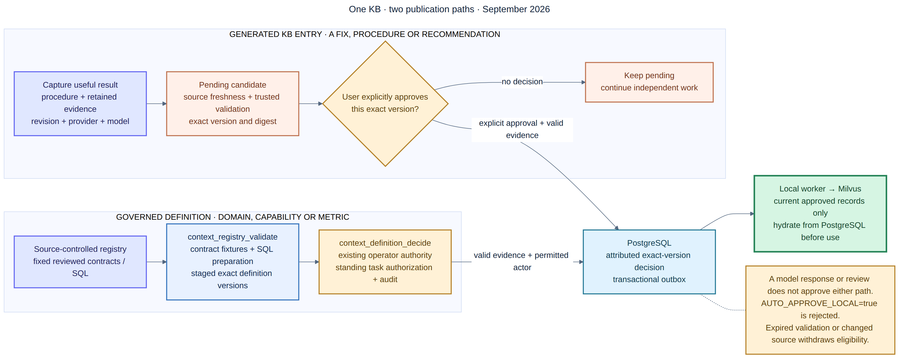

# Hybrid AI Software Engineering Platform

A local-first platform for software development. OpenClaw coordinates the work,
Ollama runs local models, and the MCP server gives Codex and other agents one
safe way to use shared knowledge. Codex and Kimi are optional cloud services.
The platform never sends work to them as a hidden fallback.

## How it works

1. An agent searches approved lessons and the current code graph.
2. A local Ollama model or Codex works on the task and runs checks.
3. Codex or Kimi may review a small, sanitized package when policy allows it.
4. A person reviews the result before it becomes reusable knowledge.
5. PostgreSQL saves the official record. Milvus makes approved records easy to
   find by meaning.

Maintenance always uses local Ollama models. A single developer can perform
the Development, QA, Product Owner, and Operations roles. Larger teams can
require different people for selected approvals.

The repository implements:

- A Go MCP server over Streamable HTTP or STDIO.
- PostgreSQL for durable workflow state, provenance, review gates, Git-repository graphs, and a transactional outbox.
- A headless, compiler-aware Go analyzer for revisioned symbols, calls, references, implementations, imports, and tests.
- Milvus for derived semantic indexes of approved knowledge, repository relationships, and selected code symbols.
- Ollama for local embeddings and local coding inference.
- Immutable SHA-256 prompt/output artifacts.
- An asynchronous indexing worker and administrative CLI.
- A versioned workflow state machine with authenticated principals, Cerbos
  policy enforcement, immutable transition evidence, and optimistic/idempotent
  transitions.
- An OpenClaw controller plugin backed by managed Task Flows plus deterministic
  Lobster workflow definitions.
- An independent bounded-work contract and disposable-clone patch verifier for OpenClaw local execution.
- Local Docker Compose deployment, Codex/OpenClaw examples, CI, and an enterprise migration path.



See the [exact review-learning diagram](docs/diagrams/hybrid-ai-review-learning-loop.svg)
and the [full local deployment architecture](docs/diagrams/hybrid-ai-local-architecture.svg)
for implementation detail.

## The key design rule

PostgreSQL holds the official records. Milvus is a search index that can be
rebuilt.

- PostgreSQL answers: “What is true, approved, and current?”
- Milvus answers: “Which approved item is most similar to this question?”
- Stable PostgreSQL IDs connect every Milvus result to its official record.

Every generated solution starts as a pending candidate. It includes the
original problem, reusable steps, test evidence, model and repository details,
and files whose contents are protected by SHA-256 hashes. Review feedback may
improve a pending candidate. Only an explicit approval makes it searchable.
PostgreSQL saves the approval and indexing request together. A worker then
adds the approved item to Milvus.

Repository relationships follow the same rule. PostgreSQL stores the exact,
evidence-backed links. Milvus helps an agent discover related repositories by
meaning.

For source code, PostgreSQL stores every exact symbol and relationship for a
specific Git revision. Milvus stores searchable summaries of selected symbols.
After a Milvus match, the service always loads the current PostgreSQL record
before following calls, references, implementations, imports, or tests.

## Technology choices

| Concern | Choice | Reason |
|---|---|---|
| MCP and data plane | Go 1.25 | Small services, good concurrency, and an official MCP SDK. |
| Workflow and graph authority | PostgreSQL | Safe multi-step writes, strong rules, graph queries, and audit history. |
| Semantic/hybrid index | Milvus | Vector search that can grow from one machine to a distributed cluster. |
| Local inference | Ollama | Simple local model serving and local embeddings. |
| Local coding on GBX100/GB10 | `qwen3.6:35b` | Current open-weight agentic coding model with ample memory headroom on 128 GB. |
| Local embeddings | `embeddinggemma` | Small local embedding model; 768 dimensions by default. |
| Code analysis | Go compiler APIs plus SCIP for JVM, TypeScript/JavaScript, and Python | Deterministic, build-aware evidence without an LLM or editor bridge. |
| Cloud architecture review | `moonshot/kimi-k3` | Explicit, sanitized review subagent. |
| Cloud coding and independent code review | Codex/ChatGPT | MCP-connected implementation/review and reusable validated outcome capture. |

Go was selected over Python for the long-running production data plane and over Rust for faster team delivery. Python remains a good optional sidecar language for evaluation or ML experiments; Rust is appropriate only for a measured hot path. See [ADR-0001](docs/adr/0001-go-for-the-mcp-data-plane.md).

## Quick start

Prerequisites: Docker Compose v2, Git, and approximately 16 GB free RAM for the infrastructure. NVIDIA GPU use additionally requires the NVIDIA Container Toolkit. The application itself is multi-architecture; the intended host is the ASUS Ascent GX10/GB10.

1. Create protected local configuration with independent random secrets:

   ```bash
   make env-init
   ```

   The target never prints secrets and refuses to overwrite an existing `.env`.
   `CODEGRAPH_HOST_ROOT` selects the one host directory mounted read-only at
   `/workspace` for analysis. Use an absolute path to analyze another repository.

2. Start the stack. Use `up-gpu` on the GBX100/GB10 host:

   ```bash
   make up-gpu
   # or: make up
   ```

3. Optionally pull the recommended local coding model. The initial stack pulls only the embedding model:

   ```bash
   make pull-local-model
   ```

4. Verify it:

   ```bash
   make mcp-status
   ```

For Docker permission repair, a deliberately volume-free rebuild, cloning and
indexing multiple repositories, exact MCP request examples, SQL verification,
and timing guidance, follow the
[local setup and multi-repository indexing runbook](docs/local-setup-and-indexing.md).

All published ports bind to `127.0.0.1`. Do not expose PostgreSQL, Milvus, Ollama, or the MCP endpoint directly to an untrusted network.

## Role-based commands

The same canonical Make targets are grouped into four operating workflows:

```bash
make help-operations
make help-development
make help-qa
make help-product-owner
```

Role-prefixed commands such as `ops-start-gpu`, `dev-session-repo`,
`qa-candidates`, and `po-approve` show which role is responsible. In `solo`
mode, one person may perform all four roles. The platform still records the
role and evidence at each approval step. Follow the complete
[role workflows and handoffs](docs/role-workflows.md).

## Connect Codex

The current Codex configuration supports local STDIO and Streamable HTTP MCP servers. Codex can use a stored ChatGPT sign-in, so this workflow does not require `OPENAI_API_KEY`. The local MCP bearer token is a separate, non-billable secret used only between Codex and the gateway. Merge [examples/codex/config.toml](examples/codex/config.toml) into `~/.codex/config.toml` or use this repository's project-scoped `.codex/config.toml`, then export the token:

```bash
export HYBRID_AI_MCP_TOKEN='the AUTH_TOKEN value from .env'
codex mcp list
```

For two separate terminals, the repository provides a fail-fast workflow:

```bash
# Terminal 1: start the platform/MCP server, then follow its logs.
make mcp-start
# On the GBX100/GB10 host, use: make mcp-start-gpu
make mcp-logs

# Terminal 2: load AUTH_TOKEN from .env as HYBRID_AI_MCP_TOKEN and start Codex.
make codex
```

To work in another checkout while retaining this HTTP MCP server:

```bash
make codex-repo REPO=/absolute/path/to/software-repository
```

Inside Codex, `/mcp` should show `hybrid_knowledge` connected. The project configuration has `required = true`, so a new Codex session fails clearly if the server or token is unavailable.

Codex CLI can be the primary development session, not only a final reviewer.
Use MCP to retrieve approved knowledge and exact graphs, let Codex inspect and
change the selected repository, run local validation, and capture the validated
outcome with `generation_capture`. It remains pending until separately
approved; once indexed, Ollama can retrieve the generalized solution for a
similar future task. Because Codex inference is cloud-backed, this path follows
the same disclosure rules as any other cloud development or review request and
is never used by the maintenance profile.

For authentication boundaries, first-time setup, `/mcp verbose` verification, token rotation, and troubleshooting, follow the [operations runbook](docs/operations.md).

The STDIO alternative is in [examples/codex/config-stdio.toml](examples/codex/config-stdio.toml). Codex is configured to prompt for write tools, with an explicit prompt for the approval decision tool. See the official [Codex MCP documentation](https://learn.chatgpt.com/docs/extend/mcp) and OpenAI's [MCP server guide](https://developers.openai.com/plugins/build/mcp-server/).

## Connect OpenClaw, Ollama, and Kimi

This repository pins and tests its controller plugin against OpenClaw
`2026.7.1-2`.

1. Configure local Ollama using its native URL—never `/v1` for OpenClaw tool calling:

   ```bash
   export OLLAMA_API_KEY=ollama-local
   openclaw onboard --non-interactive \
     --auth-choice ollama \
     --custom-base-url http://127.0.0.1:11434 \
     --custom-model-id qwen3.6:35b \
     --accept-risk
   ```

2. Install the official Moonshot provider and enter the Kimi API key only in the onboarding wizard:

   ```bash
   openclaw plugins install @openclaw/moonshot-provider
   openclaw gateway restart
   openclaw onboard --auth-choice moonshot-api-key
   openclaw models set moonshot/kimi-k3
   ```

3. Build, verify, and install the local controller plugin:

   ```bash
   make openclaw-plugin-deps
   make openclaw-plugin-check
   make openclaw-plugin-install
   ```

4. Merge [examples/openclaw/openclaw.hybrid.json5](examples/openclaw/openclaw.hybrid.json5) into `~/.openclaw/openclaw.json`. It defines:

   - `workflow-coordinator`: the non-human managed-flow controller.
   - `developer`: local primary model, permitted to delegate explicitly to cloud review.
   - `qa`: local independent validation agent.
   - `maintenance`: local model only, empty fallbacks, and a one-model
     per-agent allowlist that prevents stored cloud-model overrides.
   - `cloud-review`: Kimi K3 with a read-only sandbox.
   - The MCP server using `CONTROLLER_AUTH_TOKEN` and a bounded tool list.

5. Start OpenClaw in its own terminal. This loads only the non-human controller
   credential from `.env`:

   ```bash
   make openclaw-start
   ```

The default local human credential remains `AUTH_TOKEN`. It represents
`human:local-developer` with Development, QA, Product Owner, and Operations
roles for every project, so one developer can perform the complete solo flow.
OpenClaw never receives this credential and therefore cannot cross human QA or
Product Owner gates.

Current official references: [Kimi K3 in OpenClaw](https://platform.kimi.ai/docs/guide/use-kimi-in-openclaw), [OpenClaw Ollama provider](https://docs.openclaw.ai/providers/ollama), [managed Task Flows](https://docs.openclaw.ai/automation/taskflow), and [Lobster workflows](https://docs.openclaw.ai/tools/lobster).

## Bounded local work and review learning

OpenClaw remains the task router. Routine work goes to local Ollama; Codex and
Kimi are explicit advisory reviewers. Delegated patches use the independent
[`hybrid-ai/work-packet/v1`](examples/openclaw/work-packet.example.json)
contract:

```bash
make workpacket-evaluate PACKET=/path/to/work-packet.json
make workpacket-verify PACKET=/path/to/work-packet.json PATCH=/path/to/change.patch
```

Verified local results may receive a sanitized remote review. Exact review
output and the context manifest are stored as immutable evidence; a proposed
improvement remains pending. Only locally validated, generalized, explicitly
approved improvements are embedded in Milvus for later local reuse.
Maintenance remains local-only and can retrieve approved lessons without
invoking a cloud model. See [Remote Review and Local Learning](docs/remote-review-learning.md).

The [capability scorecard](docs/cost-routing-evaluation.md) distinguishes what
is implemented, configured, partial, and still unmeasured. No cost or quality
percentage is claimed before the documented benchmark gates pass.

## MCP workflow

The usual software-development loop is:

```text
knowledge_search + repository_graph_get + code_symbol_search
  -> local implementation and validation
  -> generation_capture (pending)
  -> optional Kimi/Codex review_record (may revise pending content)
  -> human/policy knowledge_candidate_decide
  -> PostgreSQL outbox
  -> Ollama embedding worker
  -> Milvus approved index
```

Available tools:

| Tool | Effect |
|---|---|
| `platform_status` | Check dependency health. |
| `knowledge_search` | Search approved project knowledge; lexical fallback is reported explicitly. |
| `knowledge_get` | Fetch one approved item. |
| `generation_capture` | Store a run, immutable artifacts, provenance, procedure, validation, and pending candidate. |
| `review_record` | Save review provenance, findings, immutable raw-output/context-manifest artifacts; `revise` requires fresh local validation and updates only a pending candidate. |
| `knowledge_candidates_list` | List the review queue. |
| `knowledge_candidate_decide` | Approve or reject; approval queues vector indexing. |
| `repository_relation_upsert` | Store a typed, approved Git-repository edge and queue its vector projection. |
| `repository_graph_get` | Traverse exact SQL relationships to depth 1–5. |
| `repository_relation_search` | Semantically search relationship evidence in Milvus. |
| `code_repository_index` | Analyze an allowlisted local Go, Java, Kotlin, TypeScript, JavaScript, or Python repository and atomically publish a repository-, branch-, and revision-mapped SQL graph snapshot. |
| `code_symbol_search` | Discover selected symbols through Milvus, then hydrate the active PostgreSQL entity. |
| `code_graph_get` | Traverse the exact active SQL graph around a symbol to depth 1–5. |

Supported repository edge types are `depends_on`, `provides_api_to`, `deploys_with`, `shares_contract`, `fork_of`, `upstream_of`, `successor_of`, `contains`, and `related_to`.

## Repository layout

```text
cmd/                 gateway, indexing worker, and admin CLI
components/          code graph analyzer plus bounded-work policy/verifier
automation/          OpenClaw controller plugin and Lobster workflows
contracts/           versioned workflow JSON Schemas
internal/            domain, services, PostgreSQL, Milvus, Ollama, MCP, HTTP
migrations/          embedded transactional SQL migrations
policies/            versioned Cerbos policies and allow/deny fixtures
deploy/compose/      complete local stack and NVIDIA GPU overlay
deploy/kubernetes/   enterprise application-layer Kustomize base
examples/            Codex and OpenClaw configurations
docs/                architecture, implementation, security, operations, ADRs
```

## Development

```bash
make check-all
make build
docker compose --env-file .env.example -f deploy/compose/compose.yaml config --quiet
```

Native and STDIO code analysis requires Git plus the selected language indexers and build toolchains. The local Compose `gateway-analyzer` image includes Go, Java/Maven/Gradle, Node, and pinned SCIP indexers. It keeps `/workspace` read-only and runs non-Go indexers against disposable copies. The production gateway target remains distroless; enterprise deployments should run analyzers in isolated queued workers.

The module uses the official MCP Go SDK `v1.7.0`, which supports MCP protocol `2026-07-28`, and the Milvus Go client `v2.6.5`. Milvus Standalone is pinned to `v2.6.21`, matching the official 2.6 deployment line. Review dependency and image updates through CI rather than following floating `latest` tags.

## Enterprise path

The local and enterprise versions keep the same contracts. Replace only deployment implementations:

- One gateway becomes stateless replicas behind an OIDC-aware API gateway.
- PostgreSQL becomes managed HA PostgreSQL with PITR and read replicas.
- Milvus Standalone becomes Milvus Distributed; rebuild projections from PostgreSQL when necessary.
- The local artifact volume becomes versioned, encrypted S3-compatible storage.
- The in-process outbox poller can become CDC into Kafka/NATS when throughput justifies it.
- Static bearer tokens become workload identity and short-lived OAuth tokens.

See [enterprise-deployment.md](docs/enterprise-deployment.md) and the [enterprise architecture image](docs/diagrams/hybrid-ai-enterprise-architecture.png).

## Documentation

- [Plain-English glossary](docs/glossary.md)
- [Local setup and multi-repository indexing](docs/local-setup-and-indexing.md)
- [Implementation guide](docs/implementation-guide.md)
- [Remote review and local learning](docs/remote-review-learning.md)
- [Role workflows and Make commands](docs/role-workflows.md)
- [OpenClaw agentic automation design and implementation plan](docs/openclaw-agentic-automation-plan.md)
- [Routing capability and benchmark scorecard](docs/cost-routing-evaluation.md)
- [Operations runbook](docs/operations.md)
- [Security model](docs/security.md)
- [Enterprise deployment](docs/enterprise-deployment.md)
- [Architecture diagrams and Mermaid sources](docs/diagrams/README.md)
- [Architecture decisions](docs/adr/)

## License

The platform is MIT-licensed except for files under `components/codegraph`, which are MPL-2.0 as documented in that component's `LICENSE` and `NOTICE`. See [LICENSE](LICENSE) and [THIRD_PARTY_NOTICES.md](THIRD_PARTY_NOTICES.md).
