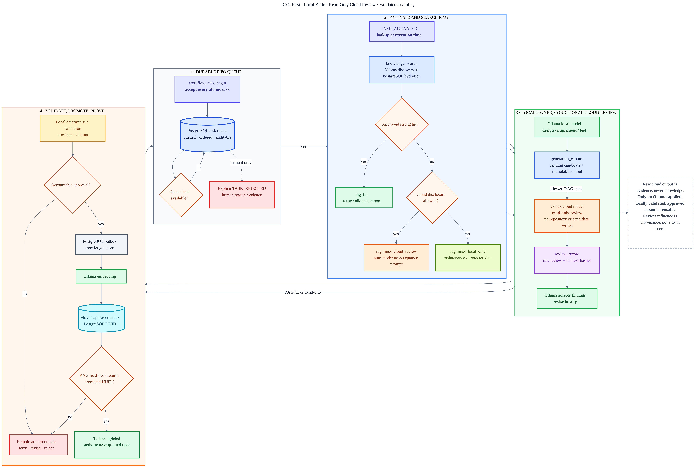

# Hybrid AI Software Engineering Platform

A local-first platform for software development. OpenClaw coordinates the work,
Ollama runs local models, and the MCP server gives Codex and other agents one
safe way to use shared knowledge. Codex and Kimi are optional cloud services.
The platform never sends work to them as a hidden fallback.

## How it works

1. An agent searches approved lessons and the current code graph.
2. A local Ollama model or Codex works on the task and runs checks.
3. Codex or Kimi may review a small, sanitized package when policy allows it.
4. A person reviews the result before it becomes reusable knowledge.
5. PostgreSQL saves the official record. Apache AGE expands exact topology and
   Milvus makes approved records easy to find by meaning.

Maintenance always uses local Ollama models. A single developer can perform
the Development, QA, Product Owner, and Operations roles. Larger teams can
require different people for selected approvals.

The repository implements:

- A Go MCP server over Streamable HTTP or STDIO.
- PostgreSQL for durable workflow state, provenance, review gates, Git-repository graphs, and a transactional outbox.
- Apache AGE for a rebuildable property-graph projection and bounded Cypher traversal.
- A headless, compiler-aware Go analyzer for revisioned symbols, calls, references, implementations, imports, and tests.
- Milvus for derived semantic indexes of approved knowledge, repository relationships, selected code symbols, and graph edges.
- Ollama for local embeddings and local coding inference.
- Immutable SHA-256 prompt/output artifacts.
- An asynchronous indexing worker and administrative CLI.
- A versioned workflow state machine with authenticated principals, Cerbos
  policy enforcement, immutable transition evidence, and optimistic/idempotent
  transitions.
- An OpenClaw controller plugin backed by managed Task Flows plus deterministic
  Lobster workflow definitions.
- An independent bounded-work contract and disposable-clone patch verifier for OpenClaw local execution.
- Local Docker Compose deployment, Codex/OpenClaw examples, CI, and an enterprise migration path.



See the [review-learning design](docs/remote-review-learning.md)
and the [full local deployment architecture](docs/diagrams/hybrid-ai-local-architecture.png)
for implementation detail.

## The key design rule

PostgreSQL holds the official records. Apache AGE and Milvus are indexes that
can be rebuilt.

- PostgreSQL answers: “What is true, approved, and current?”
- Apache AGE answers: “What is connected to it?”
- Milvus answers: “Which approved item is most similar to this question?”
- Stable PostgreSQL IDs connect every AGE/Milvus result to its official record.

Every generated solution starts as a pending candidate. It includes the
original problem, reusable steps, test evidence, model and repository details,
and files whose contents are protected by SHA-256 hashes. Review feedback may
improve a pending candidate. Only an explicit approval makes it searchable.
PostgreSQL saves the approval and indexing request together. A worker then
adds the approved item to Milvus.

Repository relationships follow the same rule. PostgreSQL stores the exact,
evidence-backed links. Milvus helps an agent discover related repositories by
meaning.

For source code, PostgreSQL stores every exact symbol and relationship for a
specific Git revision. Milvus stores searchable summaries of selected symbols.
After a Milvus match, the service always loads the current PostgreSQL record
before following calls, references, implementations, imports, or tests.

## Technology choices

| Concern | Choice | Reason |
|---|---|---|
| MCP and data plane | Go 1.25 | Small services, good concurrency, and an official MCP SDK. |
| Workflow and graph authority | PostgreSQL | Safe multi-step writes, strong rules, graph queries, and audit history. |
| Property-graph traversal | Apache AGE 1.6 / PostgreSQL 17 | Cypher traversal without a separate graph authority or service. |
| Semantic/hybrid index | Milvus | Vector search that can grow from one machine to a distributed cluster. |
| Local inference | Ollama | Simple local model serving and local embeddings. |
| Local coding on GBX100/GB10 | `qwen3.6:35b` | Current open-weight agentic coding model with ample memory headroom on 128 GB. |
| Local embeddings | `embeddinggemma` | Small local embedding model; 768 dimensions by default. |
| Code analysis | Go compiler APIs plus SCIP for JVM, TypeScript/JavaScript, and Python | Deterministic, build-aware evidence without an LLM or editor bridge. |
| Cloud architecture review | `moonshot/kimi-k3` | Explicit, sanitized review subagent. |
| Cloud coding and independent code review | Codex/ChatGPT | MCP-connected implementation/review and reusable validated outcome capture. |

Go was selected over Python for the long-running production data plane and over Rust for faster team delivery. Python remains a good optional sidecar language for evaluation or ML experiments; Rust is appropriate only for a measured hot path. See [ADR-0001](docs/adr/0001-go-for-the-mcp-data-plane.md).

## Quick start

Prerequisites: Docker Compose v2, Git, and approximately 16 GB free RAM for the infrastructure. NVIDIA GPU use additionally requires the NVIDIA Container Toolkit. The application itself is multi-architecture; the intended host is the ASUS Ascent GX10/GB10.

1. Create protected local configuration with independent random secrets:

   ```bash
   make env-init
   ```

   The target never prints secrets and refuses to overwrite an existing `.env`.
   `CODEGRAPH_HOST_ROOT` selects the one host directory mounted read-only at
   `/workspace` for analysis. Use an absolute path to analyze another repository.

2. Start the stack. Use `up-gpu` on the GBX100/GB10 host:

   ```bash
   make up-gpu
   # or: make up
   ```

3. Optionally pull the recommended local coding model. The initial stack pulls only the embedding model:

   ```bash
   make pull-local-model
   ```

4. Verify it:

   ```bash
   make mcp-status
   ```

5. Synchronize and index a GitHub organization with the reproducible Make
   workflow:

   ```bash
   make repository-org-index-all GITHUB_ORG=example-organization
   make repository-org-wait
   ```

   The workflow refuses dirty checkouts, registers documentation-only
   repositories in the PostgreSQL catalog, skips empty code graphs, retains
   already-current snapshots, and indexes stale supported-language revisions.
   Use `REPOSITORY_BRANCH_OVERRIDES='repository=branch'` when an intentional
   analysis branch differs from the forge default branch.

For Docker permission repair, a deliberately volume-free rebuild, cloning and
indexing multiple repositories, exact MCP request examples, Make-based verification,
and timing guidance, follow the
[local setup and multi-repository indexing runbook](docs/local-setup-and-indexing.md).

All published ports bind to `127.0.0.1`. Do not expose PostgreSQL, Milvus, Ollama, or the MCP endpoint directly to an untrusted network.

## Role-based commands

The same canonical Make targets are grouped into four operating workflows:

```bash
make help-operations
make help-development
make help-qa
make help-product-owner
```

Role-prefixed commands such as `ops-start-gpu`, `dev-session-repo`,
`qa-candidates`, and `po-approve` show which role is responsible. In `solo`
mode, one person may perform all four roles. The platform still records the
role and evidence at each approval step. Follow the complete
[role workflows and handoffs](docs/role-workflows.md).

## End-to-end governed hybrid development

The governed hybrid route uses OpenClaw to queue atomic work, Ollama as the
development owner, and Codex only as a conditional read-only reviewer after an
approved RAG miss. Local-model tasks default to auto mode, so that review does
not require manual acceptance. Direct `make dev-session` cloud development is
still available, but it is a separate cloud session and does not prove that the
governed hybrid loop ran. The explicit `make dev-session-local` targets run
Codex itself on the local Ollama model. Neither route requires
`OPENAI_API_KEY`.

The local MCP bearer token is a separate, non-billable secret used only between
Codex and the loopback gateway. The Make targets load it from `.env` without
printing it. OpenClaw is not required for this Codex workflow; use
`make mcp-status` for Codex-only health checks and `make platform-status` only
when the OpenClaw integration is also expected to be running.

The complete loop is:

```text
start MCP/OpenClaw → queue atomic tasks (auto by default)
  → activate FIFO head → search approved RAG
  → Ollama design/implementation/test → capture pending candidate
  → on allowed miss: read-only Codex review → Ollama revision
  → local deterministic validation → explicit Product Owner decision
  → local embedding → Milvus read-back → activate next task
```

### 1. Perform one-time Codex setup

From this repository:

```bash
make env-init       # only when .env does not already exist
make mcp-preflight

# Required only if you will use the cloud-backed Codex targets:
make codex-login
make preflight
```

`make mcp-preflight` validates Docker access, local secrets, and Compose
configuration. For the cloud route, `make preflight` additionally validates the
stored Codex login and the `hybrid_knowledge` MCP registration. The
project-scoped [`.codex/config.toml`](.codex/config.toml) registers the local
Streamable HTTP server; the Make targets also supply equivalent one-process
overrides when Codex is launched in another repository.

### 2. Start the local platform

In the platform terminal:

```bash
# GBX100/GB10 with NVIDIA Container Toolkit
make mcp-start-gpu

# Or use the CPU fallback
# make mcp-start

make mcp-status
```

`mcp-status` must show healthy dependencies and successful `/healthz` and
`/readyz` responses. Follow the gateway and worker when troubleshooting; this
command blocks until interrupted, but the containers continue running:

```bash
make mcp-logs
```

### 3. Choose and verify the Codex inference route

Show both available routes before launching a session:

```bash
make codex-route
```

The output distinguishes the default Codex model provider from the explicit
local route and separately reports the MCP URL. An MCP call proves that Codex
used a local tool; it does not prove that the conversation model was local.

Verify that Codex supports local providers, the MCP gateway is reachable, and
the configured Qwen model is present in Ollama:

```bash
make codex-local-check
make codex-local-smoke
```

The local target explicitly passes `--oss --local-provider ollama`, the model
from `LOCAL_CHAT_MODEL`, a checked-in Qwen model catalog, and
`model_reasoning_effort="high"`. The catalog prevents Codex from applying
unknown-model fallback metadata. The reasoning override is required because
Ollama rejects the `xhigh` value that may be valid for the configured cloud
model. `codex-local-smoke` performs a real ephemeral Qwen response and requires
the exact `LOCAL_QWEN_OK` result.

Run the complete fail-closed routing acceptance suite before relying on the
hybrid boundary:

```bash
make hybrid-verify
```

It proves local inference succeeds with cloud egress denied, local inference
fails rather than falling back when its Ollama endpoint is unavailable, cloud
review cannot change the working tree, and cloud review fails rather than
falling back to reachable Ollama when cloud egress is denied. The suite uses a
temporary canary repository and leaves the shared Ollama container running.
Audit JSONL and hashed raw evidence are written below
`reports/hybrid-verification/`. See
[Hybrid Routing Verification](docs/hybrid-routing-verification.md).

Current compatibility boundary: Codex CLI `0.147.0` always defers MCP tool
schemas. Local Qwen inference succeeds, but Qwen did not reliably discover and
invoke `hybrid_knowledge` tools through that deferred interface in the
end-to-end test. `/mcp verbose`, `codex-local-check`, and the inference smoke
test must not be treated as proof of a successful MCP tool call. Until that
client/model compatibility changes, use one of these supported paths:

- `make dev-session` for an explicit direct-cloud Codex session outside the
  governed hybrid lane, with direct `hybrid_knowledge` calls;
- `make openclaw-start` for local Qwen with the OpenClaw-managed MCP tool path;
- `make dev-session-local` only when the task does not depend on MCP calls.

Codex officially supports selecting Ollama with `--oss` and
`--local-provider`; see the
[Codex advanced configuration guide](https://developers.openai.com/codex/config-advanced/#oss-mode-local-providers).

### 4. Launch an explicit direct Codex session when needed

For a direct cloud Codex-and-MCP session in this platform repository:

```bash
make dev-session
```

For another checkout while retaining this independently running MCP server:

```bash
make dev-session-repo REPO=/absolute/path/to/software-repository
```

When the task does not require MCP tools, explicitly select local Qwen with:

```bash
make dev-session-local
make dev-session-local-repo REPO=/absolute/path/to/software-repository
```

The second target resolves the repository path, changes the Codex working
directory, and loads `AUTH_TOKEN` as `HYBRID_AI_MCP_TOKEN` only for the child
process. Do not copy `.env` or the bearer token into the target repository.

The local launcher prints the selected model route before Codex starts. The
Codex startup banner must also show values equivalent to:

```text
model: qwen3.6:35b
provider: ollama
reasoning effort: high
```

After sending a prompt, independently confirm the model loaded in Ollama:

```bash
curl --silent http://127.0.0.1:11434/api/ps | jq -r '.models[].name'
```

`qwen3.6:35b` should appear while it remains loaded. This runtime evidence,
together with the Codex startup banner, proves the conversation used Qwen.

Inside Codex, verify a real MCP connection:

```text
/mcp verbose
```

Confirm that `hybrid_knowledge` is connected and its tools are visible, then
ask:

```text
Call platform_status and report the dependency health.
Use project_id "local-development" for the following task unless I specify a
different project namespace.
```

The MCP server is configured as required, so a new Codex session fails clearly
when the server cannot initialize or the bearer token is invalid.

### 5. Create or refresh the repository code snapshot

Every active code graph is mapped to a repository, checked-out branch, and
exact Git revision. Before the first task in a repository—or after its clean
`HEAD` changes—ask Codex:

```text
Read this repository's exact name, origin URL, checked-out branch, remote
default branch, and full HEAD commit. Convert the host repository path relative
to CODEGRAPH_HOST_ROOT into the corresponding /workspace/<relative-path>.

Call code_repository_index with project_id "local-development", those exact
identity values, and allow_dirty=false. Return the repository, branch,
revision, analyzers, entity count, relation count, duration, and indexing
state. Do not index an uncommitted working tree.
```

Approve the MCP write prompt. Use `allow_dirty=true` only when a deliberately
non-reproducible working-tree snapshot is required. Documentation-only or
unsupported-language repositories may be reported as skipped rather than
receiving an empty active graph. For request JSON, multi-repository ordering,
and Make-based verification, use the
[multi-repository indexing runbook](docs/local-setup-and-indexing.md#8-index-repositories-through-make-and-mcp).

For an entire GitHub organization, prefer the non-interactive Make workflow:

```bash
make repository-org-index-all \
  GITHUB_ORG=example-organization \
  REPOSITORY_PROJECT=local-development \
  REPOSITORY_BRANCH_OVERRIDES='special-repository=release-branch'
make repository-org-wait
```

The branch override changes the checked-out and analyzed branch only. The
catalog still records the remote default branch separately. Every operation
uses the authenticated MCP code-index tool or the Compose admin boundary; the
workflow does not write code graphs directly.

The analyzed branch and exact commit are indexed. Their canonical API and SQL
names are `branch` and `revision`; `branch_name` and `git_commit` are useful
descriptions, but are not separate stored fields.

### 6. Retrieve context before changing files

Give Codex the task and require retrieval before implementation:

```text
I need to implement: <describe the task>.

Before changing files:
1. Call knowledge_search with project_id "local-development".
2. If sibling repositories may be affected, call repository_graph_get for the
   current repository with depth 2.
3. Call code_symbol_search for the relevant behavior, identifiers, or symbols.
4. Call code_graph_get for the best matching symbols to inspect callers,
   dependencies, implementations, references, and tests.
5. Confirm the repository, branch, and revision attached to graph results.
6. Inspect the current working tree and repository guidance.
7. Propose a bounded implementation and validation plan. Do not edit yet.
```

Semantic matches are discovery candidates. Exact topology comes from the
PostgreSQL-backed graph. An empty repository relationship result means no
evidence-backed relationship has been recorded; it is not permission to invent
one.

### 7. Define and evaluate bounded work

For the complete governed path, copy and customize the versioned
[work-packet example](examples/openclaw/work-packet.example.json). Set the
absolute target workspace, exact base revision, allowed and forbidden files,
data classification, risk categories, deterministic checks, change limits, and
rollback steps.

Evaluate it from this platform repository before allowing edits:

```bash
make dev-policy-check PACKET=/path/to/task.work-packet.json
```

Do not continue when the evaluation returns `allowed: false`. High-risk or
destructive work requires the approval fields enforced by the packet policy.
Restricted and maintenance work must remain local-only; use the OpenClaw
maintenance profile with Ollama instead of this cloud-backed Codex path.

### 8. Implement, test, and verify the patch

After accepting the plan, tell Codex:

```text
Proceed with the implementation within the approved work-packet boundaries.
Do not modify secrets, environment files, generated output, or unrelated files.
Run the target repository's native tests and checks. Inspect the final diff and
report files changed, behavior changed, validation results, remaining risks,
and rollback steps.
```

Create a patch without modifying file contents. If the task adds untracked
files, make each one visible to `git diff` with an intent-to-add entry, then
clear that entry after writing the patch:

```bash
cd /absolute/path/to/software-repository
git status --short
git add --intent-to-add -- path/to/new-file  # repeat only for intended new files
git diff HEAD --binary --output=/tmp/task.patch
git reset -- path/to/new-file                # clear each intent-to-add entry
```

Apply and verify that patch in a disposable clone using the packet's exact
checks:

```bash
cd /absolute/path/to/local-ai-development-platform
make dev-patch-verify \
  PACKET=/path/to/task.work-packet.json \
  PATCH=/tmp/task.patch
```

Use the target repository's own Maven, Gradle, npm, Python, Go, or other native
checks. `make dev-check` validates this platform repository itself. Run it for
platform changes, and add the authorization-policy test when Cerbos policies
change:

```bash
make dev-check
make dev-authz-policy-test  # required when policies/cerbos changes
```

### 9. Capture the validated outcome

After every required check passes, ask Codex:

```text
Call generation_capture with project_id "local-development". Record the
original task, final implementation summary, provider and model, repository
revision, ordered procedure, important tool actions, validation commands and
observed results, applicability, exclusions, rollback guidance, and outcome
"success". Return the pending candidate ID. Do not approve it.
```

`generation_capture` stores immutable prompt/output artifacts and creates a
pending candidate. Model generation or self-review never makes that candidate
approved knowledge.

### 10. Perform independent QA

First rerun the disposable-clone verifier from the platform repository:

```bash
make qa-candidates PROJECT=local-development LIMIT=25
make qa-candidate-get ID=<candidate-uuid>
make qa-patch-verify \
  PACKET=/path/to/task.work-packet.json \
  PATCH=/tmp/task.patch
```

Then create a fresh QA worktree at the packet's exact base revision, apply the
candidate patch, and start a new Codex session there:

```bash
git -C /absolute/path/to/software-repository worktree add --detach \
  /absolute/path/to/qa-worktree <base-revision>
git -C /absolute/path/to/qa-worktree apply /tmp/task.patch

cd /absolute/path/to/local-ai-development-platform
make qa-session-repo REPO=/absolute/path/to/qa-worktree
```

Inside the QA Codex session:

```text
Independently review candidate <candidate-uuid> and its patch. Verify scope,
acceptance criteria, tests, error handling, security implications,
cross-repository impact, reusable-knowledge quality, and rollback guidance.
Reproduce the important checks. Call review_record with verdict approve,
reject, revise, or comment and include the exact validation evidence. Do not
perform the final knowledge decision.
```

A `revise` verdict requires improved content and fresh local validation.
`review_record` preserves review evidence but cannot publish the candidate.

### 11. Make the explicit knowledge decision

After checking QA evidence, applicability, exclusions, and business acceptance:

```bash
make po-candidate-get ID=<candidate-uuid>
make po-approve ID=<candidate-uuid>
# Or: make po-reject ID=<candidate-uuid>
```

Approval commits the authoritative PostgreSQL decision and queues local Ollama
embedding and Milvus projection. Monitor dependency and worker health with:

```bash
make ops-doctor
make mcp-logs
```

The projection is asynchronous. Future Codex sessions can retrieve the approved
generalized outcome with `knowledge_search`; they must still inspect current
source and repeat relevant validation rather than copying stored output blindly.

### 12. Commit and re-index the new revision

Commit only after reviewing the verified diff according to the target
repository's normal Git workflow. Then repeat step 5 with the new clean `HEAD`
so future symbol searches and graph traversals use the new repository, branch,
and revision mapping. Never claim that an uncommitted implementation is
represented by the previous active snapshot.

For organization-managed checkouts, rerun `make repository-org-index-all`.
Current branch/revision pairs are retained, while changed repositories are
re-analyzed. Finish with `make repository-org-wait` and
`make repository-org-verify` so handoff does not occur with pending semantic
vectors.

For authentication boundaries, token rotation, startup failures, and MCP
diagnostics, follow the [operations runbook](docs/operations.md). For the concise
Development → QA → Product Owner responsibilities, see
[role workflows and handoffs](docs/role-workflows.md). The STDIO alternative is
in [examples/codex/config-stdio.toml](examples/codex/config-stdio.toml); it makes
Codex own the MCP subprocess rather than using the independently running HTTP
gateway described above.

Codex is configured to prompt for MCP write tools and explicitly prompt for
indexing, repository-relation, and approval writes. See the official
[Codex MCP documentation](https://learn.chatgpt.com/docs/extend/mcp) and
OpenAI's [MCP server guide](https://developers.openai.com/plugins/build/mcp-server/).

## Connect OpenClaw, Ollama, and Kimi

This repository pins and tests its controller plugin against OpenClaw
`2026.7.1-2`.

1. Configure local Ollama using its native URL—never `/v1` for OpenClaw tool calling:

   ```bash
   export OLLAMA_API_KEY=ollama-local
   openclaw onboard --non-interactive \
     --auth-choice ollama \
     --custom-base-url http://127.0.0.1:11434 \
     --custom-model-id qwen3.6:35b \
     --accept-risk
   ```

2. Install the official Moonshot provider and enter the Kimi API key only in the onboarding wizard:

   ```bash
   openclaw plugins install @openclaw/moonshot-provider
   openclaw gateway restart
   openclaw onboard --auth-choice moonshot-api-key
   openclaw models set moonshot/kimi-k3
   ```

3. Configure, verify, and idempotently install the local controller plugin:

   ```bash
   make openclaw-setup
   ```

   The setup target installs pinned dependencies, runs all plugin checks,
   dry-runs and applies
   [examples/openclaw/openclaw.hybrid.json5](examples/openclaw/openclaw.hybrid.json5),
   force-replaces the trusted local plugin so reruns are safe, and runs plugin
   diagnostics. The applied configuration defines:

   - `workflow-coordinator`: the non-human managed-flow controller.
   - `developer`: local primary model, permitted to delegate explicitly to cloud review.
   - `qa`: local independent validation agent.
   - `maintenance`: local model only, empty fallbacks, and a one-model
     per-agent allowlist that prevents stored cloud-model overrides.
   - `cloud-review`: Kimi K3 with a read-only sandbox.
   - The MCP server using `CONTROLLER_AUTH_TOKEN` and a bounded tool list.

4. Start OpenClaw in its own terminal. This loads only the non-human controller
   credential from `.env`:

   ```bash
   make openclaw-start
   ```

   If another OpenClaw gateway is already reachable, the target stops before
   starting a conflicting listener and tells the operator how to resolve it.
   In particular, a separately installed systemd user service does not inherit
   the controller credential from this repository's `.env`; stop that service
   before using this target.

The default local human credential remains `AUTH_TOKEN`. It represents
`human:local-developer` with Development, QA, Product Owner, and Operations
roles for every project, so one developer can perform the complete solo flow.
OpenClaw never receives this credential and therefore cannot cross human QA or
Product Owner gates.

From a third terminal, verify the complete running integration with:

```bash
make platform-status
```

This status check fails if a running systemd user service lacks the controller
credential, even when its listener is otherwise healthy.

Current official references: [Kimi K3 in OpenClaw](https://platform.kimi.ai/docs/guide/use-kimi-in-openclaw), [OpenClaw Ollama provider](https://docs.openclaw.ai/providers/ollama), [managed Task Flows](https://docs.openclaw.ai/automation/taskflow), and [Lobster workflows](https://docs.openclaw.ai/tools/lobster).

## Bounded local work and review learning

OpenClaw remains the task router. Routine work goes to local Ollama; Codex and
Kimi are explicit advisory reviewers. Delegated patches use the independent
[`hybrid-ai/work-packet/v1`](examples/openclaw/work-packet.example.json)
contract:

```bash
make workpacket-evaluate PACKET=/path/to/work-packet.json
make workpacket-verify PACKET=/path/to/work-packet.json PATCH=/path/to/change.patch
```

Atomic tasks enter a PostgreSQL FIFO queue. At activation, approved RAG is
searched first. A strong hit skips cloud review; an allowed miss requires a
read-only Codex review and then an Ollama revision; maintenance or protected
data takes the local-only miss route. Exact review output and the context
manifest are immutable evidence, and the checkpoint verifies both hashes
against a matching PostgreSQL review row. Only locally validated, generalized,
explicitly approved improvements are embedded in Milvus, and successful
Milvus read-back is required before the next task activates. See
[Remote Review and Local Learning](docs/remote-review-learning.md).

Local-model tasks default to `execution_mode=auto`: policy-required cloud
review starts without a manual acceptance prompt. `manual` mode is opt-in and
adds a Product Owner review-start decision; knowledge promotion remains a
separate accountable gate.

The [capability scorecard](docs/cost-routing-evaluation.md) distinguishes what
is implemented, configured, partial, and still unmeasured. No cost or quality
percentage is claimed before the documented benchmark gates pass.

## MCP workflow

The usual software-development loop is:

```text
workflow_task_begin -> FIFO activation -> approved RAG lookup
  -> local Ollama implementation
  -> generation_capture (pending)
  -> conditional read-only Codex review_record on an allowed RAG miss
  -> local Ollama revision and validation
  -> human/policy knowledge_candidate_decide
  -> PostgreSQL outbox
  -> Ollama embedding worker
  -> Milvus approved index
  -> RAG read-back -> complete -> activate next queued task
```

Available tools:

| Tool | Effect |
|---|---|
| `platform_status` | Check PostgreSQL, AGE, Ollama, Milvus, and authorization dependency health. |
| `knowledge_search` | Search approved project knowledge; lexical fallback is reported explicitly. |
| `knowledge_get` | Fetch one approved item. |
| `generation_capture` | Store a run, immutable artifacts, provenance, procedure, validation, and pending candidate. |
| `review_record` | Save review provenance and immutable raw-output/context-manifest artifacts; only `provider=ollama` may use `revise` with fresh local validation to update a pending candidate. |
| `knowledge_candidates_list` | List the review queue. |
| `knowledge_candidate_decide` | Approve or reject; approval queues vector indexing. |
| `workflow_task_begin` | Queue an atomic task; automatically activate the FIFO head and perform RAG routing. |
| `workflow_task_get` | Read queue position, route, checkpoint, provider/model, candidate, and evidence references. |
| `workflow_task_transition` | Record provider-gated local, review, validation, promotion, read-back, or manual rejection events. |
| `repository_relation_upsert` | Store a typed, approved Git-repository edge and queue its vector projection. |
| `repository_graph_get` | Traverse AGE repository topology to depth 1–5 with stale/unavailable fallback to recursive SQL. |
| `repository_relation_search` | Semantically search relationship evidence in Milvus. |
| `code_repository_index` | Analyze an allowlisted local Go, Java, Kotlin, TypeScript, JavaScript, or Python repository and atomically publish a repository-, branch-, and revision-mapped SQL graph snapshot. |
| `code_symbol_search` | Discover selected symbols through Milvus, then hydrate the active PostgreSQL entity. |
| `code_graph_get` | Traverse the exact active AGE graph around a symbol to depth 1–5 with recursive SQL fallback. |
| `graph_context_search` | Find Milvus seeds, hydrate them from PostgreSQL, expand bounded AGE topology, and re-hydrate authoritative context. |

Supported repository edge types are `depends_on`, `provides_api_to`, `deploys_with`, `shares_contract`, `fork_of`, `upstream_of`, `successor_of`, `contains`, and `related_to`.

## Repository layout

```text
cmd/                 gateway, indexing worker, and admin CLI
components/          code graph analyzer plus bounded-work policy/verifier
automation/          OpenClaw controller plugin and Lobster workflows
contracts/           versioned workflow JSON Schemas
internal/            domain, GraphRAG, AGE, PostgreSQL, Milvus, Ollama, MCP, HTTP
migrations/          embedded transactional SQL migrations
policies/            versioned Cerbos policies and allow/deny fixtures
deploy/compose/      complete local stack and NVIDIA GPU overlay
deploy/kubernetes/   enterprise application-layer Kustomize base
examples/            Codex and OpenClaw configurations
docs/                architecture, implementation, security, operations, ADRs
```

## Development

```bash
make check-all
make integration-test-fresh
make hybrid-verify
make build
make mcp-preflight
```

The fresh integration target uses an isolated Compose project and deletes its
temporary database, containers, and network. The hybrid verifier builds its
runner with `--pull --no-cache`, exercises the four fail-closed provider cases,
and writes hashed audit evidence under `reports/hybrid-verification/`.

Native and STDIO code analysis requires Git plus the selected language indexers and build toolchains. The local Compose `gateway-analyzer` image includes Go, Java/Maven/Gradle, Node, and pinned SCIP indexers. It keeps `/workspace` read-only and runs non-Go indexers against disposable copies. The production gateway target remains distroless; enterprise deployments should run analyzers in isolated queued workers.

The module uses the official MCP Go SDK `v1.7.0`, which supports MCP protocol `2026-07-28`, and the Milvus Go client `v2.6.5`. Milvus Standalone is pinned to `v2.6.21`, matching the official 2.6 deployment line. Review dependency and image updates through CI rather than following floating `latest` tags.

## Enterprise path

The local and enterprise versions keep the same contracts. Replace only deployment implementations:

- One gateway becomes stateless replicas behind an OIDC-aware API gateway.
- PostgreSQL becomes managed HA PostgreSQL with PITR and read replicas.
- Milvus Standalone becomes Milvus Distributed; rebuild projections from PostgreSQL when necessary.
- The local artifact volume becomes versioned, encrypted S3-compatible storage.
- The in-process outbox poller can become CDC into Kafka/NATS when throughput justifies it.
- Static bearer tokens become workload identity and short-lived OAuth tokens.

See [enterprise-deployment.md](docs/enterprise-deployment.md) and the [enterprise architecture image](docs/diagrams/hybrid-ai-enterprise-architecture.png).

## Documentation

- [Blog: From repository scan to a local-hybrid BPMN designer workflow](docs/blog/local-hybrid-flowable-bpmn-designer.md)
- [Hybrid routing fail-closed verification](docs/hybrid-routing-verification.md)
- [Plain-English glossary](docs/glossary.md)
- [Local setup and multi-repository indexing](docs/local-setup-and-indexing.md)
- [Implementation guide](docs/implementation-guide.md)
- [Remote review and local learning](docs/remote-review-learning.md)
- [Role workflows and Make commands](docs/role-workflows.md)
- [OpenClaw agentic automation design and implementation plan](docs/openclaw-agentic-automation-plan.md)
- [Routing capability and benchmark scorecard](docs/cost-routing-evaluation.md)
- [Operations runbook](docs/operations.md)
- [Security model](docs/security.md)
- [Enterprise deployment](docs/enterprise-deployment.md)
- [Architecture diagrams and Mermaid sources](docs/diagrams/README.md)
- [Architecture decisions](docs/adr/)

## License

The platform is MIT-licensed except for files under `components/codegraph`, which are MPL-2.0 as documented in that component's `LICENSE` and `NOTICE`. See [LICENSE](LICENSE) and [THIRD_PARTY_NOTICES.md](THIRD_PARTY_NOTICES.md).
