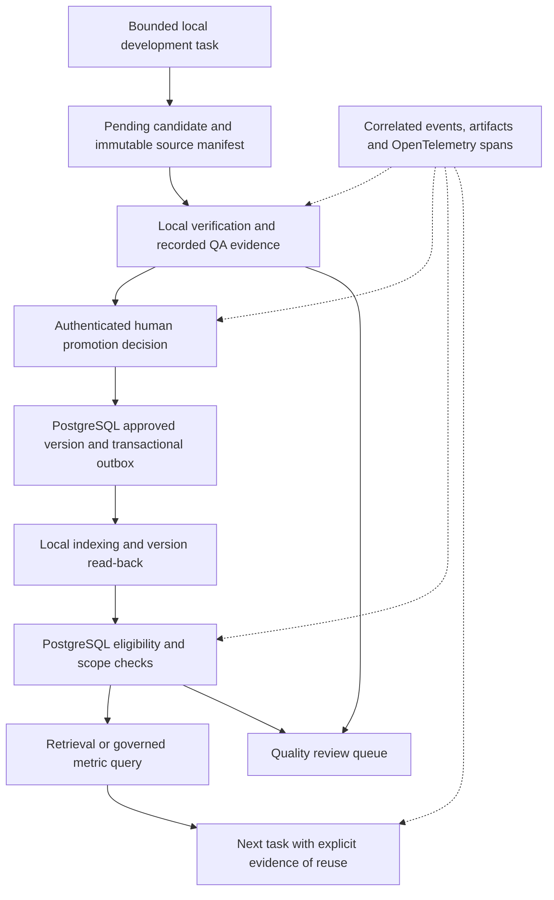

# Agent-ready data: design and implementation plan

Track follow-up work and validation evidence in the
[gap checklist](agent-ready-gap-checklist.md).

Status as of 2026-09-10: the five-gap local implementation and deterministic
acceptance are available. The retained real-Ollama Task A has now passed local
validation after a recorded syntax-only repair. Accountable human publication,
Task B reuse and live rollout remain outstanding. See the
[recovery evidence](agent-ready-pilot-20260910.md),
[original attempt history](agent-ready-pilot-20260906.md) and
[operator runbook](agent-ready-data-operations.md).

Prepared: 2026-09-06. Baseline revision: `4af9954a35ada0818d69ee7888216574e59d57aa`.

This plan addresses the five priorities identified while comparing the platform
with [Making Your Data Ready for Agentic AI](https://martinfowler.com/articles/making-data-ready-for-agentic-ai.html):
consistent promotion gates, freshness and quality enforcement, decision
reconstruction, governed metric definitions, and a demonstrated development and
knowledge-reuse workflow. The detailed design below is specific to this
software-engineering platform.

The intended first release is a governed local development workflow. It does
not establish enterprise readiness: delegated per-user credentials, enterprise
tenant isolation, highly available infrastructure, and production retention
requirements need separate deployment work.

### Implementation checkpoint — 2026-09-06

Implemented in the current worktree (application images and database not upgraded):

- Immutable validation reports and source manifests, authenticated human QA
  attestations, and a CLI boundary that executes the local work-packet verifier.
- A shared versioned, idempotent decision path for MCP and CLI; active human
  Product Owner checks, managed workflow gates, and configured role separation.
  Automatic approval and legacy unversioned decision paths fail closed.
- Schema compilation with positive/negative fixtures, including existing
  workflow contracts. Migration guards bind approved content to its evidence.
- PostgreSQL eligibility for direct reads, lexical fallback, vector hydration,
  and graph traversal. Milvus knowledge metadata now carries version and
  retrieval-text digest, and the worker verifies exact primary-key read-back.
- Versioned project/default quality policies, separate successful source,
  content-validation and projection clocks, immutable source-check receipts,
  a project-scoped quality review tool, and bounded outbox retries.
- Automated tests with synthetic identities and disposable PostgreSQL, AGE and
  Milvus. Tests cover local verifier execution, concurrent/idempotent decisions,
  regulated-role separation, expiry, recovery, invalid vectors, cross-project
  hydration, quarantined intermediate nodes, and stale projection read-back.

Completed in the follow-up development slice:

- Data-product/consumer-purpose policy selection; stricter code-change defaults;
  exact duplicate publication rejection; optional explicitly bounded Git ancestry
  applicability; action-time context-use checks; model/dimension/source/coverage
  projection manifests; and scoped, idempotent operator index recovery.
- Real OpenTelemetry identifiers, durable sanitized operation evidence, atomic
  mutation receipts, model/index intents and outcomes, failed-verifier artifacts,
  `workflow_trace_get`, local-only OTLP export/retry, and evidence-health alerts.
  Unknown external outcomes remain explicitly unknown; no exactly-once claim is
  made. Retention is a configurable review/hold policy, not automatic deletion.
- Pending-by-default source-controlled domain, capability and metric definitions,
  human validation/decision tools, a compiled SQL allowlist bound to the registry
  digest, Milvus semantic discovery with PostgreSQL hydration, and all four
  project-scoped metric queries. Zero denominators return null. The 8/20 = 40%
  example now passes as a synthetic integration fixture, not a platform KPI.
- Explicit versioned `used_context` receipts, trusted `validation_executor`
  workload execution (no human attestation or approval authority), and
  `VALIDATED_REUSE_COMPLETED`, which leaves Task B's new lesson pending.
- `make agent-ready-acceptance`: real disposable PostgreSQL, CAS, Milvus,
  Cerbos and local patch verification; deterministic synthetic embeddings and
  test-only approval actors. `cmd/agent-ready-pilot` provides a real local Ollama
  generation/embedding workflow that stops for human approval and resumes later.

The isolated pilot deployment is now initialized and real local-model execution
has started; its current result is recorded in the
[pilot receipt](agent-ready-pilot-20260906.md). Still operationally required:
passing Task A validation, an accountable human review/publication decision,
verified Task B reuse, and a
deliberate live rollout. Kubernetes needs deployment-specific
repository snapshot mounts. Local Git verification does not certify a remote
branch. The optional collector configuration has not been deployed. Production
archival/deletion policy and infrastructure remain deployment work.

No existing candidate was approved or modified to demonstrate these changes.
The live database was verified to remain at migration `000007`. Its running
Cerbos container bind-mounts and watches this repository's policy directory,
so policy-file edits may reload without a container restart; application and
database rollout must still be coordinated deliberately.

Checkpoint verification passed: `make check` (including race tests),
`make contracts-check`, `make authz-policy-test`,
`git diff --check`, Compose configuration validation, and the PostgreSQL
(`-race -count=1`), AGE and Milvus (`-count=1`) adapter integration suites.
The two-task acceptance suite additionally checks all four metrics, definition
approval and idempotency, project isolation, stale definitions, literal SQL-like
dimension values, exact model output capture, and mandatory-evidence failure.
All integration dependencies are isolated from the live platform; temporary
containers are stopped after verification with their data retained.

Optional pending `generation_capture` proposal: record the ordered procedure
(inspect authoritative context; add version-bound validation and decision
guards; add source/projection checks; exercise negative cases in isolated
services; run the checks above), attach the validation evidence, and identify
the repository revision as baseline `4af9954a35ada0818d69ee7888216574e59d57aa`
plus uncommitted changes. Implementation assistant provider: OpenAI; model:
Codex, exact runtime model identifier not exposed. Tests used deterministic
fixtures, not model inference. Capturing this outcome must leave it pending;
this checkpoint is not human approval of reusable knowledge.

## 1. Baseline and evidence

The existing implementation already has PostgreSQL authority, derived AGE and
Milvus projections, artifact hashes, Cerbos policies, workflow/task state
machines, a work-packet verifier, and compiler-aware repository analysis.

The inspected local database contained eight registered repositories, seven
active code snapshots, three repository relationships, four pending knowledge
candidates, and no approved knowledge or managed workflow runs. Its two
non-revoked credentials had no expiry. These are observations of that database,
not assertions about other deployments or deleted historical data.

Relevant implementation seams:

| Concern | Existing locations | Design implication |
|---|---|---|
| Automatic promotion | `internal/config/config.go`, `internal/postgres/repository.go` | Remove the available bypass; the observed gateway has it disabled. |
| Standalone and workflow approval | `internal/mcpserver/server.go`, `cmd/admin/main.go`, `policies/cerbos/resource_knowledge_candidate.yaml` | All entry points must share the same evidence requirements and transactional decision operation. |
| Knowledge retrieval | `internal/service/service.go`, `internal/postgres/repository.go` | Apply quality eligibility to vector hydration, lexical fallback, and direct reads. |
| Graph retrieval and projections | `internal/postgres/graphstore.go`, `internal/postgres/projection.go`, `internal/age/` | Reuse existing projection version/timestamp records; filter both nodes and edges. |
| Workflow evidence | `internal/service/taskcheckpoint.go`, `internal/postgres/taskcheckpoints.go`, `internal/postgres/workflows.go` | Extend existing events and artifacts with correlated operation records. |
| Contract checks | `Makefile`, `contracts/workflow/v1/` | Replace JSON parsing alone with schema compilation and positive/negative instance validation. |

Baseline `make check` passed through the existing build container. Database
integration tests were not exercised by that check. A local MCP
`knowledge_search` call was attempted but failed because the expected runtime
credential file was absent. Before implementation, restore the documented MCP
session connection and repeat the lookup when available. Do not create new
credentials merely to inspect knowledge. During implementation, the lookup was
successfully repeated through the gateway using its existing credential;
`knowledge_search` returned no matching knowledge. The scoped
`repository_graph_get` lookup returned no linked consumer repositories.

## 2. Architecture and invariants

PostgreSQL remains the authority. AGE and Milvus remain rebuildable projections.
The existing Go service, worker, Cerbos policies, and OpenClaw adapter are
extended; a new orchestration framework or analytics warehouse is unnecessary
for this release.

The implementation must preserve these invariants:

1. Capture creates a pending candidate. Model output, similarity scores, and
   model review cannot approve it.
2. Approval binds an authenticated human, the exact candidate version, its
   source manifest, and eligible validation evidence in one transaction.
3. An agent's normal knowledge retrieval returns only authorized, approved,
   currently eligible records. Review tools may expose pending or quarantined
   evidence only under explicit review permissions and task scope.
4. Every retrieval route enforces the same eligibility predicate. A failed
   vector index cannot silently bypass a quality failure through SQL or AGE.
5. Similarity controls ranking and matching. Data-quality failures control
   whether the workflow may continue autonomously.
6. Durable evidence is recorded before protected side effects. An observability
   export outage cannot erase the authoritative record.
7. Maintenance and validation remain local. There is no cloud fallback for
   maintenance, verification, indexing, or the acceptance scenario.
8. Existing knowledge is not automatically approved, revalidated, or attributed
   to a person during migration.

## 3. Gap one: one promotion gate

### Candidate and validation contract

Introduce a versioned `hybrid-ai/knowledge-validation/v1` report. It contains:

- Candidate ID and version, project ID, and the candidate content digest.
- An immutable source manifest digest. Repository sources identify repository,
  branch, base revision, and patch/result digest where applicable. Other source
  kinds identify the exact document or procedure artifact being validated.
- Validation method, required acceptance criteria, command results, start and
  finish timestamps, report digest, and output artifact references.
- Executor identity derived from authentication. Local model provenance is
  recorded when a model participated, with actual provider/model information.
- A verdict derived from the completed checks. A submitted string such as
  "tests passed" is retained as legacy evidence but cannot establish eligibility.

The local verifier executes the bounded checks and persists its report. A
general model-facing API cannot grant itself trusted executor status by
submitting `provider=ollama`, an actor name, a timestamp, or a passing verdict.
Artifact existence and digest integrity are checked before report acceptance.

Manual validation remains possible for claims without executable checks, such
as a documented operating procedure. It requires an authenticated QA human,
explicit criteria and observations, and exact source references. This is an
accountable attestation, distinguished from an executed test result.

### Promotion transaction

Implement one domain/service operation, used by MCP and administrative commands:

`DecideKnowledge(candidate_id, expected_version, validation_id, decision, reason, idempotency_key)`.

The actor comes from authentication. Under transaction locks, the operation:

1. Loads the current candidate and its applicable governance/quality policy.
2. Confirms project scope and the human Product Owner permission through Cerbos.
3. Confirms the expected version and content/source digests still match.
4. Confirms the validation report is eligible and within policy age limits.
5. Enforces any additional managed-workflow QA gate and role-separation rule.
6. Records the decision, approval state, durable audit evidence, and indexing
   intent atomically.

Repeat requests return the original decision only when the idempotency key and
request fingerprint match. Reusing a key with different contents is rejected.
Candidate revision invalidates old validation and approval eligibility.
Rejection remains available without a passing validation report.

Remove automatic approval from the capture path. A configured
`AUTO_APPROVE_LOCAL=true` must produce an explicit configuration error with
migration guidance, rather than silently changing behavior. Enforce critical
evidence/version constraints at the persistence boundary as well, so a legacy
CLI cannot bypass them. PostgreSQL superuser access remains an administrative
trust boundary, not an agent capability.

Acceptance: no-evidence, wrong-version, expired-evidence, non-human, cross-project,
and concurrently revised candidates cannot be approved; valid standalone and
workflow-linked candidates can be approved by the appropriate human; retries
create one decision and one publication intent.

## 4. Gap two: freshness, quality and quarantine

### Separate the clocks

Use three independently recorded facts:

| Clock | Meaning | Successful refresh |
|---|---|---|
| Source verification | When the system last verified the relevant source revision or digest | A successful source check, including an unchanged source |
| Content validation | When the exact candidate version last passed its required validation | A new accepted validation report for that version |
| Projection verification | When a required search projection was verified against the authoritative source manifest | Successful index completion/read-back or reconciliation proving the manifest still matches |

A running worker heartbeat alone does not refresh any of these clocks. An
unchanged Git commit or document does not imply that the verification pipeline
is healthy. Reconciliation may certify an unchanged index without recomputing
every embedding, but must verify its source manifest, coverage, model and
dimension, and record the successful run.

### Data model and policies

Add records for `knowledge_sources`, immutable `knowledge_validations`,
versioned `data_quality_policies`, and `quality_review_cases`. Extend existing
projection records with the source manifest, embedding model/dimension,
coverage, and verification run ID where those facts are absent. Keep a
separate semantic projection checkpoint from the AGE graph checkpoint.

Policies are scoped by project, data product, and consumer purpose. Initial
purposes are `development_guidance`, `code_change`, and `review`. The workflow
selects the applicable purpose server-side; an agent cannot request a weaker
policy to bypass a gate. Each policy has an accountable owner, effective
version, source/validation/index age limits, required checks, and allowed
degradation behavior.

Proposed starting defaults, to be exercised in the pilot rather than treated
as universally correct:

- General development guidance: verify sources and index manifests at least
  daily; revalidate the content at least every 30 days.
- Code-change evidence: exact target revision/patch match at execution time,
  with a maximum validation age of 24 hours.
- Source changes: invalidate affected evidence immediately, regardless of the
  remaining age allowance, until applicability is reviewed.

Generic lessons may have a declared applicability range rather than matching
every consuming repository's HEAD. Revision-specific patch evidence must match
the target exactly. Missing applicability/source information requires review.

### Enforcement and recovery

Create a shared eligibility query/domain contract covering approval, source
applicability, validation, policy version, freshness, and project scope. Use it
for `knowledge_search`, `knowledge_get`, lexical fallback, GraphRAG seeds and
expansion, worker publication, and action-time preconditions.

Recheck project scope against hydrated PostgreSQL records. Prune ineligible
graph nodes and their incident edges, and prevent traversal through forbidden
intermediate nodes. AGE cannot grant reachability that authoritative eligible
topology does not support.

For index-assisted results, verify candidate version/content digest against
the projection checkpoint. Fetching new PostgreSQL text for an old vector
match does not by itself prove that the similarity result is current.

Keep approval history separate from quality eligibility. An approved item may
be temporarily quarantined without pretending the earlier human decision
never happened. Timers/source changes create deduplicated review cases with a
reason, owner, affected version, detection time, and recovery procedure.

Query-time gates take effect even if a scheduled scan has not yet created a
review case. The worker processes bounded retries and moves exhausted failures
to an operator-visible failure queue. Reprocessing requires the appropriate
Operations capability and preserves prior attempts.

Expose distinct results for `no_match`, `quality_blocked`, and
`dependency_unavailable`. A quality failure cannot be treated as an ordinary
RAG miss that enables a cloud review or bypasses missing evidence. Approved
fallback modes are explicit policy decisions; every returned item must still
pass content/source checks. High-risk action paths stop for review.

Extend text/vector checks with nonempty content, size/truncation detection,
exact-duplicate handling, expected dimensions, finite values, and nonzero
vectors. Near-duplicate similarity and embedding-drift statistics are advisory
until evaluated; they do not independently authorize or reject business actions.

Acceptance: stale, changed-source, invalid-vector, wrong-project, and
old-projection results are withheld across every backend. Recovery after local
revalidation and reindexing restores eligible retrieval. Unchanged sources
remain available when verified successfully. No operator action rewrites the
original approval history.

## 5. Gap three: reconstructable decisions

Use OpenTelemetry trace/span identifiers and instrument the platform-owned
execution boundaries. Persist the authoritative operation records and artifact
references in PostgreSQL; export telemetry to a local collector/viewer as a
derived operational view. Start with instrumentation while implementing the
promotion and retrieval controls.

An operation record includes project/workflow/task IDs, trace/span/parent IDs,
authenticated actor and acting role, operation name, timestamps, outcome,
sanitized input/result digests, referenced source IDs and versions, policy
decision/version, validation/approval references, and provider/model when a
model call actually occurred. Add a concise decision rationale and explicit
precondition outcomes. Hidden model reasoning is not a required artifact.

Raw prompts, tool outputs and review manifests stay in the access-controlled
artifact store under the existing minimization rules. They must not become
unrestricted telemetry attributes. Tokens and credentials are never recorded.
Disclosed-context manifests and exact remote-review output remain immutable
evidence and are never automatically embedded.

Instrument MCP reads/writes, authorization, retrieval/hydration, local verifier
and model boundaries, indexing, and approvals. External clients must submit
correlated evidence through the supported workflow adapter to join a managed
trace. The gateway cannot observe an arbitrary tool or model call executed
outside that boundary; such a run is marked incomplete.

For database mutations, commit the audit record with the state change. For
external side effects, persist intent before execution and outcome afterward,
using an idempotency key and reconciliation of unknown outcomes. An exporter
outage queues export; failure to persist mandatory evidence stops the action.
Do not claim exactly-once external execution based on a database transaction.

Expose a project-scoped `workflow_trace_get` capability that assembles the
evidence into a chronological account and explicitly reports missing spans,
artifacts, or external outcomes. Provide operator alerts for incomplete traces
and a configurable retention policy. Retention duration and archival storage
must be chosen for the deployment; this design does not claim legal compliance.

Acceptance: reconstruct one completed task and one denied action, including
their exact input versions and approval basis; export failure preserves the
durable record; evidence-store failure prevents the guarded write; trace reads
respect project scope and exclude secrets.

## 6. Gap four: a small context and metrics model

Keep versioned definitions in `contracts/context/v1/`, with stable IDs and
explicit ownership bindings. Reuse the existing software domain:

`Project -> Repository -> AnalysisRun -> CodeEntity`,
`Workflow -> Task -> CandidateVersion -> Validation -> Approval`, and
`CandidateVersion -> SourceManifest / Projection / UsedContext`.

Publish definitions as MCP resources, with a small curated query interface.
The resources describe entities, metric definitions, and available
capabilities. Source-controlled definitions are compiled/validated during
build and CI. No arbitrary agent-supplied SQL, table name, join, or formula is
accepted by the metric query tool.

Milvus remains part of this context layer. Extend its existing semantic
retrieval to include approved domain and metric descriptions, linked to stable
definition IDs and versions. Embed these descriptions locally through Ollama
and publish them through the governed indexing pipeline.

| Component | Context-layer responsibility |
|---|---|
| Milvus | Discover relevant approved knowledge, code symbols, relationships, and, in this proposed extension, domain and metric descriptions by meaning. |
| Apache AGE | Traverse exact relationships between repositories, code, and knowledge when the question needs connected context. |
| PostgreSQL and versioned definitions | Resolve authoritative records, scope, approval, freshness, and the agreed metric calculation implemented by the reviewed query registry. |

Semantic retrieval selects candidate definitions. The service resolves each
candidate against its authoritative ID, version, approval, and eligibility
before use. The metric calculation comes from the versioned registry; vector
similarity does not define a formula or grant permission to execute it.

Initial metrics:

| Metric | Version-one definition |
|---|---|
| `pending_index_age_seconds` | Maximum age of eligible publication intents still awaiting verified indexing; zero when none are pending. Return backlog count alongside it. |
| `candidate_validation_rate` | Fraction of candidate versions with a passing result, using each version's latest completed validation within the requested window. Return numerator, denominator, and failures; no completed validations yields null. |
| `candidate_approval_rate` | Approved human decisions divided by approved plus rejected human decisions within the window, counting each idempotent decision once. Pending candidates are excluded; no decisions yields null. |
| `validated_reuse_rate` | Completed, locally validated tasks with explicit eligible knowledge `used_context` references divided by all completed, locally validated tasks within the window. A search hit alone does not count as reuse; this metric does not establish that retrieval caused success. |

Use UTC half-open windows `[start, end)`, explicit project scope, bounded query
ranges, and an allowlist of dimensions. Definitions specify the event timestamp
and aggregation rules. Responses include metric ID/version, unit, numerator and
denominator where applicable, query time, source coverage, and freshness state.
Use a consistent database snapshot per query; version-one rates describe the
defined records visible at query time, not arbitrary historical state replay.

Implement reviewed parameterized SQL behind `platform_metric_query`. The first
version can use a Go registry and SQL without adding dbt or another service.

### Example: "How often do we successfully reuse knowledge?"

This proposed workflow uses semantic discovery and a governed calculation:

1. The agent receives the question, with the authorized project and an explicit
   UTC reporting window.
2. Milvus finds the approved description of `validated_reuse_rate` and relevant
   supporting knowledge. It returns candidate IDs and versions. AGE can expand
   related context when needed; a direct metric query does not require graph
   traversal.
3. The service resolves the approved metric definition and checks its version,
   project permissions, source coverage, and freshness. The definition requires
   completed, locally validated tasks and explicit eligible `used_context`
   references. A retrieved lesson alone does not qualify as successful reuse.
4. The agent invokes `platform_metric_query` with the metric ID and allowed
   parameters. The service rechecks eligibility and executes the prescribed
   parameterized calculation in PostgreSQL using a consistent snapshot.
5. The response returns the value, numerator, denominator, reporting window,
   metric version, freshness state, and trace/provenance references. For
   illustration, 8 qualifying reuse tasks out of 20 completed, locally validated
   tasks gives 40%; these numbers are an example, not a deployment observation.

If no tasks qualify for the denominator, the result is null with an explanation.
If the definition or required data fails its quality gate, return the declared
quality error. The agent must not invent a formula from retrieved prose or
substitute a similarity score for the metric value.

Phase 4 acceptance includes this question as a fixture: discovery resolves the
expected definition, the controlled 8-of-20 dataset returns 40%, and stale or
unauthorized definitions are rejected before calculation.

Declare capability owner, required roles, input/output contract, live
preconditions, idempotency behavior, reversibility class, and compensation or
escalation procedure. Start with promotion, validation, source verification,
index retry, trace reads, and metric reads. The declarations bind to executable
checks and CI fixtures rather than serving only as descriptions. Undeclared
write behavior remains outside the autonomous runner.

Acceptance: known fixtures produce exact metric results, including zero/null,
window boundaries, retries, repeated validations, and project isolation.
Unsupported dimensions and formulas are rejected. No retrieved document can
change the registry or authorize a capability.

## 7. Gap five: demonstrate the governed local workflow

Use a small fixture repository and two bounded development tasks. Keep all
generated content and state in isolated test infrastructure during automated
verification.

Task A starts with no approved matching lesson, runs the local Ollama lane,
produces a patch plus a pending candidate, and passes `workpacket-verify` in a
disposable checkout. The local verifier records the exact validated version.
A Product Owner decision then permits publication. The worker indexes it and
verifies the exact version/digest in Milvus.

Task B starts only after verified publication. It finds the approved lesson,
records explicit `used_context` references, performs a bounded change, and
passes local validation. Its trace and the governed metrics demonstrate reuse.
The execution route is explicitly local-only for the scenario, including a RAG
miss; an existing optional cloud-review lane is not used for this proof.

Run two different levels of evidence:

1. A deterministic integration suite uses controlled model/tool fixtures, real
   disposable PostgreSQL, the artifact store, policy evaluation, and a test
   projection adapter. It uses clearly identified synthetic human principals
   to test approval behavior. It proves contracts and state transitions, not
   real inference or an actual human decision.
2. A local acceptance run uses real Ollama inference/embeddings, Milvus, and the
   bounded verifier. In the real pilot, it pauses at the existing human
   approval step. The actual operator reviews that candidate and records the
   decision. Test fixtures or general permission to implement the platform
   must not be presented as approval of the resulting reusable knowledge.

Negative scenarios include changed code after validation, expired source
verification, non-human promotion, cross-project retrieval, repeated requests,
concurrent candidate revision, index failure/restart, stale read-back, and
missing audit evidence. Test authorization through the service/MCP boundary,
not only direct repository calls.

The acceptance report records repository revisions, actual provider/model,
ordered procedure, checks and exit codes, candidate/validation/decision IDs,
source and artifact digests, trace ID, publication read-back, and reuse result.
Distinguish simulated results from live results. Do not approve existing
pending candidates to populate a demonstration.

Acceptance: both tasks complete with correlated evidence in the local pilot,
all negative cases fail at their intended gate, and an accountable human
decision is present for the real published lesson. Until that decision occurs,
the correct pilot status is awaiting approval, not completed.

## 8. API and compatibility strategy

Preserve existing tool names. Add versioned metadata to read responses only
after checking strict client schemas; the existing workflow schemas use
`additionalProperties: false`, so additive fields may still require a new
contract version and adapter update.

Extend the decision input with expected version, validation reference, reason,
and idempotency key. Older clients receive a structured
`validation_required`/`client_upgrade_required` response where they cannot
satisfy the new gate. Do not retain a permissive approval endpoint for backward
compatibility. Update the MCP and CLI paths in the same release.

Add the validation-report submission boundary for authorized local verifiers
and QA attestations, a project-scoped quality review query, `workflow_trace_get`,
and `platform_metric_query`. Reuse existing workflow tools for orchestration.
Expose static context/capability definitions as resources to limit tool growth.

Error contracts cover at least `version_conflict`, `validation_required`,
`validation_expired`, `quality_blocked`, `projection_unavailable`, `forbidden`,
and `evidence_unavailable`. Include retryability and the allowed next operation
without exposing unauthorized record details.

Changes affect this repository's Go service, CLI, policies, schemas, Make
targets, and OpenClaw adapter. External clients may require updates. Before
implementation, use `repository_graph_get` when accessible to identify shared
consumers; if unavailable, document that impact verification remains incomplete
and use explicit contract tests for known clients.

## 9. Delivery and migration sequence

| Slice | Deliverables | Required exit evidence |
|---|---|---|
| 1. Contracts and promotion | Validation/source contracts, shared transactional decision operation, removal of automatic approval, schema-instance validation, initial durable audit records | Positive and negative approval tests through MCP and CLI; duplicate and concurrent requests tested |
| 2. Retrieval eligibility | Quality policies, three clocks, shared filters, graph pruning, projection verification, review/failure queues | Every retrieval path rejects stale and unauthorized data; worker recovery tested |
| 3. Trace reconstruction | Correlation throughout platform boundaries, durable operation records, local telemetry export, reconstruction query | Completed and denied task reconstruction; persistence/export failure tests |
| 4. Governed context | Domain/capability resources, four metric definitions, parameterized query API | Exact fixture results and policy/isolation tests |
| 5. Workflow proof | Deterministic integration suite, isolated local-model acceptance runner, operator handoff and evidence report | Verified publication and second-task reuse, with a real pilot human decision |

Instrumentation begins in slice 1; slice 3 completes coverage and the operator
view. The acceptance harness starts with fixtures in slice 1 and expands with
each slice. Each slice should remain reviewable as a separate change.

Use new additive, ordered migrations; do not edit previously applied migration
files. Introduce tables and nullable metadata first. Backfill source references
from existing generations where they are verifiable. Legacy free-text test
claims remain evidence, but do not become trusted structured validation.

Produce an inventory of existing records and their missing requirements before
enabling enforcement. Existing approved records without sufficient evidence
become ineligible and enter review; retain their content and approval history.
Existing pending records remain pending. The four observed pending candidates
must not be automatically promoted as part of rollout.

Deploy readers, worker, CLI and adapters with compatible contract versions
before enforcing the database promotion constraints. Drain in-flight writes and
reconcile indexing checkpoints at cutover. An enforcement bypass is not a
rollback mechanism. Roll back to a compatible safe binary or temporarily stop
protected writes while repairing the release; preserve all new evidence.

Apply and test migrations first in disposable PostgreSQL. Rebuild derived
indexes only after source eligibility is established. Do not reset production
volumes or run integration fixtures against the active knowledge database.

## 10. Verification and completion criteria

Every implementation handoff runs `make check`. Run policy tests when Cerbos
changes and controller checks when its contracts change. Upgrade
`contracts-check` to compile every schema and validate versioned positive and
negative fixtures, including timestamp/digest constraints.

Add database integration checks to CI using disposable services, covering
migration from the baseline schema, transactional decisions, policy isolation,
worker recovery, and trace persistence. Keep model calls out of deterministic
CI. Run a separate documented local acceptance command for real inference and
indexing; this command records its evidence and makes its human pause explicit.

Implementation completion and operational completion are separate gates:

- Implementation complete: all five slices, migrations, documentation and
  deterministic checks pass, with the acceptance runner available.
- Operationally demonstrated: the local acceptance report contains the actual
  human promotion decision, successful indexed read-back, second-task reuse,
  and reconstructable evidence.

After a validated outcome, offer `generation_capture` with the procedure,
validation evidence, revision, provider and model. The design document itself
is a proposal and does not constitute approved reusable knowledge.
