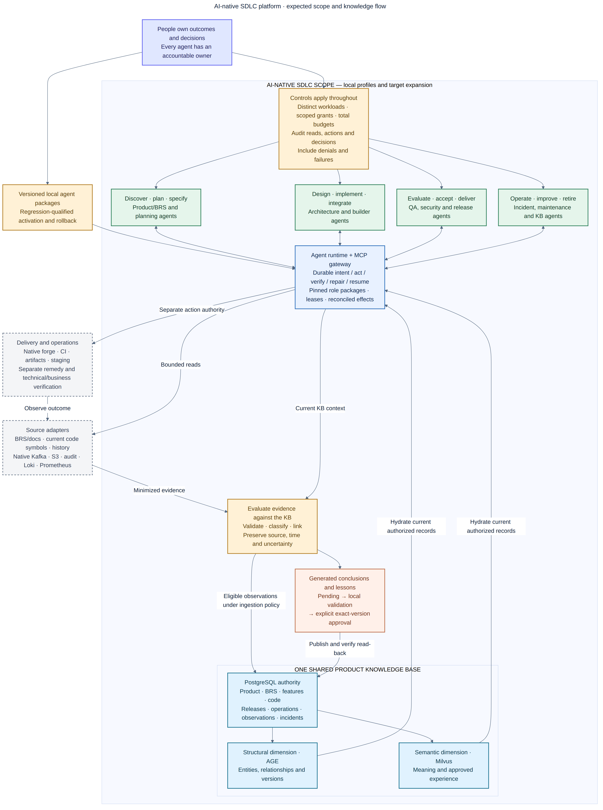
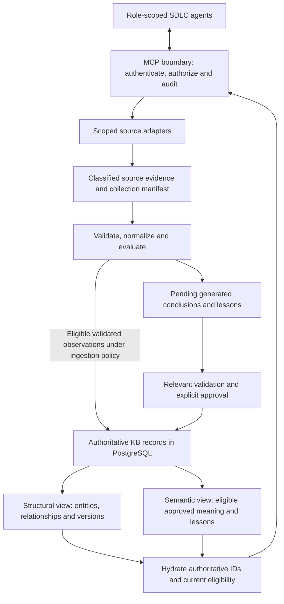

# AI-native SDLC platform: expectations and scope

Navigation: [AI-native lifecycle guide](sdlc-guide.md) ·
[AI-native gap assessment](sdlc-gap-assessment.md) · [Documentation index](README.md).

Target architecture clarified September 13, 2026. Implementation baseline:
`9fba87f23f0e733a6bba0528b505f647bbac5aef`.

This document records the intended product capabilities, their responsibilities
and completion evidence. The [lifecycle guide](sdlc-guide.md) maps them to all
15 SDLC stages; the [assessment](sdlc-gap-assessment.md) compares them with the
implementation and proposes a delivery order. These expectations define the
target, rather than declaring the functionality complete.

## Scope at a glance



[Zoomable SVG](diagrams/ai-native-sdlc-scope.svg) ·
[Editable Mermaid source](diagrams/ai-native-sdlc-scope.mmd).

The scope includes product discovery, BRS and feature definition, architecture,
implementation, evaluation, delivery, operations, improvement and retirement.
The shared KB supports every stage. MCP connects agents to knowledge, source
evidence and authorized actions. Identity, delegated authority, validation and
audit apply across the entire flow. Operational evidence feeds future product
work through governed retention and knowledge publication.

The diagram groups logical capabilities. The execution supervisor belongs at
the OpenClaw/worker boundary; the Go MCP service enforces typed requests and
durable state, with PostgreSQL authority. The combined runtime/gateway box does
not prescribe a single process or move model-driven execution into retrieval.
This retains the boundary in [ADR-0006](adr/0006-bounded-local-execution-and-cloud-review.md).

External repositories, business documents, telemetry, Kafka, data lakes, audit
databases and delivery systems remain authoritative for their source objects.
The platform connects their evidence and effects; it does not require replacing
those systems or copying their complete contents into model context.

### Expectations and related functionality

Each expectation below has a stable reference for planning and assessment.
The linked A-items describe the implementation gaps and their acceptance tests.

| Expectation | Required functionality | Observable completion evidence | Assessment |
|---|---|---|---|
| EXP-01 — Shared two-dimensional product KB | Version and connect products, BRS, features, code, releases, operations, observations and incidents; combine structural and semantic retrieval | Both views resolve to current authorized records with source/version/time lineage | [A01](sdlc-gap-assessment.md#a01), [A04](sdlc-gap-assessment.md#a04) |
| EXP-02 — KB throughout the lifecycle | Build scoped context for every stage and link evaluated results back to the same product entities | A requirement can be traced to code, tests, deployment, observations and later improvements | [A04](sdlc-gap-assessment.md#a04), [A07](sdlc-gap-assessment.md#a07), [A10](sdlc-gap-assessment.md#a10) |
| EXP-03 — MCP source and action capabilities | Discover permitted tools; query documents, code, logs, metrics, Kafka, lake and audit sources; operate delivery systems under separate write authority | Bounded queries and authorized actions have schema, scope, provenance, errors and effect read-back | [A07](sdlc-gap-assessment.md#a07), [A12](sdlc-gap-assessment.md#a12) |
| EXP-04 — Evaluated ingestion and reuse | Validate, normalize, classify, deduplicate and link observations; distinguish facts, calculations, hypotheses and lessons | Invalid evidence is quarantined; generated claims stay pending until required validation and approval | [A04](sdlc-gap-assessment.md#a04), [A10](sdlc-gap-assessment.md#a10) |
| EXP-05 — Accountable agent roles | Bind role responsibilities to workload identity, delegated task, versioned agent configuration and an accountable owner | Each action has an identifiable actor and owner; role changes cannot silently expand authority | [A03](sdlc-gap-assessment.md#a03), [A06](sdlc-gap-assessment.md#a06) |
| EXP-06 — Access control everywhere | Enforce project, source, field, environment, purpose, time and action scope; isolate execution and revoke credentials | Allowed work proceeds; cross-role, cross-project, expired and unauthorized requests fail | [A06](sdlc-gap-assessment.md#a06), [A12](sdlc-gap-assessment.md#a12) |
| EXP-07 — Complete audit and evidence | Correlate reads, writes, decisions, failures and denials with source, agent, policy, validation and actual effects | An authorized reviewer reconstructs a run, including missing evidence, without exposing protected payloads | [A11](sdlc-gap-assessment.md#a11), [A12](sdlc-gap-assessment.md#a12) |
| EXP-08 — Agent execution across the SDLC | Progress accepted intent through bounded planning, implementation, independent evaluation and delivery; support steering and recovery | One increment completes with criterion-level evidence, recoverable state and attributable required decisions | [A01](sdlc-gap-assessment.md#a01), [A02](sdlc-gap-assessment.md#a02), [A05](sdlc-gap-assessment.md#a05), [A07](sdlc-gap-assessment.md#a07), [A09](sdlc-gap-assessment.md#a09) |
| EXP-09 — KB-driven production troubleshooting | Correlate scoped live observations with BRS, deployed code and incident history; test hypotheses and verify authorized remedies | The incident walkthrough below establishes a supported diagnosis and measured business recovery | [A07](sdlc-gap-assessment.md#a07), [A08](sdlc-gap-assessment.md#a08) |
| EXP-10 — Governed continuous improvement | Reuse approved lessons; propose requirement, test, runbook and agent/config improvements from observed outcomes | Relevant local evaluations and attributed rollout/publication decisions precede reuse or activation | [A03](sdlc-gap-assessment.md#a03), [A05](sdlc-gap-assessment.md#a05), [A10](sdlc-gap-assessment.md#a10), [A11](sdlc-gap-assessment.md#a11) |

## The platform's organizing model

The platform centers on a shared, two-dimensional product knowledge base.
It retains **structural knowledge** about entities and their relationships and
**semantic knowledge** about their meaning, behavior and reusable experience.
Agents use both dimensions throughout the SDLC, obtain additional evidence
through MCP tools, perform work under assigned roles, and return evaluated
results to the knowledge lifecycle.

Product knowledge includes business requirements specifications (BRS), source
code, features, contracts, deployments, operational activities, observations
and historical production incidents. A troubleshooting agent should connect
the expected behavior in the BRS to the running code and current observations,
then compare relevant incident history and runbooks before proposing a remedy.

This is a single logical KB with complementary views. PostgreSQL remains
authoritative for identities, versions, facts, relationships, decisions and
lineage. Apache AGE supplies a derived structural graph, while Milvus supplies
derived semantic discovery. A returned graph/vector candidate is hydrated
against current authoritative records before use.

The implementation now adds versioned product/feature/intent/observation/incident
records, bounded source ingestion and business reconciliation to the existing
code, repository, governed-definition and approved-knowledge foundations. See
the [implemented source boundary](product-knowledge-and-evaluated-sources.md).
The complete vocabulary below remains the target. The [local runtime](sdlc-runtime.md)
connects role workers to native Kafka, S3, audit, log and metric readers,
feature delivery and verified incident recovery. Target production access and
additional integration vendors require their own acceptance. `platform_metric_query`
continues to query fixed platform metrics.



Evidence collection, validation, knowledge publication and operational action
are separate capabilities. A source adapter's successful response does not
automatically establish a diagnosis or authorize a production change.

## What the two KB dimensions contain

| Product knowledge | Structural representation | Semantic representation and use |
|---|---|---|
| Product and BRS | Product, domain, actor, business process, requirement ID/version and acceptance criterion | Approved business meaning, constraints and examples used in discovery, design and acceptance |
| Features and contracts | Feature dependencies, API/event/schema versions, flags, owning services and requirement links | Feature behavior, design rationale, compatibility guidance and known limitations |
| Source code | Repository, branch, commit, symbol, call/import/test relationships and artifact bindings | Revision-bound symbol descriptions and approved implementation procedures |
| Releases and operational activities | Artifact digest, environment, deployment/config change, actor, runbook version and actual effects | Approved deployment/recovery instructions and explanations of operational behavior |
| Observations | Source identity, event/collection time, bounded window, offset/snapshot, related service/release and validation state | Scoped evaluated summaries of symptoms or patterns; never presented as timeless live state |
| Incidents and learning | Incident, affected feature, observations, hypotheses, validation, remedy and measured outcome | Approved incident explanations, troubleshooting procedures and prevention lessons |

Versioned product records and a bounded relationship vocabulary are implemented.
The full entity model and automatic lifecycle links in this table remain the
target; see [current record kinds and traversal](product-knowledge-and-evaluated-sources.md#product-records-and-two-dimensional-context).

For example, a target structural path could connect:

```text
Product -> Feature -> BRS requirement -> API/event contract -> Code revision
        -> Release artifact -> Deployment -> Service/Kafka dependency
        -> Time-scoped observation -> Incident -> Verified remediation
```

Attach evidence, source versions and applicable time ranges to each relation.
An inferred dependency or causal link remains a proposal until its required
validation and decision occur. Similar incidents are hypotheses to inspect;
semantic similarity cannot establish root cause.

## MCP connects agents, data sources and the KB

The target MCP boundary exposes three distinct kinds of capability:

| Capability | Purpose | Controls and resulting record |
|---|---|---|
| Read current knowledge and source evidence | Retrieve approved context or collect a bounded source window | Project/role/source scope, parameter validation, purpose, query limits and provenance |
| Validate and ingest evaluated data | Normalize evidence, check integrity/quality and persist governed records | Idempotency, source/schema versions, validation report, classification, lineage and publication state |
| Execute an operational or delivery action | Change source, a release, configuration or an environment | Separate write authority, preconditions, exact target, effect reconciliation, validation and rollback |

The same server can host these capabilities or broker explicitly registered
MCP adapters. Connection credentials belong to the source service/runtime and
are not part of agent context. Tool discovery grants no access by itself.
The agent's role, delegated task, product/project, data purpose and environment
must all permit the request.

### Source adapter requirements

These adapter types describe the target; they are not currently callable tool
names or a promise that their backends have been configured.

| Source | Bounded collection and required provenance | Important validation/limit |
|---|---|---|
| BRS, feature/design documents | Exact document/version, owner, approval status and relevant sections | Preserve requirement identity and accepted meaning; unsupported extraction stays explicit |
| Source code and delivery system | Exact repository/commit, artifact digest, deployment/config version | Match the code to the observed deployment and relevant time |
| Application/infrastructure logs | Authorized service/environment, time range, filters, result cap and source event IDs | Redact protected fields before model context; identify sampling, truncation and retention gaps |
| Metrics/traces | Series/query identity, dimensions, units, aggregation, interval, timestamps and trace IDs | Report missing series, scrape gaps and aggregation semantics; absence of results is not zero |
| Kafka/event streams | Topic, partition, offset range, event time, schema identity and bounded sample/aggregate | Diagnosis must not reset or commit application consumer-group offsets; retain ordering/late-arrival limits |
| Lake or lakehouse data | Dataset/table, partition, snapshot/watermark, query/view version and window | Record freshness, transformations, duplicates and incomplete ingestion |
| Audit database | Approved read-only parameterized view, event/request IDs, actor representation and time window | Minimize sensitive fields, preserve authorization scope and report consistency/clock limits |
| Historical incidents and runbooks | Incident/runbook version, affected releases, validation, decisions and observed outcomes | Check applicability and failed remedies as well as similar successful cases |

Kafka stream evidence and a materialized lake snapshot have different source
identities and freshness. Preserve their lineage independently so a delayed
lake load cannot be mistaken for a missing application event.

Each connector needs explicit query timeout, page/row/byte limits, rate limits,
cancellation and partial-result semantics. The source registry should bind
permitted endpoints/views and parameters. Agents must not turn a broad SQL,
URL or shell input into an unrestricted production data interface.

## From collected data to reusable knowledge

Use the following target ingestion/evaluation path under authorized policy:

1. **Scope the question.** Bind the product, task/incident, environment,
   affected release, permitted sources and time window.
2. **Collect.** Execute the approved query and preserve a source receipt.
   Keep protected raw evidence in its authorized source/evidence store; return
   minimized fields or aggregates to the local agent.
3. **Validate the observation.** Check source authenticity, schema, integrity,
   time/offset coverage, freshness, duplicate identity, units and classification.
   Record unavailable or partial results; quarantine invalid input.
4. **Normalize and link.** Associate validated observations with known product,
   feature, requirement, code, dependency and release IDs. Preserve uncertain
   mappings instead of inventing joins.
5. **Evaluate against the KB.** Compare expected behavior, current observations
   and historical evidence. Separate source facts, derived calculations,
   hypotheses and recommendations. Record support and contradictions.
6. **Verify an interpretation or remedy.** Run relevant reproducible checks,
   an approved experiment or post-action verification. Store the exact
   procedure, source versions, evaluator, actor and outcomes.
7. **Retain and publish appropriately.** Persist eligible validated observations
   under the intended ingestion policy. Generated diagnoses, summaries and
   reusable lessons remain pending candidates until their own validation and
   explicit approval requirements are met.
8. **Project and reuse.** Build eligible structural/semantic projections from
   authoritative records; verify read-back. Subsequent tasks recheck
   applicability, freshness, permission and observation time.

The validated-observation store and source-policy path in step 7 are implemented
by the [evaluated-source boundary](product-knowledge-and-evaluated-sources.md). Existing `generation_capture` creates pending
knowledge. Do not bypass its approval gate by labeling a generated diagnosis
as a source fact or by writing directly to Milvus.

### Validate different kinds of claim differently

| Claim or record | Validation establishes | Storage/reuse treatment |
|---|---|---|
| Source observation | The collector read these values from this source/window and preserved their meaning/integrity | Time-scoped evidence or validated fact under an authorized ingestion contract |
| Derived aggregate | A versioned calculation produces the reported result from the referenced inputs | Retain inputs, query/calculation version, units and limits |
| Agent hypothesis | Evidence supports a possible explanation, with alternatives and uncertainty | Pending inference; source validity alone cannot certify causality |
| Verified remedy | The bounded action/test had the recorded result in the specified conditions | Versioned operational evidence; review applicability before reuse |
| Generalized lesson or runbook | Relevant local validation supports a reusable procedure and an accountable decision approves its exact version | Approved KB retrieval with source/freshness controls |

Raw logs, event bodies, customer rows and production dumps are not automatically
embedded. Keep secrets and personal data out of model context; production
troubleshooting and maintenance inference stay local with no cloud fallback.
Store source references, digests, redacted observations and necessary approved
summaries under their access and retention rules. Validation is not permission
to disclose sensitive content.

Preserve event time, collection time, applicable release and validity interval
separately. Re-ingesting an old incident does not make it a current observation.
Corrections append attributed versions and withdraw stale projection
eligibility while preserving audit history.

## Accountable roles with different responsibilities

Role labels must resolve to authenticated workload identities and policy.
For each run, bind the agent ID, logical role, model/config version, task,
delegating principal, accountable owner and capability set. The runtime
enforces permission; a role written in a prompt cannot grant it.

These are proposed logical specializations mapped onto the existing four human
roles and workload boundaries. They are not newly implemented Cerbos roles.
A small deployment can use one model with separate role-scoped sessions.

| Agent responsibility | Typical KB/source access | Permitted output or effect within assignment | Responsibility boundary |
|---|---|---|---|
| Product/BRS analysis | Approved business definitions, BRS versions, feature outcomes and selected observations | Requirement/specification proposals, ambiguity and coverage reports | Cannot invent business approval or silently change accepted criteria |
| Architecture and planning | Both KB dimensions, current code/contracts, dependencies and incident lessons | ADR proposals, impact analysis and bounded task/work-packet proposals | Cannot expand repository, environment or spending authority |
| Implementation | Allowed source snapshot, accepted spec, relevant approved patterns | Scoped patch, tests and execution evidence | Cannot alter protected evaluators or production data outside a separate capability |
| QA/evaluation | Exact candidate, criteria, controlled tests and necessary evidence | Independently controlled validation results and reproducible failures | Cannot convert model opinion into executed evidence or approve its own generated KB entry |
| Security/policy review | Authorized policy, data classification, sanitized traces and relevant contracts | Findings and proposed control changes | Cannot self-grant roles or activate policy changes through a review response |
| Release/deployment | Verified artifacts, checks, target configuration and runbook | Explicitly authorized release/deployment operations with effect read-back | Cannot infer production authority from staging success |
| Incident diagnosis | Scoped logs, metrics, Kafka/lake/audit evidence plus product/code/incident KB | Validated observations, hypotheses and remedy recommendations | Diagnostic read authority cannot reset offsets, modify data or redeploy services |
| Maintenance/remediation | Current runbook, incident evidence and permitted operational scope | Local-only bounded repair/recovery, tests and verified outcomes | Cannot exceed the assigned action/budget or bypass required decisions |
| Knowledge curation | Provenance, validation, observations, approved context and candidate history | Normalized source proposals, quality checks and pending generalized lessons | Cannot auto-approve or index generated knowledge as certified truth |
| Coordination | Task state, dependencies, capability inventory and evidence references | Schedule work, request task credentials from an authorized issuer, retain handoffs | Cannot impersonate human roles or inherit every worker/source credential |

Agents are operationally accountable through identified actions, obligations
and evidence. Each consequential authorization and publication decision also
has an accountable human/organizational owner. A model's name is provenance;
it is not a substitute for an authenticated actor or responsible owner.

### Access controls at every boundary

Apply least privilege across role, product/project, source, dataset/fields,
environment, task, purpose, time and action. Use expiring delegated credentials,
intersect them with current issuer authority, and enforce revocation.
Maintain different read, propose, validate, approve, execute and administer
capabilities. Keep operator credentials separate from controller/task identities.

Re-authorize at the tool call and at the resulting KB write/action. Check
version/precondition changes at execution time. Separate the controlled
evaluator from the implementation worker; using the same model twice does
not establish independent authority.

The current [Cerbos policies](../policies/cerbos/README.md),
[task delegation](task-delegation.md), service checks and PostgreSQL gates
provide foundations. Connector field-level controls, the expanded entity model
and all new capabilities need their own policy and negative tests.

### Audit every read, write and decision

The target audit trail must reconstruct what was requested, which evidence was
read, who acted, under what authority, what happened and why the next step was
permitted. Record attributable decisions and concise evidence-based explanations.
Every tool call, source/KB read or
write, agent handoff, approval and operational attempt must produce an audit
event, including unsuccessful and denied attempts.

| Audit group | Required references |
|---|---|
| Identity and accountability | Agent/workload ID, logical role, model/config version, delegating principal, accountable owner and acting role |
| Correlation | Product/project, intent/spec version, workflow/task/incident, operation/attempt and parent operation |
| Authorization | Capability/tool version, policy version and decision ID, source/environment scope, allowed/denied result |
| Inputs | Query/parameter digest, exact source/code/config/criteria versions, classification, window/offset/snapshot and collection limits |
| Evidence and interpretation | Result artifact digests, validation ID/version, factual/derived/hypothesis status, support/contradiction references |
| Effects and decisions | Precondition, requested effect, observed external state, approval reference where required, retry/reconciliation and rollback |
| Execution | Start/end, timeout/cancellation/failure, measured resource use and explicit unknown/missing outcomes |

Audit denied requests, failed collections, partial results and rejected
hypotheses as well as successes. Redact sensitive values before storing audit
payloads; a digest/reference can preserve traceability without logging a secret.
Logs/metrics collected as product evidence and the platform's own audit records
are separate datasets with linked provenance.

Preserve exact permitted model output and the disclosed-context manifest as
access-controlled immutable evidence. A user-facing summary links to those
records; it does not replace them or widen access to protected content.

Protected mutations must fail closed if required authorization or durable
audit/transition evidence cannot be established. Preserve append-only history
and content-addressed evidence with integrity verification. Production
immutability, encryption, retention/hold and recovery need the target storage
controls; local hashes alone do not prove a production retention guarantee.

## Production troubleshooting walkthrough

**Illustrative scenario:** accepted orders stop reaching the processed state.
No production collection, diagnosis or remediation is claimed by this example.

| Step | Agent activity through the target platform | Required evidence or decision |
|---|---|---|
| 1. Establish scope | Coordinator opens an incident linked to the product, feature, environment and observation window; requests diagnostic read capabilities | Incident identity, authorized source list, limits and accountable Operations owner |
| 2. Retrieve expected behavior | Analyst combines BRS acceptance criteria and feature meaning with structural links to API, event contract, code, release and dependencies | Exact accepted BRS/version, code/deployment match and applicable known incidents |
| 3. Collect observations | Source tools read filtered logs, metric/trace windows, bounded Kafka evidence, lake snapshots and approved audit views | Query receipts, offsets/snapshots, completeness, redaction and provenance |
| 4. Validate and correlate | Ingestion/evaluation checks schemas, timestamps, duplicates, source integrity and request/event IDs | Validated observations linked to service/release; unmatched or partial records stay explicit |
| 5. Form and test hypotheses | Diagnostic agent compares current evidence with prior incidents and code behavior; evaluator reproduces an explanation using sanitized fixtures | Competing hypotheses, supporting/contradicting evidence and actual test results |
| 6. Prepare a remedy | Remediation agent proposes a bounded rollback/configuration/patch procedure from current runbooks | Authorized write scope, preconditions, checks and recovery plan; human decision if required |
| 7. Act and verify | Execute only within the granted capability; read back service, stream and business-state effects | Actual action receipt, processed-state recovery, backlog/error observations and residual impact |
| 8. Retain and learn | Store permitted validated observations; link incident, causal claim, remedy and outcome; propose generalized lessons | Exact validation/actor/source lineage, pending generated knowledge and later explicit publication decision |
| 9. Improve the product | Planning/evaluation agents propose BRS/contract/test/monitoring improvements from the incident | Linked change tasks and new acceptance tests; later delivery closes the loop |

### Example hypothesis, without inventing a root cause

Suppose the observed records show increasing consumer lag, deserialization
errors and accepted orders without matching processed-state audit events.
The KB connects that consumer to an event schema and a recently changed
producer release. A prior incident describes a similar compatibility problem.

That is grounds to test a compatibility hypothesis. It does not establish that
the new release caused this incident. Check the actual deployed revisions and
schemas, sampling completeness, broker/consumer health, timing and alternative
causes. Reproduce the failure with minimized fixtures and the relevant code
versions. If the evidence remains incomplete, retain an unresolved hypothesis.

A permitted remedy might roll back an incompatible change or apply a tested
compatibility fix. Verify the **business** result from BRS criteria and audit
state, alongside stream progress and service metrics. A process restart or
falling error counter alone does not prove that affected orders recovered.

### What returns to the KB

Retain the incident's source receipts, time-scoped observations, relation
evidence, attempted/failed hypotheses, verification, action and recovery
results under their respective policies. Propose a generalized lesson with
symptoms, prerequisites, diagnosis steps, counterexamples, safe remedy,
validation and applicability bounds.

Later a design agent can use that approved lesson to plan compatibility checks;
a builder can retrieve its implementation pattern; QA can reuse its regression
case; an operations agent can compare a future incident. Every use rechecks
current applicability. This is the shared KB serving the entire SDLC.

## First end-to-end proof

Use synthetic or explicitly approved data in disposable source systems first.
Configure one product/BRS, feature, repository, deployment record and historical
incident, plus log/metric, event-stream and audit fixtures with known outcomes.
Add a lake source if it is required by the chosen incident.

The proof must demonstrate all of the following:

- Structural and semantic retrieval reach the same authorized, current entity
  identities and preserve links to the BRS and deployed code.
- Each role can perform its assigned query/action and is denied another role's
  protected capability, another project's data and an unapproved environment.
- Source collection is bounded, read-only where declared, and reports
  incomplete/late/duplicate/malformed data correctly.
- Invalid or poisoned observations cannot enter normal eligible retrieval;
  uncertain correlations cannot become certified facts.
- Diagnosis distinguishes hypotheses from verified findings and tests a
  relevant explanation before declaring a root cause.
- Remediation requires its own authority, remains local, and verifies the
  intended business outcome; interrupted/repeated calls do not duplicate effects.
- The audit joins source query, agent/role, policy decision, validation, action
  and KB entry and preserves failures, denials and missing outcomes.
- Validated observation retention and pending generated lessons follow their
  separate rules; new knowledge is reusable only after its actual approval and
  projection-readback requirements.

This extends the current platform acceptance boundary. It requires the
connector/model/runtime and governance work in
[A04](sdlc-gap-assessment.md#a04), [A06](sdlc-gap-assessment.md#a06),
[A07](sdlc-gap-assessment.md#a07), [A08](sdlc-gap-assessment.md#a08) and
[A11](sdlc-gap-assessment.md#a11); the existing 28-item result does not certify it.
