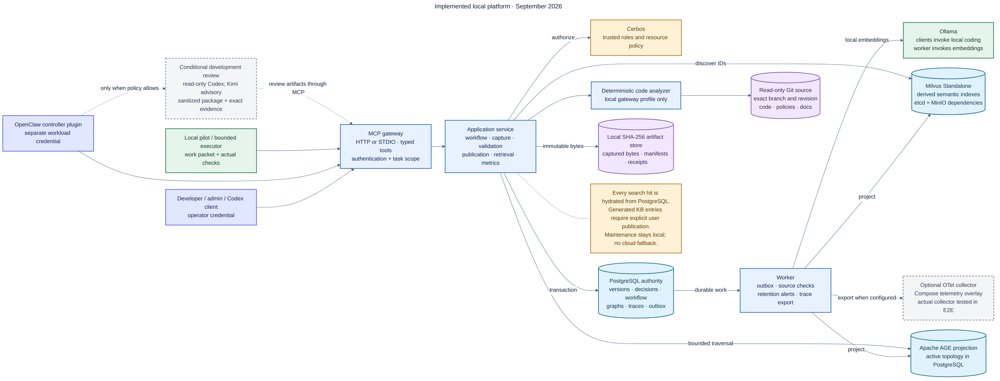
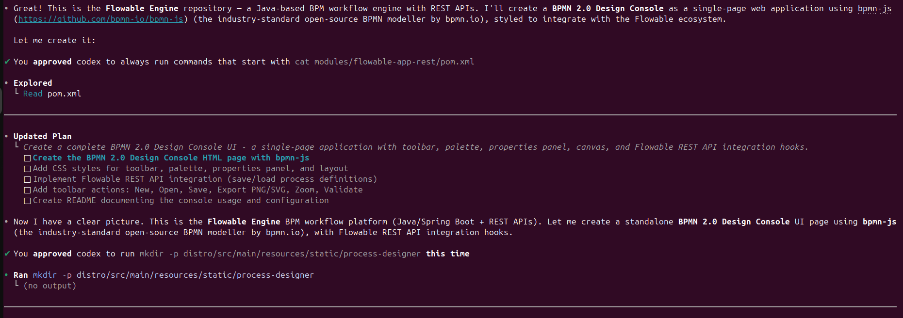
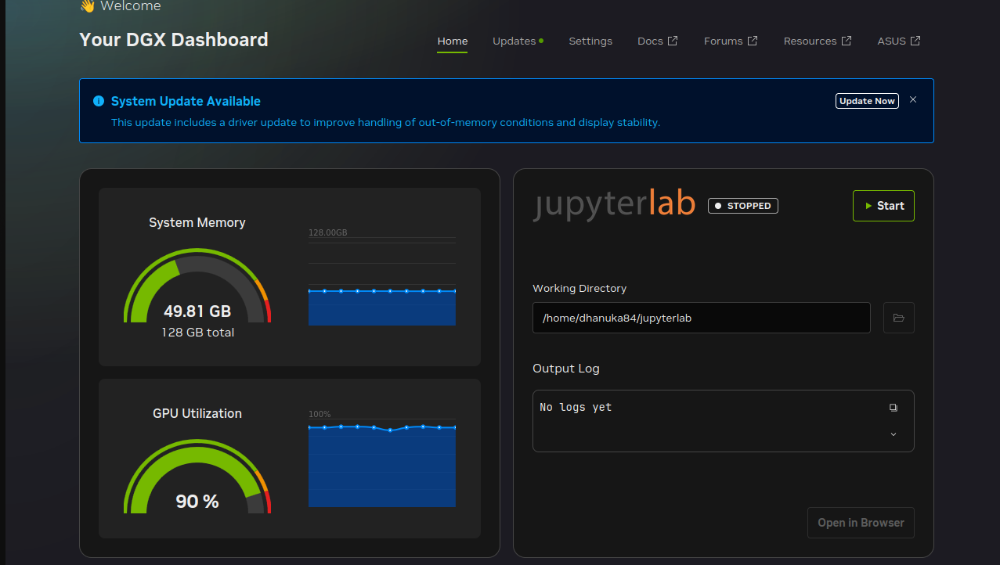

# From Repository Scan to BPMN Designer: A Local Hybrid AI Development Workflow

Large repositories expose the weakness of a purely conversational coding
assistant: the model can read only a fraction of the code at once, and a
plausible answer is not necessarily grounded in the branch actually being
changed. This article builds a different workflow on a single NVIDIA GB10
workstation. We will start the platform locally, index a `java-25` branch of
the open-source Flowable Engine repository, retrieve revision-specific code
context, and use a local Ollama model through Codex to explore a BPMN 2.0
designer UI.

The result is a practical local-hybrid loop:

- Ollama performs local model inference and creates embeddings.
- PostgreSQL stores the authoritative repository catalog, active code graph,
  provenance, workflow state, and indexing outbox.
- Milvus discovers semantically relevant code entities.
- Apache AGE can project active graph topology when available; recursive
  PostgreSQL traversal remains the safe fallback.
- Codex supplies the interactive coding interface.
- MCP provides a typed boundary for health, retrieval, graph traversal, and
  governed writes.
- Cloud review remains optional and explicit. It is not an automatic fallback
  from the local model.



This is an engineering walkthrough, not a claim that the prototype shown here
is a production-ready Flowable designer. The useful outcome is the repeatable
method: establish exact repository identity, retrieve grounded context, make a
bounded change, and validate it without quietly changing model or trust
boundaries.

## What “hybrid” means in this workflow

The word *hybrid* is overloaded, so it helps to be precise.

The default local path combines local inference with several deterministic
data systems. A question is embedded by Ollama, Milvus finds semantic seeds,
PostgreSQL hydrates authoritative records, and the exact graph expands around
those seeds. The answer is still produced by one local model. A separate cloud
Codex or Kimi review can be requested later, after selecting and sanitizing
the context that may leave the workstation.

Codex CLI supports connecting a local client directly to an MCP server, and
its TUI exposes active servers through `/mcp`, as described in the
[official OpenAI MCP documentation](https://learn.chatgpt.com/docs/extend/mcp).
That connection does not, by itself, prove that every open-weight model will
select every custom MCP tool correctly. In the tested configuration,
`qwen3.6:35b` could connect to the MCP server and invoke generic MCP discovery,
but it did not reliably select the custom `platform_status` tool. For that
reason this walkthrough uses deterministic `make mcp-call` retrieval before
starting the local Codex session. Cloud Codex or OpenClaw remains the route for
work that requires reliable model-initiated custom MCP calls.

That limitation is important: this is a working local-hybrid engineering
pipeline, not silent local/cloud model mixing and not a claim of universal
tool-calling compatibility.

## Hardware and software used

The measured run used an ASUS/NVIDIA GB10 workstation with 128 GB unified
memory. The platform itself is containerized and multi-architecture, but GPU
mode requires a working NVIDIA driver and NVIDIA Container Toolkit.

The host needs:

- Docker Engine with Compose v2;
- Git and GitHub CLI where organization synchronization is required;
- Codex CLI;
- sufficient disk for source checkouts, container images, Maven dependencies,
  PostgreSQL, Milvus, and Ollama models;
- a clean Git checkout for reproducible indexing.

All operational examples below use checked-in Make targets. Run them from the
`local-ai-development-platform` repository root. From its parent directory,
use the equivalent `make -C local-ai-development-platform <target>` form.

## 1. Create protected local configuration

Create `.env` without overwriting an existing configuration:

```bash
make env-init
```

Review `.env` before starting the stack. In particular:

- set `CODEGRAPH_HOST_ROOT` to the narrow parent directory containing the
  repository checkout;
- keep `CODEGRAPH_ENABLED=true`;
- keep the generated authentication and database secrets private;
- confirm `LOCAL_CHAT_MODEL=qwen3.6:35b` and
  `OLLAMA_EMBEDDING_MODEL=embeddinggemma` unless deliberately testing another
  compatible model;
- size `CODEGRAPH_MAX_FILES`, `CODEGRAPH_MAX_ENTITIES`, and
  `CODEGRAPH_MAX_RELATIONS` for the repository being analyzed.

The code root is mounted read-only at `/workspace` inside the analyzer-enabled
gateway. Compiler-backed JVM analysis runs from a disposable copy and uses a
separate dependency cache.

Validate configuration and host prerequisites:

```bash
make mcp-preflight
make preflight
```

## 2. Start the local GPU platform

Start the NVIDIA profile while retaining existing volumes:

```bash
make up-gpu
```

Pull the larger local coding model separately; the initial stack start pulls
the embedding model:

```bash
make pull-local-model
make models-list
```

Verify the gateway and its dependencies:

```bash
make mcp-status
make doctor
make mcp-call MCP_TOOL=platform_status MCP_ARGUMENTS='{}'
```

The expected `platform_status` result reports PostgreSQL, Milvus, Ollama, and
Cerbos as healthy. AGE may intentionally use PostgreSQL fallback when the
extension is unavailable; PostgreSQL remains authoritative either way.

Finally, verify the local Codex/Ollama route:

```bash
make codex-local-check
make codex-local-smoke
```

The smoke test proves that Codex is using the configured Ollama provider. It
does not prove that the model can choose every custom MCP tool, which is why
the MCP check above is separate.

## 3. Prepare the Flowable Engine `java-25` checkout

This experiment used a fork that carries a `java-25` branch. Substitute the
URL of a fork where that branch actually exists; do not assume it is the
upstream repository’s default branch.

The single-repository synchronization target clones a missing checkout or
fast-forwards an existing clean checkout. It refuses a dirty tree, a different
origin URL, and an unsafe branch name:

```bash
make repository-sync-one \
  REPO=/home/<user>/projects/open-source/flowable-engine \
  REPOSITORY_URL=https://github.com/example-organization/flowable-engine.git \
  REPOSITORY_BRANCH=java-25
```

Point `CODEGRAPH_HOST_ROOT` at `/home/<user>/projects/open-source` for that
layout, then recreate the GPU stack with `make up-gpu` so Compose applies the
mount.

The catalog keeps three facts distinct:

| Fact | Canonical field | Meaning |
|---|---|---|
| Forge default branch | `default_branch` | Remote catalog metadata, such as `main`. |
| Analysis branch | `branch` | The checked-out branch actually scanned, here `java-25`. |
| Analysis commit | `revision` | The exact full Git commit analyzed. |

The concepts sometimes called `branch_name` and `git_commit` are therefore
present, but the implemented API and SQL names are `branch` and `revision`.

## 4. Scan and index one repository

Run the complete single-repository workflow:

```bash
make repository-index-one-all \
  REPO=/home/<user>/projects/open-source/flowable-engine \
  REPOSITORY_PROJECT=local-development
```

The target performs four bounded operations:

1. resolves and validates the real checkout path below
   `CODEGRAPH_HOST_ROOT`;
2. refuses an uncommitted tree and reads the remote, default branch, active
   branch, and exact commit;
3. invokes `code_repository_index` through the authenticated MCP boundary;
4. waits for asynchronous semantic projection and prints the authoritative
   active snapshot.

The Java/Kotlin path uses SCIP output from compiler-aware analysis. PostgreSQL
commits the analysis run, occurrences, exact relations, and active-head update
atomically. Only after that transaction succeeds does the outbox worker embed
selected entity summaries and upsert them into Milvus.

The measured warm-cache snapshot produced:

```text
repository:       flowable-engine
catalog branch:   main
analysis branch:  java-25
revision:         6c4143e4ade9c9f8d1721b1c45c485309764f652
entities:         107,826
relations:        988,504
analysis time:    approximately 3 minutes 23 seconds
```

Those are measurements from one machine and one commit, not performance
guarantees. Network state, Maven caches, model placement, container storage,
and the exact branch can change the result substantially.

Verify the snapshot again without reindexing:

```bash
make repository-verify-one \
  REPO=/home/<user>/projects/open-source/flowable-engine \
  REPOSITORY_PROJECT=local-development
make repository-org-queue-status
```

The first command should show `main` and `java-25` separately. The second
should show zero pending code projection events before feature work begins.

## 5. Retrieve feature context before asking a model to edit

The feature question is deliberately broad:

> Can we create a BPMN 2.0 designer UI for this repository?

A model can answer “yes” without understanding the repository. The retrieval
step turns that vague question into evidence attached to the indexed branch
and commit.

Start with semantic symbol discovery:

```bash
make mcp-call \
  MCP_TOOL=code_symbol_search \
  MCP_ARGUMENTS='{"project_id":"local-development","query":"REST deployment process definition BPMN XML repository service","limit":10}'
```

Then request bounded graph context scoped to the repository:

```bash
make mcp-call \
  MCP_TOOL=graph_context_search \
  MCP_ARGUMENTS='{"project_id":"local-development","repository":"flowable-engine","query":"Where should a browser BPMN modeler load, validate, save, and deploy BPMN XML through the REST application?","max_hops":2,"seed_limit":8,"max_nodes":40,"max_edges":80}'
```

Milvus supplies likely starting points; the returned code records and edges are
hydrated from the active PostgreSQL snapshot. Semantic similarity is treated
as discovery, not proof. Before changing a file, inspect the exact graph around
the best symbol:

```bash
make mcp-call \
  MCP_TOOL=code_graph_get \
  MCP_ARGUMENTS='{"project_id":"local-development","repository":"flowable-engine","symbol":"<qualified-symbol-from-search>","depth":2}'
```

The official Flowable documentation describes deployments and process
definitions as repository concerns and exposes REST resources for listing
definitions and retrieving deployment resources. Its REST endpoints require
authenticated access and recommend HTTPS with Basic Authentication. A browser
designer should therefore use a same-origin server adapter rather than
embedding credentials in JavaScript. See the
[Flowable REST API documentation](https://www.flowable.com/open-source/docs/bpmn/ch14-REST).

## 6. Shape a bounded BPMN designer experiment

For a proof of concept, `bpmn-js` is a sensible modeling surface. Its official
walkthrough describes it as a browser-based BPMN 2.0 viewer and modeler that
can be embedded in a web application. See the
[bpmn-js walkthrough](https://bpmn.io/toolkit/bpmn-js/walkthrough/).

The experiment should be split into independently testable pieces:

1. **Modeling surface** — embed the BPMN modeler, create a blank diagram, and
   import/export BPMN 2.0 XML.
2. **Application shell** — add a toolbar, palette, canvas, properties region,
   status/error area, keyboard handling, and responsive layout.
3. **Validation** — report XML/import failures and distinguish browser-side
   modeling checks from server-side engine validation.
4. **Flowable adapter** — list process definitions, retrieve BPMN resources,
   and deploy new XML through an authenticated same-origin backend.
5. **Security** — keep credentials and tokens out of browser storage, require
   HTTPS outside loopback development, constrain CORS, enforce CSRF protection,
   and log accountable deployment actions.
6. **Quality** — cover import/export round trips, keyboard accessibility,
   representative BPMN constructs, REST failures, and rollback behavior.

A static directory inside a distribution module can demonstrate the UI, but
it is not automatically the right product boundary. Retrieval should first
confirm how the chosen Flowable application packages static resources, exposes
REST endpoints, and applies authentication. A production implementation may
belong in a dedicated frontend module with an explicit server adapter instead.

## 7. Start local Codex in the target repository

Launch Codex with Ollama as the model provider:

```bash
make codex-local-repo \
  REPO=/home/<user>/projects/open-source/flowable-engine
```

The session should report `qwen3.6:35b`, not a cloud GPT model. A useful first
prompt is:

```text
We are evaluating a BPMN 2.0 designer UI on the indexed java-25 revision.
Use the retrieved code-symbol and graph-context evidence supplied with this
task. Inspect the current repository before proposing files. Design a bounded
proof of concept using bpmn-js with import/export, validation, and a
same-origin Flowable REST adapter. Do not place credentials in browser code.
First return the architecture, affected modules, security constraints,
acceptance criteria, and deterministic validation plan. Do not edit until the
plan is approved.
```

After approving the bounded plan, allow the agent to create only the agreed
files. Avoid granting broad permanent command prefixes merely to remove
friction; approve the narrow operations needed for this experiment.



The screenshot captures the local coding loop identifying the Java/Spring and
REST context, choosing a browser BPMN modeler, and expanding the work into UI,
integration, export, validation, and documentation steps. It is evidence of a
prototype session, not evidence that all acceptance criteria have passed.

## 8. Observe local resource use

During the captured run, the GX10 dashboard showed approximately 90% GPU
utilization and 49.81 GB of 128 GB unified memory in use:



This is a point-in-time observation rather than a benchmark. The useful
operational lesson is that the 35B local model leaves meaningful memory
headroom for PostgreSQL, Milvus, Ollama, containers, analyzer caches, and the
desktop. GPU saturation during inference is expected; sustained out-of-memory
pressure, queue growth, or repeated model eviction is not.

Check platform health during a long session with:

```bash
make mcp-status
make repository-org-queue-status
```

## 9. Validate before calling the feature complete

The prototype is complete only when behavior, integration, and security are
verified. At minimum, require:

- a BPMN XML import/export round trip with no semantic loss;
- creation and editing of representative events, tasks, gateways, sequence
  flows, pools, and lanes;
- deterministic error reporting for invalid XML;
- load and deployment through a server-side authenticated adapter;
- no credentials in source, generated bundles, local storage, screenshots, or
  captured prompts;
- keyboard navigation and basic accessibility checks;
- documented configuration and rollback;
- repository-native tests at the exact base revision.

For a governed patch, encode the allowed files and exact checks in a work
packet, evaluate it, and validate the resulting patch in a disposable clone:

```bash
make workpacket-evaluate \
  PACKET=/absolute/path/to/bpmn-designer-work-packet.json
make workpacket-verify \
  PACKET=/absolute/path/to/bpmn-designer-work-packet.json \
  PATCH=/absolute/path/to/bpmn-designer.patch
```

The verifier applies the patch to the declared revision, enforces scope and
size limits, and runs the packet’s explicit command-and-argument checks without
modifying the original checkout.

## 10. Add optional independent cloud review

Local implementation and cloud review are separate trust lanes. If policy
permits cloud review, package only the bounded diff, relevant interfaces,
sanitized test output, and specific questions. Do not send the entire indexed
repository or raw database context merely because the model has a large
context window.

Use the cloud Codex route only when that explicit review is intended:

```bash
make codex-repo \
  REPO=/home/<user>/projects/open-source/flowable-engine
```

The local route and cloud route are deliberately different Make targets. This
prevents an unavailable local model from silently changing the disclosure
boundary. Any useful review finding remains a candidate until it is reproduced
locally, validated, and approved.

## What this experiment demonstrates

The important result is not that an agent can generate HTML and CSS. It is
that a local workstation can maintain a revision-specific understanding of a
large Java repository and use that evidence in a governed development loop.

The workflow preserves several invariants that ordinary chat-based coding
does not:

- repository, branch, and commit attribution are explicit;
- a failed scan cannot replace the active graph;
- exact code relations stay in PostgreSQL even when semantic search is used;
- vector indexing is asynchronous and rebuildable;
- the local model and optional cloud reviewer are visibly different routes;
- a single user can perform development, QA, product-owner, and operations
  roles in solo mode while each transition still records its acting role;
- validation evidence, not model confidence, determines whether the change is
  complete.

## Closing thought

“Can we build a BPMN 2.0 designer?” is an easy question to answer with a demo.
The harder and more valuable question is whether we can build it against the
right branch, through the right integration boundary, with reproducible
evidence and without leaking the codebase to an unintended model provider.

On one GB10 workstation, the combination of Ollama, PostgreSQL, Milvus,
compiler-aware indexing, MCP, and Codex gets us much closer to that standard.
The remaining local-model tool-selection limitation is visible and testable,
which is exactly how a trustworthy hybrid architecture should fail: explicitly,
without pretending that registration is the same as correct execution.

