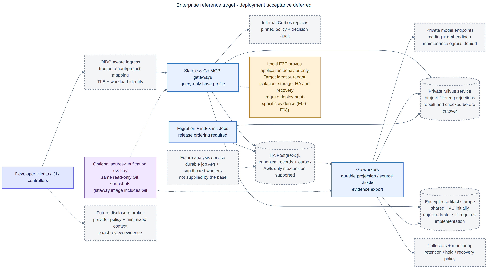

# Enterprise Deployment

## Plain-English summary

The enterprise version keeps the same behavior and data rules. It replaces
single-machine services with highly available managed or distributed services,
uses organization identity instead of static tokens, and adds stronger network,
secret, audit, and recovery controls. PostgreSQL is still the official record,
and Milvus is still a rebuildable search index.

## Invariants

The enterprise deployment changes scale and identity, not semantics:

- PostgreSQL remains authoritative.
- Milvus remains derived and project/tenant filtered.
- Exact revisioned code graphs remain in PostgreSQL; Milvus code vectors use the same stable entity UUIDs.
- Knowledge and repository relations require provenance and approval.
- Maintenance remains local/private with no cloud fallback.
- Cloud review is explicit, minimized, and audited.
- Exact reviewer output and disclosed-context manifests are immutable evidence;
  only approved generalized improvements enter semantic retrieval.
- MCP is the typed client boundary.

## Target mapping

| Local | Enterprise |
|---|---|
| One gateway container | Stateless gateway replicas, HPA, PodDisruptionBudget. |
| Static bearer token | OIDC/OAuth at API gateway; workload identity/mTLS internally; replicated Cerbos PDPs for contextual authorization. |
| PostgreSQL container | Managed HA PostgreSQL, multi-AZ, PITR, connection pooler. |
| Milvus Standalone | Milvus Distributed on Kubernetes or managed Zilliz/Milvus. |
| Local artifact volume | Encrypted, versioned S3-compatible object storage. |
| One worker | Independently scaled worker deployment partitioned by tenant/project. |
| Synchronous analyzer in local gateway | Durable analysis queue plus sandboxed, autoscaled analyzer workers partitioned by tenant/repository. |
| PostgreSQL outbox polling | Keep polling initially; add CDC to Kafka/NATS only after measured need. |
| One Ollama daemon | Private GPU inference pool with model routing and quotas. |
| Local Kimi/OpenAI credentials | Central egress broker, DLP, per-project policy, cost limits. |
| Local content-addressed review evidence | Encrypted, versioned object storage with tenant keys, retention policy, legal hold where required, and PostgreSQL references. |

## Deployment topology

The Kustomize base under `deploy/kubernetes/base` deploys only the application layer. PostgreSQL, Milvus, Ollama/GPU inference, object storage, identity, and ingress are platform dependencies and should be provisioned with their supported operators or managed services.

The gateway uses the MCP SDK's stateless Streamable HTTP mode, allowing ordinary request balancing across replicas. Keep client compatibility tests in the release gate because older clients may negotiate an earlier MCP revision; do not enable server-to-client request features that require a durable session.

## Multi-tenancy

`project_id` is the current logical namespace. Enterprise deployments should derive it from authenticated authorization, not trust a model-supplied value. The gateway verifies OIDC/workload identity, loads trusted project/resource context, and asks an internal Cerbos PDP whether the action is allowed. PostgreSQL transition rules and, where needed, row-level security remain a second enforcement layer. Include tenant/project in Milvus partitioning or scalar filters and in object-store prefixes.

Run multiple stateless Cerbos PDP replicas behind an internal service. Build,
test, sign, and promote policy bundles independently of application releases;
pin each deployment and record the decision call ID/policy version with the
application audit event. Cerbos Hub is optional for centralized policy
distribution and decision-log operations—the self-hosted PDP remains in the
data path. A PDP outage must deny protected mutations rather than bypass policy.

## Repository and code graphs at scale

PostgreSQL recursive CTEs are suitable for bounded product graphs. If deep, high-rate topology traversal becomes a measured bottleneck, introduce a graph projection (for example Neo4j) behind a domain interface. PostgreSQL must remain the authority, and updates should flow through the same outbox/CDC pattern. Milvus complements the graph with semantic discovery; it does not replace edge integrity or traversal.

Do not run repository analysis inside stateless enterprise MCP gateways. `CODEGRAPH_ENABLED=false` removes the synchronous filesystem indexing tool while retaining symbol search and exact traversal. OpenClaw or CI submits durable jobs to a separate control-plane API; sandboxed analyzer workers consume those jobs, fetch an immutable revision, emit a deterministic snapshot, and let PostgreSQL atomically advance the repository head. Use incremental changed-file analysis, repository-scoped partitioning, batched projection events, retention for old runs, and explicit per-tenant resource quotas when scaling to thousands of repositories.

## Availability and consistency

Writes are strongly consistent in PostgreSQL. Milvus indexing is eventual. Track:

- Oldest pending outbox age.
- Attempts and terminal/repeated errors.
- PostgreSQL-to-Milvus projection delay.
- Repository analysis queue age, duration, failures, and active-revision freshness.
- Search fallback rate.
- Embedding latency and dimension errors.
- Candidate approval/rejection/revision rates.
- Cloud review volume, exported bytes, latency, and cost.
- Review artifact/manifest completeness and orphan-object cleanup lag.
- Finding dispositions, local reproduction pass rate, and approved-lesson retrieval quality.

The gateway can continue exact PostgreSQL retrieval during a vector outage. Repository and code semantic discovery are unavailable, but exact graph traversal from a known repository or symbol remains available.

Cloud review should pass through a dedicated disclosure broker. It derives the
tenant and purpose from workload identity, applies DLP and provider policy,
issues a short-lived review capability, records the immutable context manifest,
and sends only the approved package. Reviewer output returns to the evidence
pipeline, not directly to Milvus. The end-to-end contract remains the one in
[Remote Review and Local Learning](remote-review-learning.md).

## Delivery phases

1. Run Compose on one trusted GB10 host and establish retrieval/approval evaluation sets.
2. Move PostgreSQL and artifacts to managed durable services while retaining local Milvus/Ollama.
3. Deploy gateway/workers to Kubernetes behind identity-aware ingress.
4. Move Milvus to distributed mode and reindex from PostgreSQL.
5. Add dedicated GPU inference pools, policy egress broker, observability, and autoscaling.
6. Add CDC/event streaming only when outbox polling no longer meets measured latency/throughput targets.

The visual transition is captured in [hybrid-ai-local-to-enterprise-evolution.png](diagrams/hybrid-ai-local-to-enterprise-evolution.png) and its Mermaid source.
