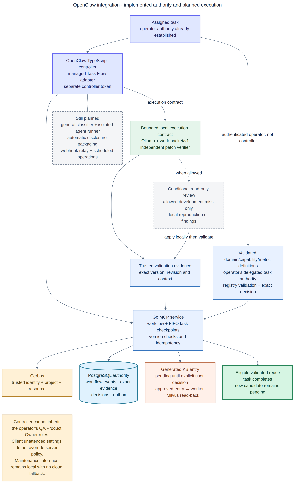

# OpenClaw Agentic Automation Design and Implementation Plan

**Status:** Core foundation implemented; full automatic execution is still planned

**Last updated:** 2026-08-09

**Scope:** Automate the Operations, Development, QA, and Product Owner
workflows without removing accountable human approval or PostgreSQL authority.

## Plain-English summary

OpenClaw coordinates the steps but does not become the source of truth. The Go
service checks every workflow change, Cerbos checks permission, and PostgreSQL
saves the official result. Local agents use Ollama. Codex or Kimi can provide
an optional cloud review after the context is minimized and policy allows it.
A human still makes the final knowledge decision.

The foundation is working now:

- PostgreSQL principal, governance, workflow, event, step, and approval schema;
- authenticated human and workload principals with a four-role solo human by
  default and a separate non-human OpenClaw controller;
- fail-closed Cerbos enforcement, decision correlation, and policy tests;
- optimistic/idempotent Go workflow transitions and immutable evidence;
- workflow-aware generation, review, and knowledge records;
- an installable, tested OpenClaw managed Task Flow adapter;
- versioned JSON contracts and bounded Development, QA, and maintenance
  Lobster pipelines.

The automatic classifier, isolated worktree runner, cloud-disclosure packager,
webhook relay, scheduled Operations jobs, and enterprise identity/high-
availability controls are still planned. Do not describe those parts as fully
automatic yet.

## 1. Design summary

The design uses five parts:

1. **OpenClaw Managed Task Flow** remembers progress, waits, retries, and
   cancellation for each multi-step task.
2. **Lobster workflows** run fixed command sequences and can pause and resume at
   approval points.
3. **Role-specific agents** perform limited Development, QA, cloud-review, and
   Operations work in isolated sessions or worktrees.
4. **Cerbos** decides whether an authenticated person or service may act.
5. **The Go MCP service and PostgreSQL** validate changes and keep the official
   identities, roles, workflows, evidence, knowledge, graphs, and outbox.

OpenClaw's task database helps it coordinate work. It is not the official
product workflow or knowledge database. Every important change is also written
to PostgreSQL with retry protection and a version check.



The editable source is retained as
`diagrams/openclaw-agentic-automation-workflow.mmd`; documentation links use
the high-resolution PNG above.

## 2. Why these OpenClaw mechanisms

Use each mechanism for one purpose:

| OpenClaw mechanism | Platform use |
|---|---|
| [Managed Task Flow](https://docs.openclaw.ai/automation/taskflow) | Durable multi-step orchestration, linked background tasks, wait states, revision conflicts, cancellation, and restart recovery. |
| [Background tasks](https://docs.openclaw.ai/automation/tasks) | Audit ledger for subagents, ACP/Codex runs, cron executions, and detached commands. |
| [Lobster](https://docs.openclaw.ai/tools/lobster) | Deterministic pipelines, structured envelopes, approval checkpoints, and resume tokens without re-running completed steps. |
| [Subagents](https://docs.openclaw.ai/tools/subagents) | Isolated local Development, QA, and review work with explicit target-agent allowlists. |
| [ACP/Codex agents](https://docs.openclaw.ai/tools/acp-agents) | Optional Codex coding/review harness controlled by OpenClaw and tracked as a task. ACP execution is host-side and requires its own permissions boundary. |
| [Webhooks](https://docs.openclaw.ai/webhook) | Authenticated issue, pull-request, CI, and platform-event triggers using a dedicated token and agent allowlist. |
| [Cron](https://docs.openclaw.ai/automation/cron-jobs) | Exact schedules for backups, retrieval evaluations, stale-flow audits, and periodic code-graph refresh. |
| [Heartbeat](https://docs.openclaw.ai/automation) | Batched lightweight operational awareness; never a durable business workflow. |
| [Standing orders](https://docs.openclaw.ai/automation/standing-orders) | Persistent role authority, escalation rules, and execute-verify-report discipline in each agent workspace. |
| [Typed plugin hooks](https://docs.openclaw.ai/plugins/hooks) | Block disallowed tool calls, enforce workflow/role context, and emit telemetry. Internal lifecycle hooks are not the business workflow engine. |
| [Exec approvals](https://docs.openclaw.ai/tools/exec-approvals) | Host command allowlists and operator prompts in addition to agent tool policy. |

The workflow controller should be a TypeScript OpenClaw plugin because managed
Task Flow and typed hooks are native plugin-runtime contracts. The MCP gateway,
state machine, evidence store, graph truth, and approval transactions remain Go
services. This does not reverse ADR-0001; TypeScript is confined to the
OpenClaw integration boundary.

## 3. Design invariants

1. PostgreSQL is authoritative for business workflow and approval state.
2. Milvus contains only approved semantic projections.
3. OpenClaw may propose a transition but the Go service validates it.
4. Models cannot approve their own output or impersonate a human actor.
5. Product Owner promotion remains a human approval in the initial release.
6. Maintenance remains local-only with no Kimi, OpenAI, Codex, or external
   browsing route.
7. Restricted data never enters a cloud-review package.
8. Confidential cloud disclosure always waits for an authorized human.
9. Every model call, tool run, patch, context manifest, test result, review, and
   decision is linked by stable workflow/step IDs and immutable artifacts.
10. Every side effect is idempotent, bounded, cancellable, and has a rollback
    or compensation instruction.
11. Retries are limited and policy-driven; a model cannot retry indefinitely.
12. Workflow cancellation is sticky and prevents new work.
13. Cerbos decides whether an action is authorized; the Go state machine still
    decides whether the transition is valid and PostgreSQL commits it.
14. Protected writes fail closed when authorization cannot be evaluated.

## 3.1 Governance profiles

Role separation is about explicit responsibilities and gates, not necessarily
four employees. Configure the policy per project:

| Profile | Human arrangement | Enforcement |
|---|---|---|
| `solo` | One authenticated person may hold Operations, Development, QA, and Product Owner roles. | Each action records an explicit `acting_role`; QA evidence and Product Owner decision remain separate transitions. Models still cannot perform human gates. |
| `team` | One or more people may hold overlapping roles. | Project policy may require a different principal for selected high-risk gates. |
| `regulated` | Separation of duties is mandatory. | Configured gates require distinct authenticated principals; two-person disclosure or Operations approval can be enforced. |

In solo mode, one login can have all four role bindings. The person does not
need four credentials or four OpenClaw accounts, but must deliberately resume a
waiting flow in the required role. For example, the same principal may
implement as `development`, inspect the independent automated QA evidence as
`qa`, and later decide as `product_owner`. The event log preserves all three
acting-role transitions.

The policy object should support:

```json
{
  "governance_profile": "solo",
  "allow_role_overlap": true,
  "require_distinct_principals_for": [],
  "always_human_gates": ["product_approval", "confidential_disclosure"],
  "two_person_gates": []
}
```

A regulated project can instead list gates such as `product_approval`,
`restricted_maintenance`, or `confidential_disclosure` under
`require_distinct_principals_for`/`two_person_gates`.

## 4. Logical architecture

```text
manual request / Git webhook / CI event / cron
                  |
                  v
OpenClaw hybrid-workflow-controller plugin
  managed Task Flow + typed hooks + task ledger
                  |
       +----------+-----------+
       |                      |
       v                      v
Lobster deterministic     role-specific subagents / ACP
pipelines and gates       local dev · QA · Kimi · Codex · ops
       |                      |
       +----------+-----------+
                  |
                  v
role-scoped MCP tools over loopback/private network
                  |
                  v
Go workflow/knowledge service
       | authorization check
       v
 Cerbos PDP · versioned policies · decision audit
                  |
       +----------+------------------+
       |          |                  |
       v          v                  v
 PostgreSQL   Artifact CAS       outbox workers
 workflow +   exact evidence        |
 graph truth                       v
                              Ollama embedding → Milvus
```

## 5. Role-specific agents

### 5.1 Workflow coordinator

**Model:** local Ollama model.  
**Authority:** classify, create a plan, select the next permitted role, and
start/observe tasks.  
**Tools:** workflow-control tools, read-only knowledge/graph tools,
`sessions_spawn`, Task Flow, and Lobster.  
**Denied:** repository writes, final approval, unrestricted shell, direct
cloud-provider tools, and production actions.

Configuration requirements:

- `subagents.requireAgentId=true`;
- explicit `allowAgents` containing only Development, QA, and configured review
  agents;
- `maxSpawnDepth=1` initially;
- bounded concurrency, preferably two to four local child tasks;
- isolated context by default;
- a workflow ID is required on every agent task.

### 5.2 Local Development agent

**Model:** `ollama/qwen3.6:35b` or the configured local coding model.  
**Workspace:** managed worktree or disposable clone.  
**Authority:** inspect, implement, run allowlisted checks, produce a patch, and
capture a pending generation.  
**Denied:** knowledge approval, product decision, production deployment,
credential access, and unapproved cloud calls.

The agent receives a validated `hybrid-ai/work-packet/v1`, approved knowledge,
exact graph context, and current revision. It returns a structured result:

```json
{
  "status": "implemented",
  "patch_artifact_sha256": "...",
  "changed_files": ["..."],
  "checks_requested": [["go", "test", "./..."]],
  "assumptions": ["..."],
  "escalations": []
}
```

### 5.3 Codex Development/review agent

Codex remains optional. Prefer OpenClaw's native Codex integration when it is
enabled; use explicit ACP only when that runtime model is required. Codex uses
the same bounded task package and repository root as local Development.

ACP does not inherit OpenClaw's sandbox around the external harness. Therefore:

- use a disposable worktree or clone;
- set a constrained `cwd`;
- configure Codex permissions/approvals independently;
- never give the harness the Product Owner approval credential;
- run the independent work-packet verifier after the harness completes.

### 5.4 QA agent

**Model:** separate local Ollama session by default; Codex may be an explicit
independent reviewer for eligible Development work.  
**Workspace:** clean disposable clone at the candidate base plus patch.  
**Authority:** replay checks, add QA-specific checks, perform graph impact
analysis, compare acceptance criteria, and record a review.  
**Denied:** changing the authoritative Development worktree, final promotion,
and relaxing work-packet limits.

QA output must be schema-validated and contain:

- acceptance-criterion results;
- exact command results and artifact hashes;
- scope/diff verification;
- review-finding dispositions;
- residual risks;
- `pass`, `fail`, or `needs_human` recommendation.

### 5.5 Cloud review agents

Use distinct Kimi and Codex reviewer identities. They receive only the immutable
sanitized package, not unrestricted MCP search or filesystem access.

- Kimi: architecture, tradeoffs, optimization, and cross-service reasoning.
- Codex: code correctness, diff review, test gaps, and implementation quality.
- No shell, process, patch, deployment, or canonical knowledge tools.
- Raw output and disclosed-context manifest always return to the evidence
  pipeline.

### 5.6 Product Owner assistant

This agent prepares an approval preview but cannot decide. It summarizes:

- original acceptance criteria;
- Development outcome;
- QA evidence and unresolved risks;
- cloud-review disclosures and dispositions;
- proposed reusable knowledge and applicability boundaries.

The human Product Owner approves or rejects through an authenticated approval
surface. The decision records the real actor identity, acting role, timestamp,
preview artifact hash, and workflow revision. In `solo` mode this may be the
same human who acted as Development and QA; the decision is still a separate
human transition and never a model action.

### 5.7 Operations monitor and maintenance executor

Split these into two profiles:

- `operations-monitor`: read-only health, capacity, queue, backup, and stale-flow
  checks triggered by heartbeat/cron.
- `maintenance-executor`: local-only model with approval-gated, allowlisted
  operational commands and explicit rollback.

For a hard offline guarantee, run maintenance in a separate gateway/container
or OS identity with egress denied. Agent configuration alone is not a network
security boundary.

## 6. Authoritative workflow state machine

```text
intake
  ├─> needs_clarification ─> intake
  └─> classified
        ├─> policy_rejected
        ├─> awaiting_plan_approval       (medium/high risk)
        └─> ready
              └─> implementing
                    ├─> implementation_failed
                    └─> verifying
                          ├─> revision_required ─> implementing
                          ├─> review_packaging
                          │     ├─> awaiting_disclosure_approval
                          │     └─> reviewing
                          │           └─> reconciling ─> verifying
                          └─> qa_validating
                                ├─> qa_failed ─> revision_required
                                ├─> awaiting_human_qa
                                └─> qa_validated
                                      └─> awaiting_product_approval
                                            ├─> product_rejected
                                            └─> promotion_pending
                                                  └─> completed
```

`blocked`, `cancel_requested`, `cancelled`, and `failed` are reachable from
every active state under controlled rules. A workflow never transitions from a
terminal state back to active; a revision creates a new attempt under the same
workflow.

Every transition request contains:

```json
{
  "workflow_id": "uuid",
  "expected_version": 12,
  "event": "QA_VALIDATED",
  "actor": {"principal_id": "qa-agent", "role": "qa"},
  "idempotency_key": "workflow-id:qa:attempt-2:validated",
  "evidence_artifact_sha256": "...",
  "occurred_at": "RFC3339 timestamp"
}
```

PostgreSQL rejects invalid role/state combinations, stale versions, reused keys
with different payloads, and missing evidence. It enforces distinct principals
only when the selected project governance profile requires them.

## 7. Automated Development flow

### 7.1 Intake and classification

1. Trigger creates a workflow with request, project, repository roots, actor,
   and correlation ID.
2. A local JSON-only classifier proposes task class, data classification,
   affected repositories, risk categories, acceptance criteria, and review
   need.
3. Deterministic policy validates the proposal and creates the work packet.
4. Ambiguous acceptance criteria or repository scope moves the flow to
   `needs_clarification`; the agent must not guess.

### 7.2 Retrieval and planning

The coordinator automatically calls:

- `knowledge_search`;
- `repository_graph_get` and relationship search when product impact is likely;
- `code_symbol_search`, followed by exact `code_graph_get`;
- current Git revision and dirty-state inspection.

The retrieval manifest records IDs, versions, scores, graph roots, and source
revision. The local agent receives authoritative hydrated content, never raw
Milvus documents.

### 7.3 Implementation and deterministic verification

1. Spawn Development in an isolated managed worktree.
2. Require a unified patch and structured result.
3. Run `workpacket verify` through Lobster in a disposable clone.
4. Permit at most two implementation attempts by default.
5. A second failure becomes `blocked`; it does not trigger silent cloud
   fallback.
6. Capture the validated generation and artifacts as pending.

### 7.4 Review selection

The policy engine, not the model alone, selects:

| Condition | Review lane |
|---|---|
| Local-only maintenance or restricted data | No cloud review. Local QA only. |
| Low-risk, small, fully tested Development change | Local QA; optional sampled remote review. |
| Medium-risk or cross-repository change | Local QA plus Codex or Kimi according to concern. |
| Architecture, security, migration, concurrency, or high impact | Kimi and/or Codex plus human QA. |
| Confidential data | Human disclosure approval before any cloud call. |

The context packager uses allowlisted files/snippets, secret scanning, maximum
bytes, data classification, and immutable hashes. A model may recommend context
but cannot bypass the packager.

### 7.5 Reconciliation and QA

1. Store raw reviewer output and context manifest as evidence.
2. Local Development maps every finding to accepted/rejected/deferred with a
   reason.
3. Accepted changes are reproduced locally, not pasted into knowledge.
4. Verification reruns from a clean clone.
5. QA independently replays the patch and tests.
6. QA records its structured verdict; high-risk or uncertain results wait for a
   human QA actor.

### 7.6 Product decision and knowledge promotion

After QA validation, the Product Owner assistant creates a read-only approval
preview. Lobster/Task Flow waits. A human Product Owner decision triggers the
server-side transition. Approval creates the existing PostgreSQL outbox event;
the Ollama embedding worker projects the approved generalized item into Milvus.

## 8. Automated Operations flow

### Heartbeat checks

Use heartbeat only for a short batched checklist:

- gateway liveness/readiness;
- outbox oldest age;
- failed indexing count;
- active workflow stalls;
- low disk/model-storage warning;
- failed backup or unavailable local model.

Heartbeat reports anomalies but does not own durable retries or destructive
recovery.

### Cron jobs

Use isolated cron tasks for:

- daily PostgreSQL/artifact backup verification;
- nightly stale-flow and task audit;
- weekly retrieval/regeneration evaluation;
- scheduled code-graph refresh for changed repository revisions;
- monthly restore drill reminder and dependency review.

Each job creates an OpenClaw task and writes its outcome/evidence to PostgreSQL.

### Maintenance execution

1. Detect or receive an incident.
2. Retrieve approved runbooks and current local telemetry.
3. Produce an action, risk, rollback, and validation plan.
4. Run read-only diagnosis automatically.
5. Pause before restarts, writes, permission changes, upgrades, or destructive
   commands.
6. Human Operations approval resumes the Lobster workflow.
7. Execute one bounded action, verify, and stop or escalate.
8. Capture a pending incident lesson; QA/Product Owner gates still apply.

## 9. Automation matrix

| Current manual task | Target automation | Human remains required when |
|---|---|---|
| Start/status checks | Operations standing order plus health task | Initial installation, credentials, or repeated failure. |
| Task classification | Local schema-constrained classifier plus deterministic policy | Ambiguous scope, classification conflict, or high risk. |
| Knowledge/graph retrieval | Coordinator retrieves and records manifest | Developer disputes relevance or source is stale. |
| Work-packet creation | Generated from validated classification and repository state | Protected category, destructive action, or missing rollback. |
| Local implementation | Isolated Development subagent | Requirements are unclear or attempts are exhausted. |
| Patch verification | Lobster invokes Go verifier deterministically | Check definition is unsafe or unavailable. |
| Remote reviewer selection | Policy rule based on risk and concern | Confidential disclosure or exceptional provider use. |
| Context minimization | Deterministic packager and secret/DLP scan | Scanner flags content or confidential data is needed. |
| Review disposition | Local reconciliation agent proposes per-finding outcomes | Security/high-severity finding, disagreement, or uncertainty. |
| QA execution | Independent clean-clone QA agent | High risk, failed checks, waiver, or sampled audit. |
| Candidate capture | Automatic after verified step | Capture contains restricted material. |
| Product approval | Assistant prepares preview | Always human initially. |
| Embedding/indexing | Existing PostgreSQL outbox and worker | Repeated projection failure or model/dimension migration. |
| Platform monitoring | Heartbeat, cron, tasks audit | Alert threshold exceeded. |
| Maintenance action | Read-only diagnosis and plan generation | Any material side effect. |

## 10. Required Go/MCP platform changes

### 10.1 Identity and authorization

The single local bearer token is insufficient for autonomous role separation.
Add:

- service principals for controller and agent runtimes, plus human principals
  that may hold one or several acting-role bindings;
- hashed local tokens mapped to principal, project, and scopes;
- enterprise OIDC/workload-identity adapter later;
- a self-hosted Cerbos PDP queried by the Go gateway on every protected action;
- versioned Cerbos resource policies and tests stored under `policies/cerbos`;
- server-side enforcement on every tool, not only OpenClaw tool filters;
- actor identity derived from authentication rather than model input.

Cerbos is authorization, not authentication. The local token or enterprise
OIDC/workload identity first establishes the principal. The Go service loads
trusted project roles and workflow attributes, sends them to Cerbos, and only
then attempts the PostgreSQL transition. OpenClaw and model output cannot set
their own principal ID, role bindings, or governance profile.

Use the official Go SDK over gRPC to an internal PDP. Do not expose the PDP
outside the loopback/Compose/Kubernetes service network. Pin the container by
version and digest, enable decision logs, persist or export them, and copy the
returned `cerbosCallId` and deployed policy version into the platform audit
event. A protected mutation returns `authorization_unavailable` without a side
effect if the PDP cannot be reached or its response cannot be interpreted.

Implementation references: Cerbos is
[deny-by-default](https://docs.cerbos.dev/cerbos/latest/policies/evaluation.html),
evaluates [CEL conditions over supplied principal/resource
attributes](https://docs.cerbos.dev/cerbos/latest/policies/conditions.html),
supports [compiled policy test
suites](https://docs.cerbos.dev/cerbos/latest/tutorial/04_testing-policies.html),
and returns a call ID that can be correlated with [decision
logs](https://docs.cerbos.dev/cerbos/latest/policies/debugging.html). The
[CheckResources API and Go SDK](https://docs.cerbos.dev/cerbos/latest/api/index.html)
are the enforcement integration contract.

Initial Cerbos resources and actions:

| Resource kind | Actions | Important context |
|---|---|---|
| `workflow_run` | `create`, `read`, `transition`, `cancel`, `execute_step` | project, state, risk, data class, assigned agent, governance profile |
| `workflow_gate` | `qa_decide`, `product_decide`, `disclosure_decide`, `operations_decide` | gate, expected state, evidence present, prior actor IDs, distinct-principal/two-person requirements |
| `knowledge_candidate` | `read`, `review`, `approve`, `reject` | project, validation status, workflow, classification, author/reviewer IDs |
| `cloud_review_package` | `create`, `disclose`, `submit` | provider, classification, scanner result, byte budget, disclosure approval |
| `maintenance_action` | `diagnose`, `plan`, `approve`, `execute` | local-only flag, risk, command class, rollback evidence, approval actor |
| `repository_graph` | `read`, `index`, `relate` | project, repository allowlist, revision, analyzer identity |

The decision request contains only trusted authorization attributes. For a
gate, the Go service hydrates the resource from PostgreSQL, for example:

```json
{
  "principal": {
    "id": "human:alice",
    "roles": ["development", "qa", "product_owner", "operations"],
    "attr": {"project_ids": ["project-a"], "human": true}
  },
  "resource": {
    "kind": "workflow_gate",
    "id": "workflow-uuid:product-approval:attempt-1",
    "attr": {
      "project_id": "project-a",
      "gate": "product_approval",
      "workflow_state": "awaiting_product_approval",
      "governance_profile": "solo",
      "evidence_present": true,
      "distinct_principal_required": false,
      "prior_actor_ids": ["human:alice"]
    }
  },
  "action": "product_decide"
}
```

For `regulated`, the same policy receives
`distinct_principal_required=true`; it denies a principal found in the relevant
`prior_actor_ids`. PostgreSQL remains responsible for unique approvals,
two-person counts, state/version checks, and the atomic transition. This keeps
policy decisions stateless and business facts transactional.

#### Reference implementation adaptation

The [local-secure-rag-invoice](https://github.com/dhanuka84/local-secure-rag-invoice)
repository demonstrates the useful core pattern: a deterministic workflow
checks both validation evidence and a Cerbos decision before promoting a
learned artifact. Reuse that separation of conductor, policy decision point,
and promotion operation, with these production adaptations:

| Reference pattern | This platform |
|---|---|
| LangGraph conductor invokes a Cerbos promotion check | OpenClaw Task Flow/Lobster invokes a Go MCP action; the Go enforcement point invokes Cerbos |
| `template` resource with `promote` action and stage attribute | Workflow, gate, candidate, disclosure, maintenance, and graph resources with state/evidence attributes |
| Role and principal supplied by CLI/process state | Principal comes from verified token/OIDC; roles and resource attributes are hydrated from PostgreSQL |
| Optional permissive behavior on PDP errors | Protected operations always fail closed |
| Floating container and host-published policy port in the demo | Pinned image/digest, internal-only endpoint, health check, decision audit, and network policy |
| One policy file | Reviewed resource policies plus exhaustive allow/deny test suites in Git |
| Cache mutation after allow | Version-checked PostgreSQL transaction after allow, followed by an outbox event |

Do not translate the invoice implementation line by line. Its architectural
seam is reusable; its invoice roles, state, cache, and development shortcuts
are not platform security contracts.

Initial scopes:

```text
workflow:create        workflow:read          workflow:transition
workflow:execute       workflow:qa-record     workflow:approval-request
workflow:qa-decide     workflow:product-decide
knowledge:read         knowledge:capture      knowledge:review
graph:read             graph:write            code:index
platform:read          platform:maintain
```

### 10.2 Workflow tables

Add migration `000004_agentic_workflows.sql` with:

```text
workflow_runs
  id, project_id, kind, state, version, risk, data_classification,
  request_artifact_sha256, work_packet_artifact_sha256,
  openclaw_flow_id, created_by, created_at, updated_at, terminal_at

workflow_steps
  id, workflow_id, step_key, attempt, role, agent_id, provider, model,
  state, input_artifact_sha256, output_artifact_sha256,
  started_at, completed_at, error_code

workflow_events
  id, workflow_id, sequence, event_type, actor_principal_id, actor_role,
  idempotency_key, payload, evidence_artifact_sha256,
  authorization_decision, cerbos_call_id, policy_version, created_at

workflow_approvals
  id, workflow_id, gate, requested_role, state, requested_at, expires_at,
  preview_artifact_sha256, decided_by, decided_at, decision, reason

principal_role_bindings
  principal_id, project_id, role, scopes, valid_from, valid_until

project_governance_policies
  project_id, profile, allow_role_overlap, distinct_principal_gates,
  two_person_gates, always_human_gates, version
```

Constraints must enforce unique idempotency keys, monotonic event sequence,
valid states/gates, one active approval per gate/attempt, actor/acting-role
binding, project governance policy, and artifact foreign keys.

### 10.3 Controller-only MCP tools

Register these tools but expose them only to the controller service principal,
not to ordinary model agents:

```text
workflow_run_create
workflow_run_get
workflow_run_list
workflow_run_transition
workflow_step_start
workflow_step_complete
workflow_approval_request
workflow_approval_decide
workflow_event_append
```

Agent-facing tools remain narrow:

```text
workflow_context_get
workflow_step_result_submit
qa_validation_record
```

Existing `generation_capture`, `review_record`, graph tools, and
`knowledge_candidate_decide` are linked to `workflow_id` and `step_id`.
`knowledge_candidate_decide` is restricted to a Product Owner principal and
requires a successful QA gate for workflow-generated candidates.

### 10.4 Event relay

Extend the PostgreSQL outbox with workflow topics. A small Go relay posts
signed, deduplicated events to an allowlisted OpenClaw webhook route over
loopback/private networking. Use a dedicated webhook token; never reuse the MCP
or Gateway token. The plugin acknowledges the event ID only after Task Flow
creation/transition is durable.

## 11. OpenClaw plugin design

Create `automation/openclaw-plugin`:

```text
automation/openclaw-plugin/
  openclaw.plugin.json
  package.json
  src/
    index.ts                  plugin entry
    controller.ts             managed Task Flow controller
    mcp-client.ts             controller service-principal client
    transitions.ts            state/event mapping
    triggers.ts               chat/webhook/cron normalization
    agents.ts                 spawn contracts and result validation
    approvals.ts              wait/resume handling
    hooks.ts                  role/tool preflight and telemetry
  tests/

automation/workflows/
  development-local.lobster
  qa-validation.lobster
  review-package.lobster
  maintenance-action.lobster

contracts/workflow/v1/
  intake.schema.json
  classification.schema.json
  development-result.schema.json
  qa-result.schema.json
  approval-preview.schema.json
```

The plugin owns orchestration only. It does not call Cerbos directly, execute
SQL, write Milvus, approve knowledge, or store raw evidence in its SQLite
state. All authorization requests go through the Go enforcement point so the
trusted PostgreSQL resource context and committed event cannot diverge.

## 12. Trigger design

### Interactive

An authorized user starts a flow from OpenClaw chat with a project, repository,
goal, and optional issue/PR. The controller returns the workflow ID and current
gate rather than hiding background progress.

### Git/CI webhook

The Git provider or CI posts a signed event to a mapped OpenClaw webhook route.
The mapping fixes the controller, agent ID, allowed session prefix, repository
mapping, and maximum payload size. Payload text is untrusted input.

Recommended events:

- issue labeled `agent-ready`;
- pull request opened/updated for QA;
- CI completion for workflow resume;
- repository update on the policy-selected analysis branch for code graph
  refresh; forge default-branch metadata remains a separate catalog field.

### PostgreSQL outbox

Workflow approvals, CI callbacks, review completion, and projection failures can
emit outbox events. The relay uses event ID as the webhook deduplication key.

### Scheduled

Cron triggers only named Operations/evaluation workflows. Unattended cron runs
must not enter a state that requires interactive shell approval; they should
park the Task Flow and notify the appropriate role.

## 13. Reliability model

- **Idempotency:** every trigger, task attempt, transition, artifact write, and
  webhook delivery has a stable key.
- **Optimistic concurrency:** PostgreSQL workflow version and OpenClaw Task Flow
  revision are both checked. On conflict, re-read; never overwrite.
- **Leases:** active steps have lease owner/expiry; expired work can be claimed
  once after reconciliation.
- **Retries:** classify retryable infrastructure errors separately from policy,
  validation, and model-quality failures.
- **Budgets:** max attempts, elapsed time, model calls, cloud calls, exported
  bytes, changed files, and diff lines.
- **Cancellation:** cancel intent is persisted in PostgreSQL before child tasks
  are stopped; new steps are rejected.
- **Reconciliation:** on Gateway start, the controller compares active
  PostgreSQL workflows with Task Flow/task state and parks mismatches for audit.
- **Compensation:** worktrees are disposable; knowledge and graph writes use
  state transitions rather than deletion; operational actions carry explicit
  rollback commands.

## 14. Security controls

1. Separate agent workspaces, credentials, and tool profiles.
2. Separate controller, webhook, MCP, cloud-provider, and human-approval
   credentials.
3. Enforce scopes in the Go server using authenticated principal identity and
   a fail-closed Cerbos decision for protected actions.
4. Require explicit target `agentId`; do not let the coordinator spawn an
   arbitrary configured agent.
5. Deny cloud reviewers shell, process, filesystem write, unrestricted MCP, and
   production access.
6. Run local Development/QA in managed worktrees or disposable clones.
7. Treat Codex ACP as host execution with its own permission profile.
8. Add typed `before_tool_call` hooks that require workflow ID, role, expected
   step, and scope on protected tools.
9. Keep maintenance on a separate egress-denied runtime for a hard boundary.
10. Scan context before cloud export and again before artifact/knowledge
    capture.
11. Store approval previews by hash so the approved content cannot change after
    the request.
12. Run `openclaw policy check`, `openclaw security audit`, and task-flow audits
    in the release and operational schedule.
13. Pin Cerbos, keep policies and tests in Git, compile/test them in CI, and
    prevent agents from modifying or activating production policies.
14. Correlate each Cerbos decision with the platform event; do not treat the
    PDP audit log as the workflow source of truth.

## 15. Observability and audit

Correlate every record with:

```text
workflow_id · openclaw_flow_id · task_id · step_id · attempt
project_id · repository_id · revision · agent_id · role
provider · model · artifact hashes · approval_id · candidate_id
cerbos_call_id · policy_version · authorization_decision
```

Metrics:

- flow count/duration by state and risk;
- human wait time per gate;
- retries and blocked reasons;
- local/cloud model calls and exported bytes;
- patch verification and QA pass rates;
- remote findings accepted/rejected/deferred;
- candidate approval and indexing latency;
- knowledge retrieval/regeneration quality;
- maintenance automation actions and rollback rate;
- Task Flow/PostgreSQL reconciliation mismatches.

Logs must be structured and redacted. Raw prompts, source, review responses, and
approval previews belong in access-controlled artifacts, not logs.

## 16. Implementation phases

### Phase 0 — Contracts and safety baseline

Deliver:

- approve this ADR/design and state machine;
- versioned intake, result, QA, and approval JSON schemas;
- transition/role matrix with table-driven tests;
- risk automation policy and human-gate policy;
- initial Cerbos resource/action model, policies, and negative test matrix;
- benchmark task set and existing manual-flow baseline.

Exit criteria:

- every current manual task maps to automated, human-gated, or intentionally
  manual;
- prohibited maintenance/cloud and self-approval paths are represented as
  negative tests;
- Cerbos policies compile and all allow/deny fixtures pass.

### Phase 1 — PostgreSQL workflow authority and identities

Deliver:

- workflow, event, step, approval, and principal-role migrations;
- Go workflow domain/service/repository packages;
- local multi-principal token authentication and scope enforcement;
- internal Cerbos PDP, Go SDK enforcement point, decision correlation, and
  fail-closed behavior;
- Git-managed policies for `solo`, `team`, and `regulated` profiles with tests;
- controller-only and agent-facing workflow MCP tools;
- linkage from generation/review/candidate records to workflow/step IDs;
- workflow outbox topics.

Exit criteria:

- invalid transitions, stale versions, duplicate mismatched idempotency keys,
  wrong-role decisions, governance-policy violations, and approval without QA
  are rejected transactionally; a solo-profile test proves one human can
  complete all role transitions without bypassing any gate;
- a PDP outage denies protected writes without blocking PostgreSQL-backed
  health diagnostics or corrupting workflow state.

### Phase 2 — OpenClaw controller skeleton

Deliver:

- installable TypeScript plugin and manifest;
- managed Task Flow controller;
- MCP service-principal client;
- manual interactive trigger;
- reconciliation on Gateway startup;
- flow status/cancel commands;
- role workspaces and standing orders.

Exit criteria:

- a no-code dry-run flow survives Gateway restart, waits for an approval, resumes
  once, and reconciles with PostgreSQL.

### Phase 3 — Local Development happy path

Deliver:

- local classification and work-packet construction;
- automatic knowledge/repository/code retrieval manifest;
- isolated local Development subagent/worktree;
- Lobster verification pipeline using `workpacket`;
- bounded retry and capture;
- local-only maintenance negative route.

Exit criteria:

- representative low-risk tasks reach QA-ready state without manual command
  execution while respecting file/diff/check limits.

### Phase 4 — QA, cloud review, and knowledge promotion

Deliver:

- deterministic context packager with secret/DLP scanning;
- Kimi and Codex reviewer profiles;
- raw review/manifest evidence linkage;
- finding reconciliation;
- independent QA clone and result schema;
- human QA gate policy;
- Product Owner preview and authenticated wait/resume approval;
- approved-only Milvus publication verification.

Exit criteria:

- no raw review reaches Milvus;
- QA failure cannot be product-approved;
- confidential/restricted disclosure controls pass negative tests;
- approval resumes without re-running completed model work.

### Phase 5 — Operations automation

Deliver:

- read-only monitoring heartbeat;
- scheduled backup, stale-flow audit, evaluation, and graph-refresh jobs;
- local-only maintenance Lobster workflow;
- host exec allowlists and approval routing;
- alerting, audit dashboard, and recovery runbooks.

Exit criteria:

- unattended checks create durable task/evidence records;
- side effects always wait for Operations approval;
- simulated restart/failure/rollback scenarios pass.

### Phase 6 — Codex harness and enterprise hardening

Deliver:

- native Codex integration or explicit ACP profile with disposable worktree;
- centralized OIDC/workload identity and project scopes;
- durable event bus/relay where outbox polling no longer meets SLOs;
- Kubernetes controller/worker scaling and tenant quotas;
- policy/DLP egress broker and cost budgets;
- HA workflow reconciliation and DR tests.

Exit criteria:

- thousands-of-repositories load test, tenant-isolation tests, failover, and
  measured hybrid-vs-baseline evaluation pass agreed gates.

## 17. Testing strategy

### Unit

- exhaustive transition and role matrix;
- classifier/result JSON schema validation;
- idempotency and retry classification;
- context allow/deny rules;
- approval-preview hash binding;
- agent/tool policy resolution.

### Integration

- PostgreSQL concurrent transitions and outbox atomicity;
- MCP authentication/scopes per principal;
- Cerbos allow/deny decisions across every role, project, profile, and gate;
- Cerbos outage, timeout, malformed response, and policy-version correlation;
- controller plugin against a test MCP server;
- Task Flow revision conflict and restart reconciliation;
- Lobster approval halt/resume/cancel;
- artifact failures and orphan handling.

### End-to-end with fake models

- low-risk Development success;
- implementation retry then block;
- QA rejection and revision loop;
- Product Owner approve/reject;
- maintenance cloud attempt rejected;
- restricted context export rejected;
- duplicate webhook does not duplicate work;
- cancellation prevents new child tasks;
- Milvus outage preserves PostgreSQL approval and retries indexing.

### Controlled live-model evaluation

Run the existing 30-task benchmark across:

1. manual baseline;
2. local-only automated flow;
3. local plus Codex review;
4. local plus Kimi review;
5. Codex-first automated flow where allowed.

Measure acceptance, escaped defects, human minutes, latency, retries, cloud
usage, disclosure bytes, and regeneration quality. Do not claim savings before
these results exist.

## 18. Rollout policy

| Automation level | Scope | Human gates |
|---|---|---|
| A0 Shadow | Agent proposes steps but humans run existing commands. | All current gates. |
| A1 Assisted | Agent runs read-only retrieval, classification, and checks. | Implementation, QA, Product Owner, Operations actions. |
| A2 Bounded local | Agent implements/verifies low-risk changes in disposable worktrees. | QA and Product Owner. |
| A3 Hybrid review | Policy triggers sanitized Codex/Kimi review. | Disclosure when required, QA, Product Owner. |
| A4 Conditional autonomy | Low-risk flows may auto-pass machine QA under standing policy. | Product Owner remains required; sampled human QA. |

Promote one level only after negative safety tests, benchmark gates, and an
operational rollback drill pass. Start with documentation/tests and small
localized patches. Exclude authentication, authorization, cryptography,
schema/data migration, production operations, and ambiguous tasks from A4.

## 19. What remains intentionally manual

Even after full implementation:

- initial installation, trust bootstrap, and provider authentication;
- ambiguous requirements and product tradeoffs;
- confidential disclosure authorization;
- high-risk security/architecture waivers;
- Product Owner knowledge promotion;
- material production side effects;
- emergency break-glass activation;
- periodic review of standing orders, scopes, evaluation results, and retained
  knowledge.

One person may perform every human role in `solo` mode. The target is fewer
repetitive commands and consistent evidence—not removal of human
accountability or the collapse of distinct workflow gates.

## 20. First implementation backlog

| Priority | Item | Primary component |
|---|---|---|
| P0 | Workflow state/event/approval migration and transition tests | Go/PostgreSQL |
| P0 | Local principal/token/scope authentication | Go gateway |
| P0 | Solo/team/regulated project-governance policy | Go/PostgreSQL |
| P0 | Cerbos PDP, policy-as-code tests, and Go enforcement adapter | Authorization |
| P0 | Controller-only workflow MCP tools | Go MCP server |
| P0 | Workflow JSON schemas | `contracts/workflow/v1` |
| P0 | OpenClaw plugin skeleton and managed Task Flow dry run | TypeScript plugin |
| P0 | Role agent workspaces, allowlists, and standing orders | OpenClaw config |
| P1 | Local Development and QA Lobster pipelines | Automation workflows |
| P1 | Retrieval/context manifest and secret scanner | Go service/CLI |
| P1 | Human approval preview and resume binding | Plugin + Go service |
| P1 | Generation/review/candidate workflow linkage | Go/PostgreSQL |
| P1 | Webhook/outbox event relay with deduplication | Go worker + plugin |
| P2 | Operations heartbeat/cron programs | OpenClaw automation |
| P2 | Codex native/ACP bounded harness | OpenClaw integration |
| P2 | Evaluation dashboard and routing telemetry | Observability |
| P3 | OIDC, tenant isolation, distributed workers, event bus | Enterprise platform |

The next coding milestone is to finish the remaining Phase 1 step/approval
APIs and event relay, then exercise the Phase 2 controller against a live
OpenClaw Gateway restart. Autonomous subagents remain disabled until those
server-enforced contracts pass end-to-end tests.
