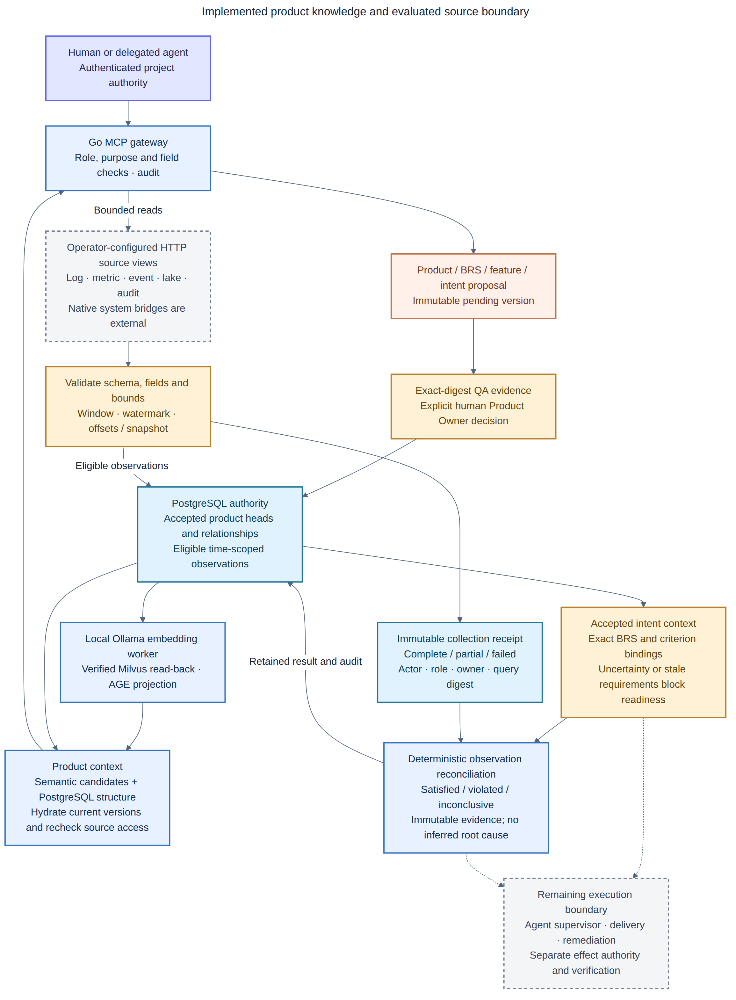

# Product knowledge, accepted intent and evaluated sources

Navigation: [Documentation index](README.md) · [Expectations](ai-native-sdlc-expectations.md) ·
[Gap assessment](sdlc-gap-assessment.md) · [Implementation guide](implementation-guide.md).

Implemented on `feature/ai-native-sdlc-20260913`, based on
`9fba87f23f0e733a6bba0528b505f647bbac5aef`. This guide describes the new source
implementation. The existing live gateway has not been upgraded by this work.

The platform can now retain versioned product knowledge, construct structural
and semantic context, collect bounded source observations through MCP, and
evaluate an accepted business criterion against those observations. Generated
interpretations remain proposals. These capabilities supply the shared context
and evidence boundary needed by the SDLC agents.



[SVG](diagrams/product-knowledge-and-sources.svg) ·
[Editable Mermaid](diagrams/product-knowledge-and-sources.mmd).

## Available tools

The source registers **60 MCP tools with local code indexing enabled, 59
without it**. The eleven product tools below are complemented by the
[17 execution/package tools](sdlc-runtime.md):

| Tool | Purpose and authority |
|---|---|
| `product_record_put` | Propose a new immutable product record version; authenticated human or existing delegated Development task; always pending |
| `product_record_get` | Hydrate an exact authorized record; `current_only` also requires active, eligible context |
| `product_record_validate` | Human QA attests source/meaning validation of an exact digest with evidence |
| `product_record_decide` | Human Product Owner accepts or rejects the exact version; acceptance requires matching, unexpired validation |
| `product_relation_put` | Link two eligible versions in the same project/product with evidence and the authenticated actor |
| `product_context_search` | Local semantic candidates, PostgreSQL hydration and bounded structural expansion |
| `product_source_list` | Discover configured sources, fields, purposes and limits available to the caller |
| `product_source_query` | Operations or Incident Diagnosis collects and validates a bounded source view; persists a receipt and eligible observation |
| `product_intent_context` | Resolve accepted criteria and exact business/context bindings; expose blockers before execution |
| `product_observations_compare` | Execute an accepted reconciliation criterion over two eligible, authorized observations and retain its result |
| `product_evaluation_get` | Read an evaluation while its exact intent, dependencies and source evidence remain current and authorized |

Tool schemas are inferred from the typed Go inputs in
[MCP registration](../internal/mcpserver/product.go). Inspect the running
server's `tools/list` before using them. New code in a checkout does not make
these tools available in an older running image.

## Product records and two-dimensional context

Records have a stable `(project_id, product_id, key)` identity and immutable
versions. Supported kinds are `product`, `brs`, `feature`, `code`, `test`,
`release`, `incident`, `hypothesis`, `procedure`, `intent`, and server-created
`observation`. Each version carries its source identity/revision, classification,
owner, actor, content digest, artifact and optional expiry.

1. Call `product_record_put` with `expected_version: 0` for a new key, or the
   latest version number when proposing a replacement. Source revision is
   mandatory. The proposed version stays `pending` and leaves accepted context
   intact.
2. Human QA inspects the exact content/source and records relevant evidence
   through `product_record_validate`. This is a **human attestation**, not a
   claim that the gateway executed a command. Its 24-hour validity bounds when
   it can authorize a decision.
3. The accountable Product Owner explicitly decides that exact record and
   digest using the validation ID, reason and idempotency key. Generated
   content requires its explicit decision; routine task authorization does
   not supply one. Codex configurations keep this tool in `prompt` mode.
4. An accepted version becomes the active head. Its record expiry and later
   accepted versions govern current eligibility. An old relationship or
   accepted intent binding does not silently move to the replacement.
5. The outbox worker embeds eligible content through local Ollama, verifies
   Milvus read-back, and records the projection digest/model/dimension. When
   AGE is enabled it also projects product vertices and relationships.

Relations are `contains`, `specifies`, `implements`, `tests`, `deployed_as`,
`observed_in`, `affects`, `supports`, `contradicts`, or `supersedes`. They bind
exact eligible record versions. A `supports` edge records an evidence
association; it does not prove a causal explanation. Both endpoint permissions
are checked when creating or returning relationships.

`product_context_search` uses project/product-filtered Milvus candidates and
hydrates PostgreSQL records before returning content. A candidate must match
the current record version, content digest and verified local model projection.
Explicit roots and one-hop relationships come from PostgreSQL. The product
context path currently uses **PostgreSQL structural traversal**; AGE is a
rebuildable product projection, not the query engine for this particular tool.
Existing code GraphRAG still uses its own AGE/fallback traversal.

The request allows up to 20 explicit roots, 50 returned records and a 128 KiB
record/relation payload budget. `bytes` counts serialized records and relations;
the small response wrapper and warnings are additional. Truncation and an
explicitly configured PostgreSQL lexical fallback are reported. Required
intent constraints use a separate resolution path and are never silently
dropped to fit this budget.

An external source revision supplied on a manual proposal is provenance, not
an automatic freshness probe of that external system. Use expiry, source
validation and new accepted versions appropriately. Automatic code-symbol
bridging, deeper product traversal and stage-specific relevance remain open
in [A04](sdlc-gap-assessment.md#a04).

## Configure a source

The operator controls the fixed adapter endpoints. A model cannot supply a URL,
SQL statement, Kafka consumer group, token or arbitrary administrative action
through a query. The registry defaults to
[an empty list](../examples/sources/empty.json).

Start from the [example registry](../examples/sources/registry.example.json),
set real project/product/source identities and the accountable human Operations
owner, then configure `PRODUCT_SOURCE_REGISTRY_HOST_PATH` for Compose. The
gateway mounts that JSON as `/etc/hybrid-ai/product-sources.json`; direct
deployments set `PRODUCT_SOURCE_REGISTRY` to their local path. Restart the
gateway to load reviewed configuration changes.

The optional `token_file` is a path inside the gateway. Mount its credential
separately as a read-only private regular file, with mode `0400` or `0600`.
The registry contains no credential values. Source discovery omits endpoints
and credential paths. HTTPS is required; explicit literal-loopback HTTP is
available for disposable fixtures. Redirects are rejected.

The registry describes:

- Source kind, project/product, schema version, classification and accountable
  owner. The owner must be an active human with Operations authority in that
  project when a receipt is retained.
- Allowed authenticated roles and purposes. Query roles are Operations and
  Incident Diagnosis; a Development task credential cannot gain diagnosis
  authority by naming that role in a request.
- Known scalar fields, optional per-role field lists, and permitted string
  equality filters. Every view supplies `event_id` and `event_time`.
- Maximum rows, response bytes, elapsed query time and time-window duration,
  plus observation retention eligibility.

Execution-scoped reads additionally reserve persistent cumulative query and row
budgets under an expiring role lease. Exact retries reuse their reservation.
The native adapter enforces local concurrency/rate bounds; distributed source
quotas require the target's gateway/service controls. See the
[execution access boundary](sdlc-runtime.md#execution-and-responsibility).

## Adapter protocol and evaluated ingestion

The gateway POSTs a typed `SourceQuery` to a fixed reviewed endpoint. The
[native adapter](../internal/sourceadapter/adapter.go) translates this protocol
to Kafka, S3, PostgreSQL audit views, Loki, Prometheus or a fixed read-only MCP
tool. Its [setup and completeness contracts](sdlc-runtime.md#connect-operational-evidence)
bind native versions, watermarks and private read authority. The disposable
native-service proof does not establish access to an organization's production data.

Example query arguments, using a closed window appropriate to the actual
data being investigated:

```json
{
  "project_id": "example-project",
  "product_id": "checkout",
  "source_id": "order-events",
  "purpose": "diagnosis",
  "start": "2026-09-13T10:00:00Z",
  "end": "2026-09-13T10:30:00Z",
  "fields": ["event_id", "event_time", "status"],
  "limit": 100,
  "idempotency_key": "incident-42-events-1"
}
```

The adapter returns a `SourceEnvelope` with exact schema/revision, requested
window, watermark, completeness and bounded rows. Event sources require
partition/offset evidence; lake sources require a snapshot ID. The adapter is
responsible for honest revision, coverage and native offset semantics. The
gateway validates those declared contracts; it cannot establish the truth of
an upstream system merely from its response.

Rows must contain exactly the requested fields and declared non-null types.
Duplicate event IDs, out-of-window events, incompatible schemas, oversized
responses and unreconciled filters fail. A lagging watermark forces `partial`
coverage. Missing evidence never becomes a zero metric or proof of absence.

Validated output is minimized and retained as an immutable `observation`,
with a collection receipt binding actor, acting role, owner, purpose, query and
descriptor digests, selected fields/filters, time, offsets/snapshot and artifact.
These are **observed records**, distinct from accepted generated knowledge.
Repeated calls by the same actor with the same source/key and exact query and
descriptor return the existing receipt. Reusing that key with changed inputs
fails. Concurrent reads may reach the adapter more than once, but the unique
receipt and observation transaction prevent duplicate committed ingestion.

A failed adapter response creates a sanitized failure receipt and no eligible
observation or retained raw payload. Repeating that key returns its failed
status; use a new key for a newly authorized retry. Inspect `status` and
`record_id`, not merely the success of the MCP transport.

Retention does not widen access. Every source observation read, semantic
hydration and evaluation checks the current source registration, schema and
role/field permissions. A diagnosis agent cannot retrieve an Operations-only
field by switching from the source tool to the KB tool. Changed or revoked
source contracts can make old observations unavailable. Expiry withholds
content from current use; physical archival/deletion requires the deployment's
retention procedure.

## Bind intent and evaluate business behavior

An `intent` record contains a strict
[`hybrid-ai/sdlc-intent/v1` document](../internal/domain/intent.go). It binds a
goal, lifecycle stage, at least one exact BRS version, optional feature/code/
test/release/incident/procedure references, explicit criteria, assumptions and
clarifications. It uses the same pending, QA and human decision path.

`product_intent_context` returns `ready: false` with blockers for unresolved
questions, unconfirmed assumptions, unavailable references or changed business
meaning. It checks the exact accepted digest; a changed BRS invalidates the
old intent's readiness. A context larger than 128 KiB fails explicitly.
Readiness means the supported context contract resolves; it is not a task
completion or permission to execute an effect.

Two criterion contracts are supported:

| Oracle | Current behavior |
|---|---|
| `work_packet` | Binds the exact content digest of an accepted `test` record containing a local-only patch work packet with checks. Intent resolution checks packet policy and presence. The external verifier still executes the checks; this tool does not generate or certify a patch. |
| `observation_reconciliation` | Binds two source identities/schema versions, string join/value fields, expected right-hand value and maximum window. The gateway executes this deterministic evaluator. |

For example, a BRS can require every input order in a closed reporting window
to have a `processed` audit result in the same window. An accepted criterion
binds the event and audit sources. Call `product_observations_compare` with the
intent ID/digest, criterion ID, and the two retained observation IDs.

The evaluator rechecks source permissions, current intent dependencies, schema
and aligned windows. Its v1 contract uses unfiltered reviewed source views
with matching purposes; broader population joins need a new oracle contract.
Duplicate or missing join keys are inconclusive. A wrong observed result, or
a missing result in complete right-hand coverage, is `violated`. A nonempty,
fully covered matching window is `satisfied`. Delayed/incomplete coverage and
empty samples are `inconclusive`.

Results retain an immutable evaluator version, criterion/intent/source digests,
owner/actor, counts, reasons and artifact. Identical evaluations by the same
actor reuse the same receipt. No model supplies the outcome field. Reading an
evaluation rechecks its dependencies, so an old success cannot satisfy changed
requirements. These results do not prove a root cause, authorize a remedy,
publish a generated lesson or certify complete product recovery.

## Validation and remaining work

Run the repository checks and disposable integration suite:

```bash
make check
make authz-policy-test
make agent-ready-functional
make docs-check
```

The [product E2E](../internal/e2e/product_test.go) exercises real gateway/worker
binaries, PostgreSQL, Milvus and Cerbos with synthetic approvals and HTTP
sources. The [AGE integration test](../internal/age/product_integration_test.go)
verifies product edges and rebuild queuing. Domain/source tests cover malformed
criteria, invalid transport/data, duplicate joins, empty samples and incomplete
coverage. Functional evidence remains distinct from real-model performance.

The [runtime guide](sdlc-runtime.md) connects these contracts to durable role
execution, independent tests, native delivery/remediation and the operator CLI.
The [completion checklist](sdlc-completion-checklist.md) maps end-to-end evidence;
fixture protocol tests remain distinct from native-service and real-model trials.
