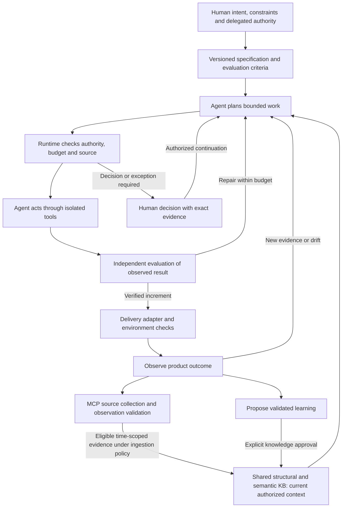

# AI-native software development lifecycle guide

Navigation: [Documentation index](README.md) · [SDLC gap assessment](sdlc-gap-assessment.md) ·
[Expectations and scope](ai-native-sdlc-expectations.md) · [Developer guide](developer-guide.md).

Re-evaluated September 13, 2026 against `main` revision
`9fba87f23f0e733a6bba0528b505f647bbac5aef`.

## Product direction and current position

The intended product is an **AI-native, AI-centric SDLC platform**. In this
guide's working definition, agents take responsibility for progressing an
authorized product intent through specification, design, implementation,
evaluation, delivery and observation. People define outcomes and constraints,
resolve material ambiguity, and exercise the decisions reserved to them.
The platform supplies the durable state, context, tools, execution environment,
evaluators and authority that make that responsibility enforceable.

The organizing foundation is a shared **structural and semantic product KB**.
Agents use it throughout the lifecycle and collect additional evidence through
MCP source tools. Their roles carry different responsibilities and scoped
authority; every read, action and decision needs attributable audit
evidence. The [expectations document and scope diagram](ai-native-sdlc-expectations.md)
define these requirements and the production troubleshooting example.

AI is central to the operating model and user experience. A user should be able
to request an outcome, inspect its evidence and progress, steer it, and handle
exceptions while authorized routine work continues. Success is a verified
product outcome with controlled cost and effects. Chat quality, generated code
volume and the number of agents are insufficient measures.

The current implementation is a **governed agent foundation with bounded local
task demonstrations**. Its retrieval, evidence, policy, workflow and verifier
components are useful building blocks. The complete intent-to-delivered-outcome
loop is still a target. In particular,
[`development-local.lobster`](../automation/workflows/development-local.lobster)
requires an existing packet and patch and runs evaluation/verification.
Generation is supplied by a client or the bounded pilot. The
[controller](../automation/openclaw-plugin/src/controller.ts) persists and mirrors
workflow/task state; the general execution supervisor remains to be built.

The forge, issue tracker, registry and deployment system remain systems of
record for their objects. In the AI-native target, agents operate those systems
through scoped, observable adapters and reconcile their actual results.
A manual handoff in the current implementation identifies an integration or
execution gap to assess; it does not define the desired agent experience.

This guide covers developing an application with the platform and developing
the platform itself. Commands such as `make check` and
`make agent-ready-functional` belong to this repository. When working on another
application, put that application's build and test commands in its work packet.
Passing this platform's tests supplies no acceptance evidence for that application.

The [AI-native gap assessment](sdlc-gap-assessment.md) prioritizes 12 capability
gaps and maps them to the 16 earlier delivery findings. Proposed components,
agent responsibilities and acceptance tests below are design targets unless
explicitly identified as implemented.

**Check the running installation first.** On September 13 the local MCP endpoint
advertised 20 tools against the baseline's 32 source registrations. The new
product-KB implementation registers 43 with code indexing enabled.
Several validation, definition and trace tools were absent. Current-source
instructions require a compatible deployment; see [G01](sdlc-gap-assessment.md#g01).
The September 12 result of 28/28 functional requirements and 132 passing
test/subtest results is a [dated platform acceptance result](documentation-validation-20260912.md),
using deterministic model fixtures. It is not a coverage percentage for the SDLC.

## The shared KB throughout the SDLC

Structural knowledge connects product, BRS, feature, contract, code, test,
release, dependency, observation and incident identities. Semantic knowledge
supplies their accepted meaning, design rationale, behavior and reusable
experience. These are two views of one logical KB, with PostgreSQL authority
and rebuildable AGE/Milvus projections. Hydrate discovered candidates and check
current permissions, versions, source applicability and publication state.

MCP tools provide the controlled boundary for reading this context, collecting
additional evidence and submitting evaluated records. The
[product KB and source guide](product-knowledge-and-evaluated-sources.md) describes
implemented records, accepted intent and a bounded HTTP adapter protocol.
Native production connectors, richer lifecycle links and the execution supervisor
remain extensions. Fixed platform metrics remain separate.

The following target map makes KB use explicit at every stage. A recorded
artifact or validated observation is not automatically approved reusable
knowledge. Generated interpretations and lessons follow their own exact-version
validation and approval path.

| Stage | Read and reason from the KB | Return evaluated evidence and relationships |
|---|---|---|
| [01 Discovery](#stage-01) | Product goals, user/business meaning, observed outcomes and incident trends | Opportunity brief, supported observations, assumptions and feature proposals |
| [02 Planning](#stage-02) | Ownership, feature/repository dependencies, effort history and operating constraints | Bounded plan, responsibility assignments, risk evidence and task dependencies |
| [03 Requirements](#stage-03) | BRS versions, domain definitions, existing behavior and known defects | Versioned criteria and feature-to-requirement links with attributed decisions |
| [04 Design](#stage-04) | Code/contracts, architecture relationships, approved patterns and failure history | ADRs, proposed contracts, compatibility/threat evidence and affected entities |
| [05 Readiness](#stage-05) | Repository/config versions, capability inventory and permitted environments | Verified source/index/tool readiness and configuration references |
| [06 Task decomposition](#stage-06) | Accepted criteria, impacted symbols/services and dependencies | Work-packet scope, checkpoints, delegated role and evaluator bindings |
| [07 Implementation](#stage-07) | Exact source, requirement meaning and applicable approved procedures | Patch/test evidence, changed symbol links and pending implementation lessons |
| [08 Integration](#stage-08) | Dependency contracts, code/review context and integration history | Exact-commit review/CI evidence and reconciled merge relationships |
| [09 Evaluation](#stage-09) | Protected acceptance criteria, historical failures and relevant data contracts | Reproducible criterion-level results, defects and coverage links |
| [10 User acceptance](#stage-10) | Accepted business meaning, demonstrated behavior and outcome evidence | Attributed product decision, residual issues and requirement disposition |
| [11 Release](#stage-11) | Verified source, dependencies, release constraints and runbook history | Artifact/provenance, release notes, configuration and rollback bindings |
| [12 Deployment](#stage-12) | Target topology, compatibility, runbook and prior recovery evidence | Actual deployment/config effects, smoke checks and recovery verification |
| [13 Operations](#stage-13) | BRS, running code/release, dependencies and applicable incident history | Validated log/metric/event/lake/audit observations, hypotheses, actions and outcomes |
| [14 Improvement](#stage-14) | Outcome trends, verified incidents, agent failures and approved lessons | Proposed requirement/test/runbook/agent changes plus validation and publication decisions |
| [15 Retirement](#stage-15) | Consumers, dependencies, retention obligations and operational history | Verified migrations/removals, revoked access and evidence disposition |

The [ingestion and governance contract](ai-native-sdlc-expectations.md#from-collected-data-to-reusable-knowledge)
defines source provenance, time/offset/snapshot handling, validation and what may
be retained or reused. Every stage uses that contract; operations does not
maintain a separate ungoverned memory.

## The agent execution loop

The platform should run this loop durably for each authorized increment.
The 15 lifecycle stages later in this guide remain useful coverage categories;
agents can revisit them as evidence changes.



The diagram is the target execution architecture. MCP and PostgreSQL provide
several existing boundaries; the complete loop and its delivery adapters are
not established by the current local functional suite.

1. **Understand:** turn intent into versioned behavior, constraints, assumptions
   and evaluation criteria. Ask only for information or authority that is missing.
2. **Ground:** build task-scoped context from current source, authoritative
   definitions and both KB dimensions. Collect authorized MCP source evidence
   when needed; validate its scope, integrity and freshness and expose gaps.
3. **Plan:** choose a bounded next action and its expected evidence. Replan
   when observations invalidate the plan, preserving the original outcome.
4. **Execute:** authorize the exact operation, enforce budgets and isolation,
   and call a typed tool with idempotency and an effect-reconciliation strategy.
5. **Evaluate:** inspect actual application/tool state and execute trusted
   checks. A model's claim of success cannot close the task by itself.
6. **Continue or escalate:** repair within the assigned scope and remaining
   budget, or present the precise failed criterion/decision to the human.
7. **Deliver and learn:** verify the deployed artifact and product outcome;
   retain eligible evaluated observations under their policy and propose
   reusable learning through the governed publication path.

Agents choose how to solve open-ended tasks. Deterministic code enforces
permissions, resource limits, transactions and evidence requirements.
Use a fixed workflow when its steps are predictable; introduce additional
agents only for a measured need for specialization or independent work.
This architecture choice follows the workflow/agent distinction in
[Building effective agents](https://www.anthropic.com/engineering/building-effective-agents);
it is a design principle, not a claim of a standardized “AI-native” certification.

## Required platform components

| Component | Responsibility in the AI-native target | Current starting point |
|---|---|---|
| Intent and specification service | Maintain outcomes, criterion versions, assumptions, scope and change impact | Immutable request/intake and governed definitions; full specification contract missing |
| Durable agent supervisor | Run plan/action/evaluate cycles, recover after interruption, schedule dependencies and reconcile effects | Workflow/task records and OpenClaw state mirror; general runner planned |
| Versioned agent packages | Bind role instructions, model/client version, tool schemas, evaluation suite and rollout policy | Example agent configuration and provider provenance |
| Shared product KB and context builder | Connect structural and semantic product knowledge; select current authorized evidence within a context budget and isolate working memory | PostgreSQL authority, AGE/Milvus and approved KB lifecycle; wider product/observation ontology missing |
| MCP source adapters and evaluated ingestion | Collect bounded BRS/code/log/metric/Kafka/lake/audit evidence, validate and link it with source/time lineage | Product records, exact intent bindings, bounded HTTP ingestion and deterministic observation reconciliation implemented; native connectors and execution remain |
| Capability and execution gateway | Bind agent role, delegator and owner; enforce tool/data/action scope, credentials, resource budgets, isolation and retry semantics | Cerbos, task delegation and work-packet verification; full runtime enforcement incomplete |
| Independent evaluation service | Check product behavior and agent behavior against protected criteria | Executed patch validation and deterministic platform E2E |
| Delivery and observation adapters | Operate forge/CI/registry/environments, read back effects and initiate bounded follow-up work | Local commands, CI and deployment runbooks; complete adapters missing |
| Human control surface | Show intent, progress, evidence, uncertainty, cost, decisions, cancellation and recovery | API/CLI/controller views; complete outcome-oriented interface missing |
| Governed improvement service | Propose lessons and agent/config changes, evaluate candidates and control rollout/rollback | Pending KB capture and exact-version knowledge decisions |
| Audit and accountability service | Correlate every read/write/decision, including denials and failures, to the actor, role, policy, evidence and actual effect | Existing audit/trace/artifact foundations; complete agent/source/action coverage requires extension |

### Specify intent as an executable contract

Before an agent runs substantial work, the target system should bind the
following information. These are proposed contract requirements, not fields
that can already be submitted to the current MCP intake API.

| Contract element | Why the agent/runtime needs it |
|---|---|
| Intent ID/version, user outcome and owner | Preserve what success means across replanning and sessions |
| Functional and nonfunctional criteria with evaluator IDs | Make acceptance observable and prevent an agent from silently redefining success |
| Repository/source versions and affected dependencies | Bound applicability and invalidate evidence after relevant changes |
| Authorized actions, environments and data classification | Execute within delegated authority and detect escalation needs |
| Time, model/tool usage, compute/spend and retry limits | Terminate or escalate bounded work instead of looping indefinitely |
| Assumptions, unresolved decisions and confidence evidence | Expose what is inferred and what needs a human decision |
| Recovery, cancellation and external-effect policy | Decide how to stop safely and reconcile interrupted actions |

An agent can draft a criterion or test; its implementation worker must not
silently weaken the accepted criterion or trusted evaluator. A legitimate
requirement change creates a new version and invalidates the affected evidence.

### Separate context, memory and learning

| Information | Lifetime and authority |
|---|---|
| Product intent, definitions and source | Versioned authoritative records with an owner and structural/semantic links; source changes trigger impact checks |
| Validated source observations | Source/window-bound evidence with integrity, classification and retention controls; authority about an observation does not certify a causal diagnosis |
| Task working context | Scoped, temporary files, observations and summaries; preserve constraints and unresolved work across sessions |
| Run history | Immutable tool results, patches, validation, decisions and effect receipts; useful for diagnosis and evaluation |
| Reusable knowledge | Generalized, validated, explicitly approved entries with current source applicability |
| Agent instructions, tools, models and evaluators | Versioned software/configuration with regression evaluation and controlled rollout |

Retrieved source and tool output are data. Their text cannot grant authority
or replace the accepted instruction/criterion hierarchy. Include stale-source,
cross-project leakage, poisoned-memory and prompt-injection cases in context
evaluation. Approving knowledge establishes its governed eligibility; it does
not authorize instructions embedded in arbitrary retrieved content.

Durable progress artifacts should let a resumed agent inspect what changed,
what passed and what remains. Resume against actual environment state rather
than replaying potentially completed side effects. This checkpoint design is
informed by [Effective harnesses for long-running agents](https://www.anthropic.com/engineering/effective-harnesses-for-long-running-agents).

### Evaluate the product and the agents

Use separate evaluations for application correctness, agent task completion,
tool use/policy compliance, retrieval quality and human interaction. Run
code-based checks wherever outcomes are executable; use calibrated model
rubrics and accountable human judgment for appropriate qualitative criteria.
Repeated trials and held-out tasks expose variability and test overfitting.
Inspect both observed outcomes and action traces. These evaluation practices
are supported by [Demystifying evals for AI agents](https://www.anthropic.com/engineering/demystifying-evals-for-ai-agents).

Start with one local execution agent and a separately controlled validator.
Multiple model opinions cannot substitute for a relevant test oracle or
required accountable decisions. Preserve failures, aborted runs and human
interventions when measuring quality, latency and cost per accepted outcome.
Maintenance evaluations use local models throughout.

### Keep the records connected

Use one stable intent/requirement ID across specification, plan, work packet,
workflow, commit, tests and release. Agents and adapters should maintain these
links automatically and reject incomplete handoffs. PostgreSQL owns platform
workflow and knowledge records; external systems retain authority for their
own objects. Today, completing that cross-system chain is a supervised procedure.

| Record | Minimum information to retain |
|---|---|
| Product need and requirement | Change ID, problem, user, owner, measurable outcome, acceptance criteria and version |
| Design decision | Requirement IDs, affected repositories, source revisions, alternatives, decision, migration and rollback implications |
| Execution | Workflow/task IDs, work packet, exact base commit, allowed files, checks, model/provider, patch and attempt identity |
| Validation and review | Exact tested revision or patch digest, command results, failures/retries, reviewer findings, decisions and actor |
| Product delivery | PR/merge commit, artifact digest, release ID, environment, deployment actor, smoke test and rollback evidence |
| Operations and learning | Incident/change ID, outcome observations, knowledge candidate/version, validation ID, source manifest and any later approval |
| Role and source access | Authenticated workload, logical role, delegator, accountable owner, policy decision, source query scope and allowed/denied result |

This table is a proposed working convention, not an implemented requirements
schema. Workflow metadata and immutable evidence can carry references, but the
platform does not yet enforce requirement-to-test-to-release completeness.
See [G02](sdlc-gap-assessment.md#g02).

### Human accountability and agent responsibilities

Human roles own outcomes and authority. Agent roles own bounded execution and
evidence production. The role names in the lifecycle map are proposed logical
specializations; they do not imply 15 separate processes or grant additional
server permissions.

| Role | Responsibility across the lifecycle |
|---|---|
| Product Owner / product lead | Problem, priorities, acceptance criteria, product acceptance and explicit decisions on generated KB publication |
| Development / technical lead | Feasibility, architecture, scope, implementation, integrations and technical documentation |
| QA | Test strategy, independent validation, failure evidence and acceptance recommendations |
| Operations / service owner | Environments, credentials, deployment, observability, recovery and retirement |
| Security or domain specialist | Project-specific threat, privacy, accessibility and domain review; assign an accountable person when required |

| Agent role in the target | Expected responsibility | Escalation boundary |
|---|---|---|
| Discovery/specification | Ground the request, identify ambiguity and draft executable criteria | Missing product intent, conflicting constraints or an unsupported assumption |
| Planner/architect | Select a design, decompose work, map dependencies and revise the plan from evidence | Scope, risk or resource needs beyond delegated authority |
| Builder | Implement the bounded change and resolve test failures | Exhausted budget, unavailable capability or unresolved design choice |
| Evaluator | Independently run protected checks and produce criterion-level findings | Ambiguous oracle, conflicting evidence or a decision reserved to QA/Product Owner |
| Delivery/operations | Reconcile PRs, builds, deployments and service signals; execute authorized recovery | Unapproved environment/effect or recovery outside the assigned policy |
| Knowledge/improvement | Extract generalized lessons and propose evaluated agent/config improvements | Exact-version publication or configuration rollout decision |

The default local account can hold the four platform roles. Team and regulated
profiles can require different principals for selected gates. Specialists in
this table are responsibilities to assign; they are not additional built-in
authorization roles. OpenClaw uses its separate controller identity and
expiring task credentials. See [role workflows](role-workflows.md) and
[task delegation](task-delegation.md).

The [agent responsibility and access-control matrix](ai-native-sdlc-expectations.md#accountable-roles-with-different-responsibilities)
defines each specialization's permitted evidence and effects. Every run must
bind a workload identity, logical role, delegator and accountable owner;
the [audit contract](ai-native-sdlc-expectations.md#audit-every-read-write-and-decision)
links source queries, policy decisions, validation and observed effects.

Agents should continue authorized reversible work without repeated permission
requests. They must still stop at the actual server-enforced human gates,
missing authority and consequential decisions outside the assigned scope.
The current human QA/product transitions remain enforced. Any change to those
gates needs a separately reviewed policy change and validation. In particular,
`execution_mode=auto` controls the cloud-review acceptance prompt; it does not
establish general autonomous execution or waive human publication decisions.

Keep these decisions distinct:

- A code review or merge accepts a change into a branch.
- Product acceptance and deployment authorization concern a product version
  and a target environment.
- Generated KB publication requires the user's explicit decision on the exact
  validated candidate version.
- Domain, capability and metric definitions use the separately validated,
  task-authorized definition decision path.

Successful tests, a workflow's `completed` state, or a KB approval cannot serve
as proof that a product was deployed. The current workflow's
`PRODUCT_APPROVED` / `PROMOTION_COMPLETED` path needs separate release and
deployment evidence from the delivery system.

## AI ownership across the lifecycle

This table defines the target behavior at each stage. The final column shows
the current foundation and the primary AI-native gap IDs. People retain the
accountability defined above while agents perform the authorized work.

| Stage | Agent execution target | Evaluator and required result | Human contribution | Current foundation / gaps |
|---|---|---|---|---|
| [01 Discovery and feasibility](#stage-01) | Discovery agent investigates available evidence and options | Source-backed opportunity brief; unsupported assumptions exposed | Define the user outcome and business constraints | Retrieval exists; A01, A04 |
| [02 Planning and risk](#stage-02) | Planner proposes scope, dependencies, cost and permitted actions | Feasible bounded plan and authority check | Set priorities, budgets and material risk decisions | Intake/policy exists; A01, A02, A06 |
| [03 Requirements and acceptance criteria](#stage-03) | Specification agent converts intent into versioned criteria and test proposals | Consistency, coverage and testability checks; protected accepted criteria | Resolve semantic ambiguity and accept product intent | Definitions exist; A01, A05 |
| [04 Architecture and design](#stage-04) | Architect inspects code, compares designs and generates contracts/prototypes | Compatibility, threat and prototype evidence | Decide consequential tradeoffs beyond assigned scope | Code graphs/ADRs exist; A03–A05 |
| [05 Environment and repository readiness](#stage-05) | Environment agent selects allowed tools, source snapshots and local runtime | Tool conformance, credential scope and readiness checks | Supply unavailable infrastructure authority | Compose/indexing/delegation exist; A06, A12 |
| [06 Decompose and govern tasks](#stage-06) | Planner dispatches bounded tasks, checkpoints and reconciles dependencies | Valid packets, dependency/source versions and recoverable progress | Resolve budget/scope exceptions | FIFO and state records exist; A02, A03 |
| [07 Implement and test locally](#stage-07) | Builder implements, tests and repairs within limits | Exact patch plus executable behavioral evidence | Resolve unbounded uncertainty or exhausted authority | Verifier and bounded pilot exist; A02, A03, A05, A06 |
| [08 Review and integrate](#stage-08) | Review/integration agents assess changes, operate the forge and reconcile CI | Independent findings and passing exact-merge checks | Exercise required code/QA decisions | Review records/CI exist; A05, A07 |
| [09 System and nonfunctional testing](#stage-09) | Evaluator exercises product journeys, negative cases and agreed budgets | Criterion-level outcomes in controlled environments | Judge cases requiring domain or subjective expertise | Platform E2E exists; A05, A11 |
| [10 User acceptance](#stage-10) | Acceptance agent assembles demos, evidence, defects and recommendation | Traceable product evidence and actual user observations | Accept the product outcome and residual risks | Attributed gates exist; A01, A09 |
| [11 Package and release](#stage-11) | Release agent builds, inventories, signs and proposes a versioned release | Reproducible artifact, provenance and supply-chain checks | Decide releases outside delegated policy | Build commands exist; A06, A07, A12 |
| [12 Deploy, migrate and verify](#stage-12) | Delivery agent promotes the artifact and verifies/reconciles environment effects | Actual deployment, smoke, data and recovery evidence | Authorize target scope or consequential recovery | Local runbooks exist; A07, A08, A12 |
| [13 Operate and respond](#stage-13) | Incident agent compares BRS/code/history with collected logs, metrics, Kafka/lake/audit evidence; a separately authorized role performs recovery | Supported diagnosis and verified business recovery without scope/budget violations | Own the incident and consequential recovery decisions | Health/traces/recovery tools exist; source connectors and full KB loop need A04, A07, A08, A11, A12 |
| [14 Maintain and improve](#stage-14) | Local maintenance agent repairs; improvement agent proposes lessons/config changes | Fresh product checks plus agent regression evaluations | Exact-version KB publication and governed rollout decisions | KB governance exists; A03, A08, A10, A11 |
| [15 Retire](#stage-15) | Retirement agent maps dependents, prepares migration and executes authorized closure | Verified client/resource removal and retained evidence recovery | Decide retirement, data disposition and irreversible effects | Graph/evidence foundations exist; A07–A09, A12 |

## Current execution mechanics for each stage

Use these commands and handoffs through a supervised agent/client today.
They ground the AI responsibilities above in the assessed implementation.
The proposed agent supervisor and adapters must eventually perform and verify
the manual connections described here; their existence is not assumed.

<a id="stage-01"></a>
### 01. Discovery and feasibility

Start with the user problem, current behavior, expected value, constraints and
a measurable outcome. Search approved knowledge for comparable work; inspect
repository relationships for existing capabilities and dependencies.

```bash
make mcp-call MCP_TOOL=knowledge_search \
  MCP_ARGUMENTS='{"project_id":"local-development","query":"validated procedures for this proposed change","limit":5}'
make mcp-call MCP_TOOL=repository_graph_get \
  MCP_ARGUMENTS='{"project_id":"local-development","root":"https://github.com/dhanuka84/local-ai-development-platform.git","depth":1}'
```

These examples use this repository's namespace; select the application's
authorized project and repository for real work. Hydrate semantic candidates
with `knowledge_get` or the corresponding authoritative graph tools and inspect
current source. An empty query is a context gap, not evidence that a capability
or dependency does not exist.

**Exit:** the Product Owner records the problem, success measure and
proceed/revise/stop decision. User research, market evidence and commercial
feasibility remain product work outside the knowledge service.

<a id="stage-02"></a>
### 02. Planning, ownership and risk

Choose an increment, assign the four responsibilities, identify dependency
owners, and record scope, risk, data classification, time/cost constraints and
rollback expectations. Use `workflow_run_create` to retain the request with a
stable idempotency key. A caller/controller supplies classification; the
general automatic classifier remains planned.

Where the governed workflow requests a plan decision, use its current version
and authenticated decision path. Do not turn every routine action into a new
approval request. Existing task authorization covers assigned implementation
and validation within the operator's actual permissions.

**Exit:** an owned, prioritized increment and an explicit risk/decision record.
Backlog scheduling, staffing and portfolio budgeting remain in the team's
planning system.

<a id="stage-03"></a>
### 03. Requirements and acceptance criteria

Write functional behavior, failure behavior and relevant nonfunctional
requirements. Include authorization, data handling, compatibility, performance,
accessibility, recovery and observability where the application requires them.
Give each criterion an ID and an executable check or accountable observation.

Use `context_definition_search` for available approved domain/capability
definitions. Changes to definitions go through `context_registry_validate` and
`context_definition_decide` with current version/digest evidence. These
definitions describe governed platform context; they do not create a complete
product requirements management system.

**Exit:** Development and QA can tell how each requirement will be proved.
Store the accepted version in the issue tracker or versioned repository docs
and connect it to the workflow ID.

<a id="stage-04"></a>
### 04. Architecture, UX, data and security design

Inspect `repository_graph_get`, `code_symbol_search`, `code_graph_get` and
`graph_context_search` before choosing file or service boundaries. Verify the
indexed branch/revision; repository relationships require evidence. The
supported analyzers and their limits are described in the
[code graph component](../components/codegraph/README.md).

Create an ADR with alternatives and consequences. Specify API/data contracts,
schema changes, authorization, failure handling, UX flows, operational needs
and rollback. Use a small prototype when an assumption needs measurement.
Retrieve approved knowledge as design input and validate its applicability.

**Exit:** reviewers can trace the design to requirements and affected
repositories. Automated architecture conformance, UX research and cross-system
contract compatibility checks require project-specific tooling.

<a id="stage-05"></a>
### 05. Environment and repository readiness

Follow the [developer setup](developer-guide.md#set-up-a-development-checkout)
and [persistent-stack setup](developer-guide.md#start-a-persistent-local-stack).
Use the existing vault on an installed workstation; initialize once on a new
one. Keep operator and controller credentials separate.

Verify `make mcp-status`, authenticated MCP discovery, the required tools and
the selected local model. `make platform-status` also checks OpenClaw.
Index clean, allowlisted source with `make repository-index-one-all REPO=...`;
use the [multi-repository runbook](local-setup-and-indexing.md) for synchronization,
branch overrides and projection completion.

Choose local inference explicitly. `make dev-session-local-repo REPO=...`
selects Ollama, but its documented MCP tool-use limitation needs a smoke test
for the exact client/model. The OpenClaw local route is the alternative governed
integration. Running a client on your workstation does not establish which
model provider it calls.

**Exit:** the intended source revision, required tools, roles and local route
work in the target environment. Missing deployed APIs must be resolved before
depending on their gates.

<a id="stage-06"></a>
### 06. Decompose work into governed tasks

Queue small tasks with `workflow_task_begin` and inspect them with
`workflow_task_get`. The FIFO head activates and performs a fresh RAG lookup.
Transitions carry the current version, stable attempt key and actual evidence.
The current queue is not a cross-repository dependency scheduler.

For each delegated patch, prepare a `hybrid-ai/work-packet/v1` with an exact
base commit, goal, allowed/forbidden files, patch limits, bounded check commands
and rollback. Start from the [example](../examples/openclaw/work-packet.example.json),
then replace its placeholder paths, `HEAD`, checks and provider settings.
For local QA validation use `local_only: true`, `cloud_review: false` and no
cloud provider. Maintenance always stays local.

```bash
make workpacket-evaluate PACKET=/absolute/path/to/work-packet.json
```

**Exit:** a task has an observable result, permitted execution scope, valid
credentials and checks that prove its acceptance criteria. Policy evaluation
alone does not execute those checks.

<a id="stage-07"></a>
### 07. Implement and test locally

Work in a focused branch/worktree. Use local Ollama for governed task
implementation, run the application's unit tests, and keep source changes
within the packet. Inspect failures and record repair attempts. The generic
isolated agent runner is still a proposal; a supervised client/operator drives
these actions today.

```bash
make workpacket-verify \
  PACKET=/absolute/path/to/work-packet.json \
  PATCH=/absolute/path/to/candidate.patch
```

The verifier applies the patch in a disposable clone and executes the packet's
checks. Its [implementation](../components/workpacket/verify.go) explicitly
leaves OS/container isolation and egress denial to the execution environment.
Use `generation_capture` to preserve the result, procedure, validation evidence,
repository revision and actual provider/model as a pending candidate.

**Exit:** an inspected patch passes its declared checks at the bound revision.
Generated output and a successful command exit need relevant assertions before
they can support the requirement.

<a id="stage-08"></a>
### 08. Review and integrate continuously

Review correctness, scope, tests, migration effects and operational behavior in
the forge. Link the PR to requirements, workflow/task IDs and verification
evidence. Use `review_record` for candidate-related findings; a cloud reviewer
remains advisory.

A strong eligible RAG hit can avoid cloud review. An allowed development miss
can select the explicit read-only review lane. Maintenance and protected-data
rules still apply. Preserve exact output and the minimized disclosed-context
manifest, reproduce accepted findings locally and revalidate. Follow the
[review guide](remote-review-learning.md); automatic disclosure packaging
remains planned.

For this repository, [.github/workflows/ci.yaml](../.github/workflows/ci.yaml)
checks Go, PostgreSQL integration, local functional behavior, contracts,
policies, docs, OpenClaw and image builds. Run applicable checks for the actual
application. Recheck the merge result if integration changes the tested source.
Branch protection and required checks must be verified in the forge separately.

**Exit:** reviewers accept the exact change and required CI results are tied to
the merge revision. Git/CI event ingestion and enforced platform-to-PR binding
remain [G05](sdlc-gap-assessment.md#g05).

<a id="stage-09"></a>
### 09. System, security and nonfunctional testing

QA maps requirements to unit, integration, API/UI, system and negative tests,
then adds performance, accessibility, compatibility and recovery checks as
required. Use synthetic or approved test data and disposable environments.
Retain failed attempts as well as the final passing run.

For platform changes, select checks using the
[test matrix](developer-guide.md#test-each-requirement-end-to-end).
`make check` is required before repository handoff.
`make agent-ready-functional` is required for changed agent-ready functional
behavior and produces the [coverage receipts](agent-ready-e2e.md).
`make check` alone skips service-dependent tests.

For trusted executed KB validation, use the authenticated local QA CLI:

```bash
go run ./cmd/admin validate validation-input.json work-packet.json candidate.patch
```

Prepare those inputs using the [validation runbook](agent-ready-data-operations.md#validate-and-decide).
`knowledge_validation_record` is an authenticated human attestation and cannot
claim it executed commands.

**Exit:** each acceptance criterion has evidence at the relevant source version,
and remaining defects have an explicit disposition. The platform's fixture-based
E2E suite does not measure model quality or certify the application under development.

<a id="stage-10"></a>
### 10. User acceptance and product decision

Demonstrate the accepted user scenarios to the Product Owner or designated
users in the target-like test environment. Record requirements passed/failed,
usability findings, unresolved risks and the accepted product revision.
Use the managed workflow's QA and product decision transitions when applicable,
under the required authenticated roles.

**Exit:** accountable product acceptance, an owned defect disposition and a
release recommendation. A synthetic approval in a test database is test
evidence; a knowledge candidate's approval concerns that knowledge version.
Keep the separate UAT/release record even when one person performs all roles.

<a id="stage-11"></a>
### 11. Package and release

Build the application from the accepted revision. Record version, immutable
artifact digest, dependencies, configuration/migration compatibility, release
notes, operator instructions and rollback target. Reuse the same verified
artifact across environments.

This repository supplies `make build` and container build targets. Its CI
container job uses `push: false`; it does not publish a product release.
Package publication, signing, provenance/SBOM policy and release approval must
be supplied by the delivery system and linked back as evidence.

**Exit:** a reproducible, identifiable artifact and complete release package
meet the project's release gates. See [G07](sdlc-gap-assessment.md#g07) and
[G08](sdlc-gap-assessment.md#g08).

<a id="stage-12"></a>
### 12. Deploy, migrate, verify and recover

Operations selects the target environment, confirms deployment authority and
credentials, rehearses migrations and recovery, and deploys the verified
artifact. Perform readiness, functional smoke and data-integrity checks.
Record the actual image digest, schema/config versions, time and actor.

Use [Operations](operations.md), the
[release preparation record](agent-ready-release-20260910.md) and
[backup/restore runbook](manual-backup-restore-postgres-milvus-google-drive.md)
for the local platform. Kubernetes files supply an application deployment base;
the [enterprise guide](enterprise-deployment.md) lists infrastructure and
identity prerequisites.

**Exit:** observed target-environment success and a tested recovery route.
Application rollback, database compatibility and restoration are separate
decisions; do not assume deploying an older image reverses a migration.
Record RTO/RPO only after measuring recovery against the chosen objectives.

<a id="stage-13"></a>
### 13. Operate and respond to incidents

Assign the service owner and escalation path. Observe availability, user-facing
errors, latency, capacity, dependency health and release effects using the
application's operational tools. Link incidents back to the deployed artifact,
requirement and repair workflow.

For platform operations, use `make ops-status`, `make ops-logs`,
`platform_evidence_health`, `workflow_trace_get`,
`knowledge_index_failures` and the documented recovery controls when present
in the deployed tool inventory. Governed metrics require validated, approved
definitions. Current fixed metrics cover index age, candidate validation,
candidate approval and validated reuse.

For the AI-native target, follow the
[production troubleshooting walkthrough](ai-native-sdlc-expectations.md#production-troubleshooting-walkthrough).
It joins the BRS and deployed code to bounded observations from logs, metrics,
Kafka, lake and audit sources, tests candidate explanations and verifies a
separately authorized remedy. Retain source/window evidence and unresolved
hypotheses accurately; propose generalized lessons through the KB approval path.
The new bounded HTTP source protocol requires native production bridges; see
the [source guide](product-knowledge-and-evaluated-sources.md#adapter-protocol-and-evaluated-ingestion).

**Exit for an incident:** service restored, impact and supported findings
recorded, recovery verified, and unresolved cause/follow-up work owned.
Health checks and retention alerts need
project-specific SLOs, alert routing, on-call procedures and production recovery
evidence; see [G10](sdlc-gap-assessment.md#g10).

<a id="stage-14"></a>
### 14. Maintain, learn and improve

Route dependency updates, defect fixes, refactoring and operational maintenance
through the same requirements, patch, validation and release chain.
Maintenance inference uses local models only, without a cloud fallback.
Dependabot configuration can propose dependency updates; it does not accept,
test or deploy them on the team's behalf.

Capture useful validated procedures as pending knowledge. For eligible reuse,
record actual context with `workflow_task_context_record` and complete through
`VALIDATED_REUSE_COMPLETED` with the trusted validation ID; its new candidate
stays pending. New-knowledge publication needs exact-version validation, fresh
sources and the user's explicit decision. After approval, verify the exact
PostgreSQL ID/version in Milvus before the task's read-back completion.

**Exit:** maintenance has fresh evidence and a verified operational outcome;
learning has its actual pending/approved status. Evaluate quality, cost and
time on representative tasks before broadening autonomy. Follow the
[evaluation protocol](cost-routing-evaluation.md) and
[adoption decisions](agent-ready-operating-decisions.md).

<a id="stage-15"></a>
### 15. Retire the product or capability

Identify users, dependent repositories/services, retained records, credentials,
data exports and recovery obligations. The Product Owner and Operations agree
the retirement date, migration path and evidence-retention decision. Use graph
context as an input and confirm dependencies with their owners.

Withdraw obsolete knowledge/definitions through their governed procedures;
retain required audit and validation history. Remove access and infrastructure
only through the project's authorized retirement process. Check for orphaned
jobs, credentials, indexes and dependent clients.

**Exit:** owners confirm dependent systems are migrated, service/access removal
is verified, and retained evidence remains recoverable for its required period.
The current retention worker creates review/hold alerts; it does not implement
general archival/deletion or product decommissioning.

## Worked example: add a CSV export to an application

This is an illustrative delivery plan, not an implemented feature or a claim
of executed tests. Use it to see how the records from all stages connect.

| Step | Agent activity, KB connection and accountable result |
|---|---|
| 01 | Analyst reads product/BRS and observed user needs; proposes the export outcome and baseline for the Product Owner's decision. |
| 02 | Planner reads dependencies and data classifications; binds Development, QA and Operations owners, agent capabilities, budget and recovery scope. |
| 03 | Specification agent drafts `REQ-EXPORT-01` through `REQ-EXPORT-04`: authorization, columns/encoding, empty/error behavior and measured size/time limits; links accepted versions to the feature/BRS. |
| 04 | Architect retrieves current API/UI relationships and approved lessons; records the streaming/batch choice, authorization, CSV injection handling and audit design with evidence. |
| 05 | Readiness agent verifies application revisions, index freshness, test environment, local route and permitted MCP tools. |
| 06 | Planner creates bounded API, UI and documentation tasks linked to criteria, source revisions, roles and evaluators. |
| 07 | Local builder retrieves applicable patterns, implements and repairs within its packet; retains exact outputs and executed test evidence. |
| 08 | Integration agent uses scoped forge/CI adapters, resolves findings and verifies exact merged revisions and API/UI compatibility. |
| 09 | Independent evaluator exercises authorization, content, UI, injection, representative volume and regression scenarios; records criterion-level evidence for QA. |
| 10 | Acceptance agent assembles the demonstration and user observations; Product Owner decides on the exact evaluated product version. |
| 11 | Release agent binds verified source to an artifact, dependencies, configuration and rollback target. |
| 12 | Delivery agent deploys under target authority, verifies export and audit effects, and records the feature-to-deployment relationship. |
| 13 | Incident agent compares failures/latency with expected behavior and the deployed code; collects bounded log/metric/audit evidence and links verified findings to the release. |
| 14 | Improvement agent proposes a validated export lesson and regression cases; exact-version approval governs later reuse. Re-measure the user outcome. |
| 15 | Retirement agent maps consumers and performs the authorized migration/removal plan; records revoked access and the owned data/evidence disposition. |

A first runnable intake for that example, after setting up the appropriate
project and permissions, is:

```bash
make mcp-call MCP_TOOL=workflow_run_create \
  MCP_ARGUMENTS='{"project_id":"example-application","kind":"software-development","risk":"medium","data_classification":"internal","request":"Deliver REQ-EXPORT-01 through REQ-EXPORT-04 using the accepted design and application test plan.","idempotency_key":"REQ-EXPORT-increment-1"}'
```

Keep the returned workflow UUID. Submit tasks with that UUID, a unique
`task_key`, `title`, `task_type`, `rag_query` and `idempotency_key`.
Use MCP discovery for the deployed schema and the
[typed source contract](../internal/mcpserver/server.go) for this revision.
This request creates a workflow record; the supervised operator/controller
still performs the planning, execution and delivery actions above.

## Completion checklist for one increment

- Accepted intent, criteria, allowed effects, budgets and accountable owners are explicit.
- The accepted requirement and design versions are linked to the workflow and PR.
- Agent roles use scoped credentials; permitted and denied tool/data actions are auditable.
- Structural and semantic KB context is current and authorized; collected evidence retains source, version, time and validation state.
- The actual source, patch, provider/model, validation and review evidence are retained.
- Required product tests and user acceptance are complete, with failures dispositioned.
- Independent evaluators check actual results; interruption, uncertainty and exhausted budgets produce accurate state and decisions.
- Release artifact, deployment, post-deploy checks and rollback evidence identify the target environment.
- Operations has an owner, monitoring, escalation and recovery instructions.
- Observed product outcomes feed evaluated records and proposed improvements back into the shared KB.
- Knowledge captures retain their actual status; exact-version approval and
  source freshness govern reuse.
- Every unfinished delivery requirement has an owner and a concrete prerequisite.

Use the [gap assessment and closure order](sdlc-gap-assessment.md) to turn missing
connections into scoped implementation work. Completing this checklist is a
product delivery decision; the existing 28-item platform functional checklist
continues to measure its own defined scope.
